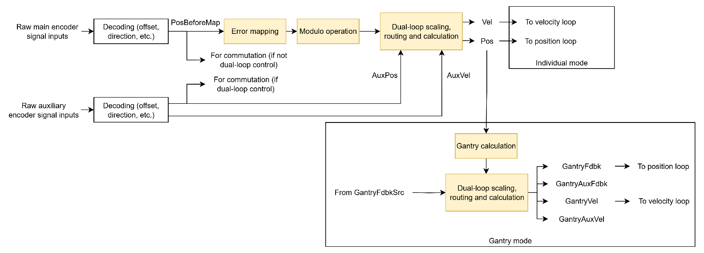

# Kinematics status

This section describes kinematic status keywords, commonly used in position and velocity controls. They can be divided into:

1.  Kinematic feedback

Kinematic feedback are derived from the [encoder](../../../02-keywords/03-encoder/00-overview.md) feedback, after [modulo operation](../../../02-keywords/03-encoder/04-modulo-mode/00-overview.md), [error mapping](../../../02-keywords/04-error-mapping/00-overview.md), [dual-loop control](../../../02-keywords/11-control-tuning/02-dual-loop-control/00-overview.md) routing/scaling and user-unit scaling (if applicable). Generally, the signal paths of main kinematic feedback are as shown with the yellow blocks being optional operations (passthrough if not applicable).

**Note:**

1. Velocity feedback (Vel) is an array where each entry represents different method of velocity calculation or approximation. Methods include simple derivative, moving average and fixed position change over measurable time (one over T method).
2. For auxiliary feedback, by default, error mapping and modulo operation are not available. Please contact Agito if such feature is required.
3. For gantry kinematic feedback, please refer to gantry control for more information.

2.  Kinematic reference

Kinematic references originate from the motion profiler or external input, depending on OperationMode and MotionMode. After the optional post-processing (offset, moving average, input shaping, injection and filter), the final position reference ([PosRef](../../../02-keywords/10-motion/01-kinematics-status/PosRef.md)) is generated. Velocity reference ([dPosRef](../../../02-keywords/10-motion/01-kinematics-status/dPosRef.md)) (not to be confused with velocity loop reference) is calculated by using filtered derivative.

A typical signal path for position and velocity reference is as shown.

**Note:**

VelRef is the velocity loop reference/input (sum of position controller output and scaled velocity reference), while dPosRef is the velocity reference (derivative of position reference). They are not the same signals. Please refer to Control tuning – Velocity control for the locations of VelRef and dPosRef.

3.  Kinematic error

Kinematics errors (PosErr and VelErr) are differences between reference and feedback, commonly used in feedback control and motion protection. They are motion performance indicators.
