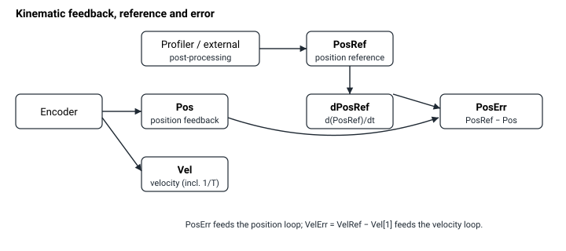

# 运动学状态

本节描述运动学状态关键字，常用于位置控制与速度控制中。下图展示了它们之间的关系：编码器产生位置反馈 [Pos](Pos.md) 和速度反馈 [Vel](Vel.md)；运动规划器（或外部输入）产生位置参考 [PosRef](PosRef.md) 及其微分 [dPosRef](dPosRef.md)；参考与反馈之差给出误差信号 [PosErr](PosErr.md) 和 [VelErr](VelErr.md)，用于驱动控制环。

这些关键字可分为：

1.  运动学反馈

运动学反馈由[编码器](../../../02-keywords/03-encoder/00-overview.md)反馈经过[取模运算](../../../02-keywords/03-encoder/04-modulo-mode/00-overview.md)、[误差映射](../../../02-keywords/04-error-mapping/00-overview.md)、[双环控制](../../../02-keywords/11-control-tuning/02-dual-loop-control/00-overview.md)路由/缩放以及用户单位缩放（如适用）后得出。

**注意：**

1. 速度反馈（Vel）是一个数组，其中每个条目代表不同的速度计算或近似方法。这些方法包括简单微分、滑动平均以及在可测时间内固定位置变化（1/T 方法）。
2. 对于辅助反馈，默认情况下误差映射和取模运算不可用。如需此功能，请联系 Agito。
3. 对于龙门运动学反馈，更多信息请参阅龙门控制。

2.  运动学参考

运动学参考来源于运动规划器或外部输入，取决于 OperationMode 与 MotionMode。经过可选的后处理（偏置、滑动平均、输入整形、注入和滤波）后，生成最终的位置参考（[PosRef](../../../02-keywords/10-motion/01-kinematics-status/PosRef.md)）。速度参考（[dPosRef](../../../02-keywords/10-motion/01-kinematics-status/dPosRef.md)）（不要与速度环参考混淆）通过滤波微分计算得出。

**注意：**

VelRef 是速度环参考/输入（位置控制器输出与缩放后速度参考之和），而 dPosRef 是速度参考（位置参考的微分）。它们不是同一信号。VelRef 和 dPosRef 的位置请参阅控制整定 – 速度控制。

3.  运动学误差

运动学误差（PosErr 和 VelErr）是参考与反馈之差，常用于反馈控制和运动保护。它们是运动性能指标。
