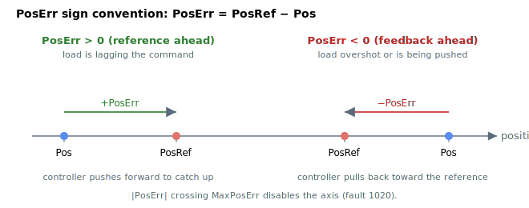

# PosErr

Position error (reference minus feedback), used for control and protection.

## Overview

`PosErr` reports the error between the position reference and the position feedback, in main user units. It is the primary position-loop control and protection signal, and the settling check that drives [InTargetStat](../05-motion-status/InTargetStat.md) compares `abs(PosErr)` against [InTargetTol](../05-motion-status/InTargetTol.md).

`PosErr` is only reported when the axis is enabled (motor on, commutation done) and in a position operation mode that is not open-loop; otherwise it is forced to `0`. It then drives the position controller, the high-position-error protection, settling/in-target, homing and operation-mode switching.



### Sign convention

`PosErr` is **reference minus feedback**. A positive value means the reference is ahead of where the load actually is (the axis is lagging the command); a negative value means the load has gone past the commanded reference (overshoot, or being externally pushed forward). The controller drives a positive `PosErr` with a positive velocity reference, so the sign of `PosErr` is also the sign of the corrective motion the loop will apply.

A worked example: with `PosRef = 10000` and `Pos = 9985`, `PosErr = +15` user units, the loop adds `15 × PosGain` to the velocity reference to close the gap. With `Pos = 10003`, `PosErr = -3`, the loop pulls back by `3 × PosGain`.

## How it works

Each control cycle `PosErr` is computed from the post-processed (shaped+filtered) reference minus the feedback:

1. Under individual (non-gantry) mode:

$$
\text{PosErr} = \text{PosRef} - \text{Pos}
$$

2. Under gantry mode (axes A/B with gantry on):

$$
\text{PosErr} = \text{PosRef} - \text{GantryFdbk}
$$

### When it is forced to zero

`PosErr` is set to `0` when any of the following hold, so a meaningless error is never fed to the loop or the protection:

| Condition | Reason |
|-----------|--------|
| Motor off / commutation not done / amplifier is a position-drive | The position loop is not running this cycle. |
| `MotorType` = stepper open-loop (value 6) | Open-loop steppers have no position feedback loop. |
| [OperationMode](../../08-axis-operation/01-general-keywords/OperationMode.md) ≠ position control, and force-over-PIV is off | Velocity/current/force modes do not close the position loop. |
| Simulation (`MotorType` = 5) | `Pos` is forced to follow `PosRef`, so the true error is zero. |

### High position-error protection

After computing `PosErr` the controller checks its magnitude against [MaxPosErr](../../06-protections/03-motion/general-maximum-limits/MaxPosErr.md); on exceedance it disables the axis and [ConFlt](../../07-status-and-faults/ConFlt.md) shows fault code 1020 (position error exceeds limit). Otherwise `PosErr` is multiplied by the position gain ([PosGain](../../11-control-tuning/03-position-control/PosGain.md)) to form the velocity-loop reference [VelRef](VelRef.md).

## Examples

```text
APosErr             ; read the current position error
```

## Changes between versions

In **v4** `PosErr` feeds a pure-proportional position controller (`VelRef = PosGain·PosErr + velocity FFW`). In **v5 (central-i)** the same `PosErr` is first passed through an optional second-order position filter and can drive a **position integral** term ([PosKi](../../11-control-tuning/03-position-control/PosKi.md)) in addition to the proportional gain, and the surrounding signals ([Pos](Pos.md), [VelRef](VelRef.md)) are 64-bit. `PosErr` itself is still reported as a 32-bit value in v5 (no range override in the frontmatter). **v5 is central-i only.**

## See also

- [PosRef](PosRef.md) — position reference (the minuend)
- [Pos](Pos.md) — position feedback (the subtrahend in non-gantry mode)
- [GantryFdbk](../../12-gantry-control/02-gantry-kinematic-feedback/GantryFdbk.md) — common-mode feedback used in gantry mode
- [PosGain](../../11-control-tuning/03-position-control/PosGain.md) — proportional gain that scales `PosErr` into the velocity reference
- [MaxPosErr](../../06-protections/03-motion/general-maximum-limits/MaxPosErr.md) — error threshold that disables the axis (closed loop)
- [MaxPosErrOL](../../06-protections/03-motion/general-maximum-limits/MaxPosErrOL.md) — open-loop equivalent of the trip
- [VelRef](VelRef.md) — velocity-loop reference produced from `PosErr`
- [InTargetTol](../05-motion-status/InTargetTol.md) — settling window compared against `PosErr`
- [StatReg](../../07-status-and-faults/StatReg.md) — bit 23 (velocity saturation) commonly accompanies a large `PosErr`
