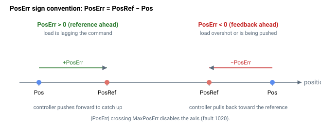

# PosErr

位置误差（参考值减反馈），用于控制和保护。

## 概述

`PosErr` 以主用户单位报告位置参考与位置反馈之间的误差。它是位置环的主要控制与保护信号，驱动 [InTargetStat](../05-motion-status/InTargetStat.md) 的稳定到位检查会将 `abs(PosErr)` 与 [InTargetTol](../05-motion-status/InTargetTol.md) 进行比较。

`PosErr` 仅在轴已使能（电机使能、换相完成）且处于非开环的位置运行模式时才会报告；否则它被强制置为 `0`。随后它驱动位置控制器、高位置误差保护、稳定/到位、回零以及运行模式切换。



### 符号约定

`PosErr` 为**参考值减反馈**。正值表示参考值领先于负载的实际位置（轴落后于指令）；负值表示负载已越过指令参考值（超调，或被外部向前推动）。控制器以正的速度参考来驱动正的 `PosErr`，因此 `PosErr` 的符号也就是控制环将施加的修正运动的符号。

一个具体示例：当 `PosRef = 10000` 且 `Pos = 9985` 时，`PosErr = +15` 用户单位，控制环向速度参考添加 `15 × PosGain` 以消除偏差。当 `Pos = 10003` 时，`PosErr = -3`，控制环回拉 `3 × PosGain`。

## 工作原理

每个控制周期，`PosErr` 由经过后处理（整形+滤波）的参考值减去反馈值计算得出：

1. 在单独（非龙门）模式下：

$$
\text{PosErr} = \text{PosRef} - \text{Pos}
$$

2. 在龙门模式下（轴 A/B 且龙门开启）：

$$
\text{PosErr} = \text{PosRef} - \text{GantryFdbk}
$$

### 何时被强制置零

当以下任一条件成立时，`PosErr` 被置为 `0`，从而绝不会将无意义的误差送入控制环或保护：

| 条件 | 原因 |
|-----------|--------|
| 电机失能 / 换相未完成 / 驱动器为位置型驱动器 | 本周期位置环未运行。 |
| `MotorType` = 步进开环（值 6） | 开环步进电机没有位置反馈环。 |
| [OperationMode](../../08-axis-operation/01-general-keywords/OperationMode.md) ≠ 位置控制，且 force-over-PIV 关闭 | 速度/电流/力模式不闭合位置环。 |
| 仿真（`MotorType` = 5） | 位置环被旁路；`Pos` 被强制跟随 `PosRef`，因此报告的误差保持其上一个值（自使能以来为零）。 |

### 高位置误差保护

计算 `PosErr` 后，控制器将其幅值与 [MaxPosErr](../../06-protections/03-motion/general-maximum-limits/MaxPosErr.md) 进行比较；一旦超出便禁用轴，并且 [ConFlt](../../07-status-and-faults/ConFlt.md) 显示故障码 1020（位置误差超出限值）。当相关的 `MaxErrStat` 位指示为开环时，所用阈值改为 [MaxPosErrOL](../../06-protections/03-motion/general-maximum-limits/MaxPosErrOL.md)，此时报告的故障为码 1055（开环下位置误差超出限值）而非 1020。否则 `PosErr` 乘以位置增益（[PosGain](../../11-control-tuning/03-position-control/PosGain.md)）以构成速度环参考 [VelRef](VelRef.md)。

### 边界情况

- **电机失能：** 控制器强制 [PosRef](PosRef.md) = [Pos](Pos.md)，并且 `PosErr` 因上述条件被强制置为 `0`；不会产生使能瞬态。
- **仿真模式（`MotorType` = 5）：** 位置环被旁路，`Pos` 被驱动跟随 `PosRef`，因此报告的 `PosErr` 为 `0`。
- **ModRev 环绕：** 环绕在同一周期内将 `Pos`、`PosRef` 和整形滤波后的参考值一起平移 `ModRev`，因此 `PosErr` 在环绕过程中得以保持（不会出现虚假的误差尖峰）。
- **有效故障：** 轴被禁用——`PosErr` 被强制置为 `0`；查看 [ConFlt](../../07-status-and-faults/ConFlt.md) 快照字段可恢复跳闸时刻的值。
- **双环：** 在伪双环中，`Pos` 是经过缩放的辅助值，因此 `PosErr` 度量的是负载端误差。在真双环中，位置环闭合于主编码器；辅助编码器仅馈入速度环。
- **龙门：** 如上所示，对于龙门开启的轴 A/B，`PosErr = PosRef − GantryFdbk`，因此位置环闭合于共模。
- **越界写入：** `PosErr` 为只读——写入操作被参数系统拒绝。

## 示例

```text
APosErr             ; read the current position error
```

## 版本间的差异

在 **v4** 中，`PosErr` 馈入纯比例位置控制器（`VelRef = PosGain·PosErr + velocity FFW`）。在 **v5（central-i）** 中，同一 `PosErr` 首先经过一个可选的二阶位置滤波器，并且除比例增益外还可驱动一个**位置积分**项（[PosKi](../../11-control-tuning/03-position-control/PosKi.md)），且周边信号（[Pos](Pos.md)、[VelRef](VelRef.md)）为 64 位。`PosErr` 本身在 v5 中仍报告为 32 位值（frontmatter 中无范围覆盖）。**v5 仅适用于 central-i。**

## 另请参阅

- [PosRef](PosRef.md) — 位置参考（被减数）
- [Pos](Pos.md) — 位置反馈（非龙门模式下的减数）
- [GantryFdbk](../../12-gantry-control/02-gantry-kinematic-feedback/GantryFdbk.md) — 龙门模式下使用的共模反馈
- [PosGain](../../11-control-tuning/03-position-control/PosGain.md) — 将 `PosErr` 缩放为速度参考的比例增益
- [MaxPosErr](../../06-protections/03-motion/general-maximum-limits/MaxPosErr.md) — 禁用轴的误差阈值（闭环）
- [MaxPosErrOL](../../06-protections/03-motion/general-maximum-limits/MaxPosErrOL.md) — 跳闸的开环等效项
- [VelRef](VelRef.md) — 由 `PosErr` 生成的速度环参考
- [InTargetTol](../05-motion-status/InTargetTol.md) — 与 `PosErr` 比较的稳定窗口
- [StatReg](../../07-status-and-faults/StatReg.md) — 位 23（速度饱和）通常伴随较大的 `PosErr`
