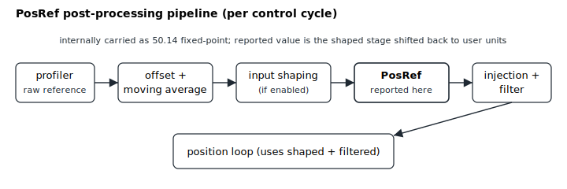

# PosRef

Position reference into the position loop, after profiler post-processing.

## Overview

`PosRef` is the position reference, in main user units, after the optional post-processing steps (offset, moving average, input shaping, injection and filter) applied to the value generated by the motion profiler. It is the input to the position loop: the position error [PosErr](PosErr.md) is `PosRef − Pos`, and the velocity reference [dPosRef](dPosRef.md) is its filtered derivative.

`PosRef` is read-only. It is not a single number but the *reported* end of a multi-stage reference pipeline that the controller maintains internally at higher precision (a 50.14 fixed-point accumulator) so that fractional motion accumulates without drift.

## How it works

### Reference pipeline

The motion profiler produces a raw target each control cycle; that value is then post-processed through several internal stages before it reaches the loop. Each stage is carried internally as a 64-bit fixed-point value scaled by `2^14`, and `PosRef` is reported by shifting the **shaped** reference back down to user units:

```text
profiler ─► raw reference ─► (offset / moving-average) ─► smoothed reference
         ─► [input shaping] ─► shaped reference ─► [injection] ─► [filter] ─► shaped+filtered reference ─► position loop
```



`PosRef` is reported from the shaped stage (the higher-precision value shifted back down to user units, with rounding). The fully post-processed value that the position loop actually subtracts the feedback from is the shaped-and-filtered reference, so the reported `PosRef` is one snapshot of this chain rather than the literal loop input after shaping/filtering — there can be a small per-cycle offset between what `PosRef` reads and what `PosErr` is computed against when input shaping, injection or the position filter is active.

### Software position-limit clamping

When the reference exceeds a software travel limit it is clamped to the limit rather than reported beyond it. See [FwdPLim](../../06-protections/03-motion/position-limit-protection/FwdPLim.md) and [RevPLim](../../06-protections/03-motion/position-limit-protection/RevPLim.md).

### Motor-off and simulation

While the motor is off the controller forces the reference to track the live feedback (`PosRef = Pos`), so position error is zero at the instant of enable and there is no jump. In **simulation** (`MotorType` = simulation, value 5) the controller feeds the shaped reference back in as the encoder reading, so the feedback [Pos](Pos.md) follows `PosRef` exactly.

### Modulo (ModRev)

If [ModRev](../../03-encoder/04-modulo-mode/ModRev.md) ≠ 0, when the feedback wraps the controller shifts the **whole reference frame** by `ModRev` in the same control cycle — the raw, smoothed, shaped and all of the shaped/filtered history values are offset together — so the following error is preserved across the wrap and `PosRef` stays inside the modulo frame.

### Edge cases

- **Motor off:** the reference is forced to follow [Pos](Pos.md); the profiler is bypassed.
- **Simulation mode (`MotorType` = 5):** the profiler runs as usual and [Pos](Pos.md) is forced equal to `PosRef`; the references are otherwise unchanged.
- **Software position limit hit:** `PosRef` is clamped to the limit (`PosErr` builds against the live feedback up to [MaxPosErr](../../06-protections/03-motion/general-maximum-limits/MaxPosErr.md), so a sustained block can still trigger a fault).
- **ModRev wrap:** all reference-pipeline stages and the gear-master are shifted together; `PosRef` stays inside `[0, ModRev)`.
- **Out-of-range write:** `PosRef` is read-only — writes are rejected.
- **Active fault:** axis disabled, `PosRef = Pos` is enforced.
- **Dual-loop / gantry:** `PosRef` itself is per-axis; the gantry common-mode/phase split happens downstream when computing [PosErr](PosErr.md) against [GantryFdbk](../../12-gantry-control/02-gantry-kinematic-feedback/GantryFdbk.md).

## Examples

```text
APosRef             ; read the current position reference
```

## Changes between versions

In **v5 (central-i)** the pipeline is 64-bit (`PosRef` is reported as a 64-bit value with the larger range shown in the frontmatter); the reference stages and clamping behaviour are the same. **v5 is central-i only**, so on standalone `PosRef` remains the v4 32-bit value.

## See also

- [PosErr](PosErr.md) — position error (`PosRef − Pos`)
- [dPosRef](dPosRef.md) — velocity reference, the filtered derivative of `PosRef`
- [Pos](Pos.md) — position feedback
- [ModRev](../../03-encoder/04-modulo-mode/ModRev.md) — modulo mode that shifts the whole reference frame
- [MotorType](../../02-motor-and-amplifier/MotorType.md) — simulation mode makes `Pos` follow `PosRef`
