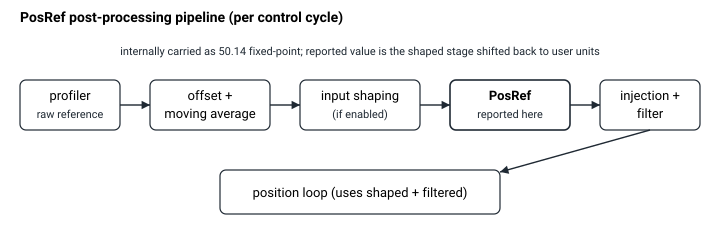

# PosRef

进入位置环的位置参考，经规划器后处理之后。

## 概述

`PosRef` 是位置参考，以主用户单位表示，是对运动规划器生成的值应用可选后处理步骤（偏置、移动平均、输入整形、注入和滤波）之后的结果。它是位置环的输入：位置误差 [PosErr](PosErr.md) 为 `PosRef − Pos`，速度参考 [dPosRef](dPosRef.md) 为其滤波后的微分。

`PosRef` 为只读。它并非单个数字，而是一条多级参考流水线的*报告*末端，控制器在内部以更高精度（50.14 定点累加器）维护该流水线，使得分数运动能够无漂移地累加。

## 工作原理

### 参考流水线

运动规划器每个控制周期产生一个原始目标值；该值随后经过若干内部级的后处理，然后才到达控制环。每一级在内部都以缩放 `2^14` 的 64 位定点值携带，`PosRef` 通过将**整形后**的参考值移回用户单位来报告：

```text
profiler ─► raw reference ─► (offset / moving-average) ─► smoothed reference
         ─► [input shaping] ─► shaped reference ─► [injection] ─► [filter] ─► shaped+filtered reference ─► position loop
```



`PosRef` 报告为整形并滤波后的参考值（即将更高精度的内部值移回用户单位，并带舍入）。这与位置环用于减去反馈的值完全相同，因此 `PosErr = PosRef − Pos` 所用的正是报告的 `PosRef`——即使输入整形、注入或位置滤波器处于激活状态，`PosRef` 的读数与 `PosErr` 计算所依据的值之间也没有偏差。

### 软件位置限位钳位

当参考值超出软件运动限位时，它被钳位到该限位，而非在超出后报告。参见 [FwdPLim](../../06-protections/03-motion/position-limit-protection/FwdPLim.md) 和 [RevPLim](../../06-protections/03-motion/position-limit-protection/RevPLim.md)。

### 电机失能与仿真

电机失能时，控制器强制参考值跟踪实时反馈（`PosRef = Pos`），因此在使能瞬间位置误差为零且不会跳变。在**仿真**中（`MotorType` = 仿真，值 5），控制器将整形后的参考值作为编码器读数回馈，因此反馈 [Pos](Pos.md) 精确跟随 `PosRef`。

### 取模（ModRev）

若 [ModRev](../../03-encoder/04-modulo-mode/ModRev.md) ≠ 0，当反馈环绕时，控制器在同一控制周期内将**整个参考坐标系**平移 `ModRev`——原始、平滑、整形以及所有整形/滤波历史值一起偏移——因此跟随误差在环绕过程中得以保持，且 `PosRef` 保持在取模坐标系内。

### 边界情况

- **电机失能：** 参考值被强制跟随 [Pos](Pos.md)；规划器被旁路。
- **仿真模式（`MotorType` = 5）：** 规划器照常运行，[Pos](Pos.md) 被强制等于 `PosRef`；其余参考值不变。
- **触及软件位置限位：** `PosRef` 被钳位到该限位（`PosErr` 会针对实时反馈累积，直至 [MaxPosErr](../../06-protections/03-motion/general-maximum-limits/MaxPosErr.md)，因此持续阻挡仍可能触发故障）。
- **ModRev 环绕：** 所有参考流水线级和齿轮主轴一起平移；`PosRef` 保持在 `[0, ModRev)` 内。
- **越界写入：** `PosRef` 为只读——写入被拒绝。
- **有效故障：** 轴被禁用，强制 `PosRef = Pos`。
- **双环 / 龙门：** `PosRef` 本身为按轴；龙门共模/相位拆分在下游针对 [GantryFdbk](../../12-gantry-control/02-gantry-kinematic-feedback/GantryFdbk.md) 计算 [PosErr](PosErr.md) 时进行。

## 示例

```text
APosRef             ; read the current position reference
```

## 版本间的差异

在 **v5（central-i）** 中，流水线为 64 位（`PosRef` 报告为 64 位值，范围更大，见 frontmatter）；参考级和钳位行为相同。**v5 仅适用于 central-i**，因此在独立产品上 `PosRef` 仍为 v4 的 32 位值。

## 另请参阅

- [PosErr](PosErr.md) — 位置误差（`PosRef − Pos`）
- [dPosRef](dPosRef.md) — 速度参考，`PosRef` 滤波后的微分
- [Pos](Pos.md) — 位置反馈
- [ModRev](../../03-encoder/04-modulo-mode/ModRev.md) — 平移整个参考坐标系的取模模式
- [MotorType](../../02-motor-and-amplifier/MotorType.md) — 仿真模式使 `Pos` 跟随 `PosRef`
