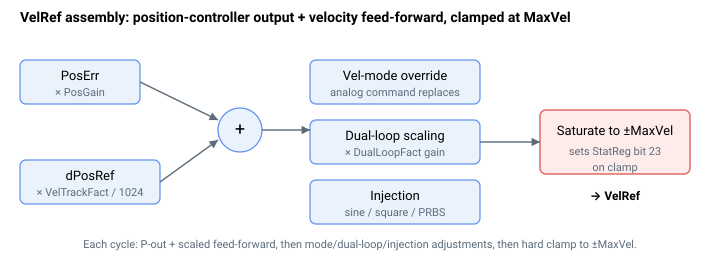

# VelRef

速度环参考/输入（位置控制器输出加上速度参考）。

## 概述

`VelRef` 是速度环参考/输入，单位为主用户单位每秒。它通常是位置控制器输出与（缩放后的）速度前馈之和，并作为速度环的输入。

`VelRef` 不可与速度参考 [dPosRef](dPosRef.md) 混淆：`dPosRef` 是位置参考的滤波微分，而 `VelRef` 还包含位置控制器输出。速度误差 [VelErr](VelErr.md) 由 `VelRef` 计算得出。其 frontmatter 范围窄于 ±2³¹，因为它被硬限幅至 ±[MaxVel](../../06-protections/03-motion/general-maximum-limits/MaxVel.md)（见下文）。

## 工作原理

仅当电机使能、换相已完成、轴不处于仿真且驱动器不是位置驱动时，才会构建 `VelRef`。构建过程分阶段进行。



### 1. 位置控制器输出 + 速度前馈

基础值是位置增益作用于 [PosErr](PosErr.md) 加上由 [dPosRef](dPosRef.md) 导出的速度前馈项：

$$
\text{VelRef} = \text{PosErr} \cdot \text{PosGain} + \frac{\text{dPosRef} \cdot \text{VelTrackFact}}{1024}
$$

在龙门模式下，使用龙门位置增益替代 [PosGain](../../11-control-tuning/03-position-control/PosGain.md)。乘积以 64 位计算，然后在存储前钳位到 32 位范围。

### 2. 双环与运行模式覆盖

| 阶段 | 影响 |
|-------|--------|
| 双环开启（[DualLoopOn](../../11-control-tuning/02-dual-loop-control/DualLoopOn.md) = 1） | `VelRef` 按由 [DualLoopFact](../../11-control-tuning/02-dual-loop-control/DualLoopFact.md) 导出的指令增益缩放 |
| 速度运行模式 | `VelRef` 被替换为滤波后的模拟速度指令 |
| FIFO 位置跟踪（如 EtherCAT CSP），运动中 | 添加用户位置跟踪偏置 |

### 3. 注入

如果 [InjectPoint](../../13-injection/InjectPoint.md) 指向速度参考，则测试信号（[InjectType](../../13-injection/InjectType.md)）会替换 `VelRef` 或叠加到 `VelRef` 上：

| 注入类型 | 对 `VelRef` 的操作 |
|-------------|--------------------|
| Sine direct | 用插值正弦替换 `VelRef` |
| Sine add | 将正弦叠加到位置环输出 |
| Square direct / add | 替换 / 叠加方波 |
| PRBS direct / add | 替换 / 叠加伪随机二进制序列（用于系统辨识） |

### 4. 饱和至 MaxVel

最后 `VelRef` 被硬限幅至 ±[MaxVel](../../06-protections/03-motion/general-maximum-limits/MaxVel.md)。发生饱和时，会设置 [StatReg](../../07-status-and-faults/StatReg.md) 的速度饱和位（bit 23），同时设置通用的“任意饱和”标志。该钳位即是 `VelRef` 报告值在 ±1.3e9 范围内而非完整 32 位范围的原因。

### 算例

当 `PosErr = 20`、`PosGain = 50`、`dPosRef = 100000` 用户单位/秒、`VelTrackFact = 1024` 且 `MaxVel = 1000000` 时，构建过程为：

```text
PosErr * PosGain                       = 20 * 50           = 1000
dPosRef * VelTrackFact / 1024          = 100000 * 1024/1024 = 100000
VelRef (before clamp)                                       = 101000
VelRef (after MaxVel clamp)                                 = 101000  ; within ±MaxVel
```

如果同样情形下 `MaxVel = 50000`，则钳位会将 `VelRef = 50000`，并在该周期设置 `StatReg` 的 bit 23（速度饱和）。

### 边界情况

- **电机失能 / 换相未完成 / 驱动器为位置驱动 / 仿真：** 本周期不构建 `VelRef`——其先前值仍保留在内存中，但不会驱动进入速度环。
- **活动故障：** 轴被禁用——不构建 `VelRef`。
- **ModRev 回绕：** `VelRef` 由 `PosErr` 和 `dPosRef` 构建，二者在回绕时均被保留，因此 `VelRef` 在回绕过程中连续。
- **超出范围写入：** `VelRef` 为只读。
- **双环：** 双环指令增益缩放在 `MaxVel` 钳位之前应用于已构建的 `VelRef`。
- **龙门：** 龙门位置增益在步骤 1 中替代 [PosGain](../../11-control-tuning/03-position-control/PosGain.md)；其余流程为按轴处理。
- **饱和：** `MaxVel` 钳位还会设置 [StatReg](../../07-status-and-faults/StatReg.md) 的 bit 23 和通用的“任意饱和”标志——即使未产生故障，也可用于标记整定问题。

## 示例

```text
AVelRef             ; read the velocity-loop reference
```

## 版本间变更

在 **v5（central-i）** 中，`VelRef` 为 64 位值，限幅至 ±`MaxVel`，且馈入它的位置控制器输出在比例增益之外还包含一个可选的**位置积分**项（[PosKi](../../11-control-tuning/03-position-control/PosKi.md)）和一个位置误差滤波器——因此 v5 的 `VelRef` 是 PI（+滤波器）+FFW 的输出，而 v4 是 P+FFW。双环、运行模式、FIFO 偏置、注入和 `MaxVel` 饱和各阶段保持不变。**v5 仅限 central-i。**

## 另请参阅

- [dPosRef](dPosRef.md) — 速度前馈来源（不同信号）
- [VelErr](VelErr.md) — 速度误差（`VelRef − Vel[1]`）
- [Vel](Vel.md) — 反馈速度数组
- [PosErr](PosErr.md) / [PosGain](../../11-control-tuning/03-position-control/PosGain.md) — 位置控制器输入
- [VelTrackFact](../../11-control-tuning/04-velocity-control/VelTrackFact.md) — 速度前馈增益
- [MaxVel](../../06-protections/03-motion/general-maximum-limits/MaxVel.md) — 饱和限值
- [StatReg](../../07-status-and-faults/StatReg.md) — bit 23（速度饱和）标记针对 `MaxVel` 的钳位
- [DualLoopFact](../../11-control-tuning/02-dual-loop-control/DualLoopFact.md) — 双环指令缩放
