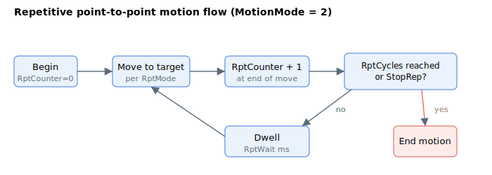

# Motion configuration

Before commanding a move, the motion properties are configured. [MotionMode](MotionMode.md) selects what kind of motion runs when [Begin](../04-motion-command/Begin.md) is issued, and [JerkMode](JerkMode.md) selects the profiler order. For repetitive point-to-point motion the [RptMode](RptMode.md), [RptCycles](RptCycles.md) and [RptWait](RptWait.md) keywords control how the move repeats, as shown below.

Below is the summary of all relevant keywords.

| No. | Keyword | Summary |
|-----|---------|---------|
| 1 | [MotionMode](MotionMode.md) | Selects the type of motion performed when `Begin` is issued. |
| 2 | [JerkMode](JerkMode.md) | Selects the point-to-point profiler order (second or third order). |
| 3 | [PTPKeepMoving](PTPKeepMoving.md) | Lets a new `Begin` blend into the existing move instead of stopping first. |
| 4 | [RptMode](RptMode.md) | Selects bidirectional or unidirectional repetitive motion. |
| 5 | [RptCycles](RptCycles.md) | Number of repetitions; `0` repeats indefinitely. |
| 6 | [RptWait](RptWait.md) | Dwell time, in milliseconds, between repetitions. |

The running repetition count is reported by [RptCounter](../05-motion-status/RptCounter.md) in the motion-status section.
