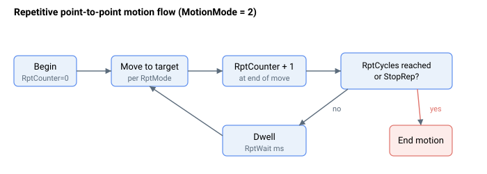

# 运动配置

在下发移动指令之前，需先配置运动属性。[MotionMode](MotionMode.md) 选择当下发 [Begin](../04-motion-command/Begin.md) 时运行何种运动，[JerkMode](JerkMode.md) 选择规划器阶数。对于重复点到点运动，[RptMode](RptMode.md)、[RptCycles](RptCycles.md) 和 [RptWait](RptWait.md) 关键字控制移动如何重复，如下所示。

下面是所有相关关键字的汇总。

| No. | Keyword | Summary |
|-----|---------|---------|
| 1 | [MotionMode](MotionMode.md) | 选择下发 `Begin` 时执行的运动类型。 |
| 2 | [JerkMode](JerkMode.md) | 选择点到点规划器阶数（二阶或三阶）。 |
| 3 | [PTPKeepMoving](PTPKeepMoving.md) | 让新的 `Begin` 融入现有移动，而非先停止。 |
| 4 | [RptMode](RptMode.md) | 选择双向或单向重复运动。 |
| 5 | [RptCycles](RptCycles.md) | 重复次数；`0` 表示无限重复。 |
| 6 | [RptWait](RptWait.md) | 重复之间的停留时间，单位为毫秒。 |

正在运行的重复计数由运动状态部分的 [RptCounter](../05-motion-status/RptCounter.md) 报告。

## 整形关键字与限值关键字

有两组关键字与移动交互，它们具有不同的作用：

- **整形关键字** — [Speed](../03-kinematics-configuration/Speed.md)、[Accel](../03-kinematics-configuration/Accel.md) 和 [Decel](../03-kinematics-configuration/Decel.md) 定义规划器在*规划*（间接）模式下生成的轨迹：它所朝向斜坡逼近的巡航速度以及它所规划的加速度/减速度斜率。这些是规划器本身用于构建轨迹的唯一运动学值。
- **限值关键字** — [MaxVel](../../06-protections/03-motion/general-maximum-limits/MaxVel.md) 和 [MaxAcc](../../06-protections/03-motion/general-maximum-limits/MaxAcc.md) 是保护上限。规划器在生成轨迹时**不**读取它们；它们改为在两个独立位置起作用：
  - **在 `Begin` 时（准入检查）。** [Begin](../04-motion-command/Begin.md) 会以错误码 271 拒绝 `Speed` 超过 `MaxVel` 的间接移动，并且在 central-i v5 上还会以错误码 324 拒绝 `Accel` 或 `Decel` 超过 `MaxAcc` 的点动或 PTP 系列移动。
  - **在速度环中（连续钳位）。** 每个控制采样，速度参考被硬钳位至 ±`MaxVel`；当其钳位时，会设置 [StatReg](../../07-status-and-faults/StatReg.md) 的速度饱和位（bit 23）。由于被钳位的参考是位置控制器输出加上速度前馈——而非原始的规划巡航速度——因此即使 `Speed` 处于或低于 `MaxVel`，该钳位也可能触发（例如，在较大跟随误差时）。监视 [StatReg](../../07-status-and-faults/StatReg.md) 的 bit 23 和 [VelRef](../01-kinematics-status/VelRef.md) 以检测它。

实用规则：保持 `Speed` 处于或低于 `MaxVel`，并（在 v5 上）保持 `Accel`/`Decel` 处于或低于 `MaxAcc`，以使移动通过 `Begin` 准入检查；并保留裕量，使下游速度钳位在瞬态期间不触发。
