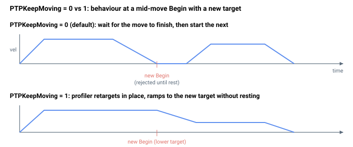

# PTPKeepMoving

允许新的 `Begin` 融入现有运动，而无需先停止。

## 概述

`PTPKeepMoving` 控制在前一个点到点运动完成之前发出新的 [Begin](../04-motion-command/Begin.md) 命令时所发生的行为。当设置为 `1` 时，轴会平滑融入新目标（[AbsTrgt](../13-motion-mode-ptp/AbsTrgt.md) / [RelTrgt](../13-motion-mode-ptp/RelTrgt.md)）而无需先停止，这对于动态重定目标很有用。当设置为 `0` 时，只有在当前运动结束后才会接受新的 `Begin`。它是一个轴相关参数，不保存至闪存，可在任何时候更改，包括在运动过程中。

## 工作原理

在正常的点到点运动中，规划器在到达目标且速度足够低时即宣告运动完成 —— 它进入曲线平滑尾段（[MotionStat](../05-motion-status/MotionStat.md) 位 6），并最终清除 `MotionStat` 的运动中位。当 `PTPKeepMoving = 1` 时，控制器**完全跳过该运动结束测试**，因此轴保持在运动中状态，规划器无限期地持续跟踪 [AbsTrgt](../13-motion-mode-ptp/AbsTrgt.md)。

由于运动从不报告"完成"，一个新的 `Begin`（带有新的 `AbsTrgt`/`RelTrgt`）会对已在运行的规划器重定目标，规划器从当前速度而非从静止开始向新目标加减速 —— 从而产生融合。当 `PTPKeepMoving = 0` 时，运动正常完成，因此在运动过程中发出的 `Begin` 受通常的运动中规则约束。

同一个点到点规划器由单次 PTP（[MotionMode](MotionMode.md) `= 1`）和重复 PTP（`MotionMode = 2`）共用，因此 `PTPKeepMoving` 在两者中都会被查询。对于重复 PTP，应将其保持为 `0`：将其设置为 `1` 会抑制段结束完成，因此段永远不会报告完成，[RptCounter](../05-motion-status/RptCounter.md) 永远不会递增，重复也无法推进。摇杆位置模式（`MotionMode = 12` 和 `13`）是独立的无限期运动，不受 `PTPKeepMoving` 影响。它对点动、电子齿轮、ECAM 或其他模式没有影响。



## 示例

```text
APTPKeepMoving=1     ; blend into a new target without stopping
APTPKeepMoving=0     ; require the move to complete first
APTPKeepMoving      ; query state
```

### 实例：动态重定目标

```text
AMotionMode=1        ; PTP
APTPKeepMoving=1     ; allow blend
AAbsTrgt=100000      ; first target
ABegin               ; start the move
; ... while the axis is still moving toward 100000:
AAbsTrgt=140000      ; profiler retargets to the new value, no stop, no re-Begin
```

如果没有 `PTPKeepMoving = 1`，第二个 `AAbsTrgt` 只会被搁置以待下一次运动 —— 正在运行的运动仍将以原始的 100000 为目标。设置该值后，规划器每个周期读取更新后的 `AbsTrgt` 并将轴加减速至新目的地，融合轨迹。

对于增量重定目标，在轴处于运动中**且** `PTPKeepMoving = 1` 时写入 [RelTrgt](../13-motion-mode-ptp/RelTrgt.md) 会自动将写入的 `RelTrgt` 加到当前的 `AbsTrgt` 上（因此融合按该增量偏移）。该更新以原子方式应用，因此即使同一时刻发生 `ModRev` 环绕，它也保持正确 —— 这是在 `ModRev` 处于激活状态时进行增量动态重定目标的预期方式。在运动中融合之外，写入 `AbsTrgt` 会将 `RelTrgt` 清零为 `0`。

### 边界情况

- **电机失能：** 该参数被保持；它会在下一次 `Begin` 时被读取。
- **超范围写入：** 参数系统拒绝 `0`–`1` 之外的值。
- **仿真模式（`MotorType` = 5）：** 行为相同（规划器在仿真中运行）。
- **ModRev 环绕：** 融合可贯穿环绕，因为环绕会将 `AbsTrgt` 和参考状态一起按 `ModRev` 偏移；融合会向环绕后的目标加减速。
- **激活的故障：** 无论 `PTPKeepMoving` 如何，轴都会被禁用且运动中位被清除。
- **重复 PTP（`MotionMode = 2`）：** 将 `PTPKeepMoving = 0` 保持不变。因为重复模式共用 PTP 规划器及其段结束测试，将 `PTPKeepMoving = 1` 会抑制段完成并使重复停止推进 —— [RptCounter](../05-motion-status/RptCounter.md) 永远不会递增。重复在其他方面由 [RptCounter](../05-motion-status/RptCounter.md)/[RptCycles](RptCycles.md) 和 [StopRep](../04-motion-command/StopRep.md) 管理。
- **Stop/Abort：** 无论 `PTPKeepMoving` 如何，`Stop` 和 `Abort` 都会结束运动（停止请求位优先）。

## 参见

- [Begin](../04-motion-command/Begin.md) —— 启动（或重定目标）运动
- [AbsTrgt](../13-motion-mode-ptp/AbsTrgt.md) —— 绝对目标位置
- [RelTrgt](../13-motion-mode-ptp/RelTrgt.md) —— 相对目标位置
- [MotionMode](MotionMode.md) —— 适用于点到点（模式 1）和重复 PTP（模式 2）
- [MotionStat](../05-motion-status/MotionStat.md) —— `PTPKeepMoving` 所保持置位的运动中位
