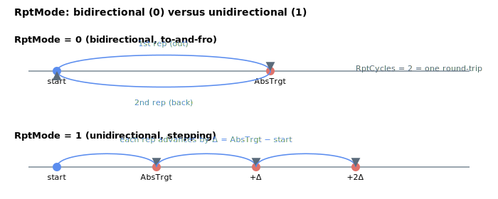

# RptMode

Selects whether repetitive point-to-point motion is bidirectional or unidirectional.

## Overview

`RptMode` defines whether repetitive motion is bidirectional (to-and-fro) or unidirectional (stepping ever further away), which is useful for repeated step-motion applications. It is used only when [MotionMode](MotionMode.md) = 2 (repetitive point-to-point motion), and it also determines what one repetition means for the [RptCycles](RptCycles.md) count. It cannot be changed while the axis is in motion.

## How it works

| RptMode | Descriptions |
|---|---|
| 0 | **Bidirectional motion** Axis will move to AbsTrgt (or relative location defined by RelTrgt) and then back to initial location. 1 repetition number equals to 1 motion to AbsTrgt (or relative location defined by RelTrgt), or 1 motion back to initial position This means RptCycles = 2 equals to one set of to-and-fro motion. |
| 1 | **Unidirectional motion** Axis will always move at the position delta of (AbsTrgt – initial position) or RelTrgt, where axis will move further and further away. 1 repetition number equals 1 delta motion. |



### How the return target is computed

When the move begins, the controller records the starting reference and sets up the *next* repetition target according to `RptMode` (re-applied at each dwell):

| RptMode | Next target each repetition |
|---|---|
| 0 (bidirectional) | `next target = position at Begin` — the move goes out to `AbsTrgt`, then the next move targets the original start, alternating out/back forever. |
| 1 (unidirectional) | `next target = AbsTrgt + (AbsTrgt − position at Begin)` — each repetition advances by the same delta, so the axis keeps stepping the same distance in one direction. |

If [RelTrgt](../13-motion-mode-ptp/RelTrgt.md) ≠ 0 the absolute target is first derived as `AbsTrgt = PosRef + RelTrgt`. At `Begin` both `AbsTrgt` and the computed next target are range-checked against the software position limits [FwdPLim](../../06-protections/03-motion/position-limit-protection/FwdPLim.md)/[RevPLim](../../06-protections/03-motion/position-limit-protection/RevPLim.md), so for unidirectional mode the *first* and *second* repetition targets must already lie inside the limits. Subsequent step targets are not pre-checked at `Begin`; if the stepping motion ever advances past `FwdPLim`/`RevPLim`, the per-cycle clamp on `AbsTrgt` inside the PTP profiler will pin the reference to the limit and the axis will stall there rather than fault.

### Edge cases

- **Motor off:** the value is held; it is read on the next `Begin`.
- **Out-of-range write:** the parameter system rejects values outside `0`–`1`.
- **Simulation mode (`MotorType` = 5):** behaviour identical; the profiler runs in simulation.
- **ModRev wrap:** for a unidirectional move that keeps stepping in one direction, the wrap will fire each time the reference crosses the modulus boundary, shifting all reference state by `ModRev`; the per-step delta is unaffected by the wrap.
- **Active fault:** the axis is disabled and the repetition is abandoned; on re-enable, the next `Begin` starts a fresh repetition.
- **Other motion modes:** `RptMode` is ignored outside [MotionMode](MotionMode.md) `= 2`.
- **`RptCycles = 1`:** the move runs once (the "out" leg in bidirectional, the first step in unidirectional) and then ends — the value of `RptMode` does not change that one-shot behaviour, but it does change the next target that would be computed (just not used).
- **`RptWait = 0`:** the move flows directly from one repetition into the next with no dwell; `RptMode` still chooses bidirectional/unidirectional in exactly the same way.
- **Cannot change in motion:** writes are rejected while the axis is in motion (the `NOMOTN` flag).

## Examples

```text
ARptMode=0           ; bidirectional (to-and-fro)
ARptMode=1           ; unidirectional (stepping away)
ARptMode            ; query current value
```

## See also

- [MotionMode](MotionMode.md) — must be 2 for `RptMode` to apply
- [RptCycles](RptCycles.md) — number of repetitions (one leg vs one step depends on `RptMode`)
- [RptWait](RptWait.md) — dwell time between repetitions
- [RelTrgt](../13-motion-mode-ptp/RelTrgt.md) / [AbsTrgt](../13-motion-mode-ptp/AbsTrgt.md) — define the per-repetition target
- [FwdPLim](../../06-protections/03-motion/position-limit-protection/FwdPLim.md) / [RevPLim](../../06-protections/03-motion/position-limit-protection/RevPLim.md) — targets are range-checked at `Begin`
