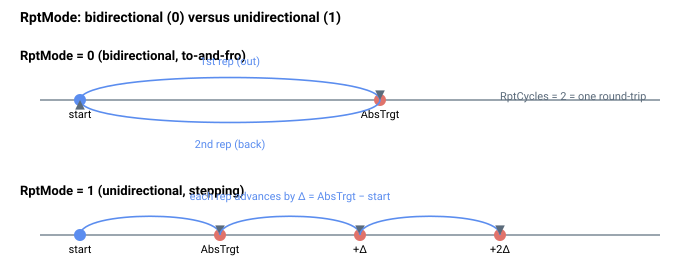

# RptMode

选择重复点到点运动是双向还是单向。

## 概述

`RptMode` 定义重复运动是双向（往返）还是单向（不断向更远处步进），这对于重复步进运动应用很有用。它仅在 [MotionMode](MotionMode.md) = 2（重复点到点运动）时使用，并且它还决定一次重复对于 [RptCycles](RptCycles.md) 计数意味着什么。它无法在轴运动中更改。

## 工作原理

| RptMode | Descriptions |
|---|---|
| 0 | **双向运动** 轴将移动到 AbsTrgt（或由 RelTrgt 定义的相对位置），然后返回初始位置。1 个重复次数等于 1 次到 AbsTrgt（或由 RelTrgt 定义的相对位置）的运动，或 1 次返回初始位置的运动。这意味着 RptCycles = 2 等于一组往返运动。 |
| 1 | **单向运动** 轴将始终以 (AbsTrgt – 初始位置) 或 RelTrgt 的位置增量移动，轴会越来越远。1 个重复次数等于 1 次增量运动。 |



### 返回目标如何计算

当运动开始时，控制器记录起始参考值，并根据 `RptMode` 设置*下一次*重复目标（在每次停留时重新应用）：

| RptMode | 每次重复的下一个目标 |
|---|---|
| 0（双向） | `next target = position at Begin` —— 运动去往 `AbsTrgt`，然后下一次运动以原始起点为目标，永久交替往返。 |
| 1（单向） | `next target = AbsTrgt + (AbsTrgt − position at Begin)` —— 每次重复前进相同的增量，因此轴在一个方向上持续步进相同的距离。 |

若 [RelTrgt](../13-motion-mode-ptp/RelTrgt.md) ≠ 0，则首先将绝对目标推导为 `AbsTrgt = PosRef + RelTrgt`。在 `Begin` 时，`AbsTrgt` 和计算出的下一个目标都会针对软件位置限位 [FwdPLim](../../06-protections/03-motion/position-limit-protection/FwdPLim.md)/[RevPLim](../../06-protections/03-motion/position-limit-protection/RevPLim.md) 进行范围检查，因此对于单向模式，*第一个*和*第二个*重复目标必须已经位于限位之内。后续的步进目标在 `Begin` 时不会预先检查；如果步进运动越过了 `FwdPLim`/`RevPLim`，PTP 规划器内对 `AbsTrgt` 的每周期钳位会将参考值钉在限位处，轴将在该处堵转而非触发故障。

### 边界情况

- **电机失能：** 值被保持；它会在下一次 `Begin` 时被读取。
- **超范围写入：** 参数系统拒绝 `0`–`1` 之外的值。
- **仿真模式（`MotorType` = 5）：** 行为相同；规划器在仿真中运行。
- **ModRev 环绕：** 对于在一个方向上持续步进的单向运动，每次参考值越过取模边界时环绕都会触发，将所有参考状态按 `ModRev` 偏移；每步增量不受环绕影响。
- **激活的故障：** 轴被禁用，重复被放弃；在重新使能时，下一次 `Begin` 会开始一次全新的重复。
- **其他运动模式：** `RptMode` 在 [MotionMode](MotionMode.md) `= 2` 之外被忽略。
- **`RptCycles = 1`：** 运动运行一次（双向中的"去程"段，单向中的第一步），然后结束 —— `RptMode` 的值不会改变这种一次性行为，但它确实会改变将要计算的下一个目标（只是不被使用）。
- **`RptWait = 0`：** 运动从一次重复直接流入下一次，没有停留；`RptMode` 仍以完全相同的方式选择双向/单向。
- **无法在运动中更改：** 在轴运动中写入会被拒绝。

## 示例

```text
ARptMode=0           ; bidirectional (to-and-fro)
ARptMode=1           ; unidirectional (stepping away)
ARptMode            ; query current value
```

## 另请参阅

- [MotionMode](MotionMode.md) —— 必须为 2，`RptMode` 才适用
- [RptCycles](RptCycles.md) —— 重复次数（一段还是一步取决于 `RptMode`）
- [RptWait](RptWait.md) —— 重复之间的停留时间
- [RelTrgt](../13-motion-mode-ptp/RelTrgt.md) / [AbsTrgt](../13-motion-mode-ptp/AbsTrgt.md) —— 定义每次重复的目标
- [FwdPLim](../../06-protections/03-motion/position-limit-protection/FwdPLim.md) / [RevPLim](../../06-protections/03-motion/position-limit-protection/RevPLim.md) —— 目标在 `Begin` 时进行范围检查
