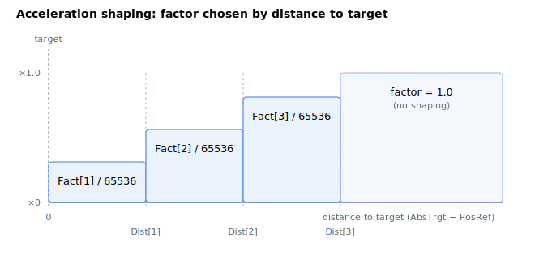

# AccShapeOn

Enables acceleration shaping to reduce vibration via a shaped acceleration curve.

## Overview

`AccShapeOn` enables the acceleration-shaping feature, which modifies the acceleration profile to reduce mechanical vibration by applying a shaped (filtered) acceleration curve. When set to `1`, the [AccShapeDist](AccShapeDist.md) and [AccShapeFact](AccShapeFact.md) arrays define the shaping profile applied on top of the base [Accel](Accel.md) ramp. It is an axis-related parameter saved to flash and can be changed at any time, including during motion.

## How it works

Acceleration shaping scales the acceleration (and deceleration) used by the profiler as a function of the **remaining distance to the target**, using a 10-entry lookup table. While `AccShapeOn != 0`, each control cycle the profiler computes the distance to target `d = |AbsTrgt − PosRef|` and finds the first table segment whose distance threshold exceeds `d`:

```text
if d < AccShapeDist[1]      factor = AccShapeFact[1]  / 65536
else if d < AccShapeDist[2] factor = AccShapeFact[2]  / 65536
   ... up to ...
else if d < AccShapeDist[10] factor = AccShapeFact[10] / 65536
else                         factor = 1.0
```

The chosen `factor` then multiplies both the acceleration and the deceleration limits for that cycle:

```text
AccelFinal = Accel × AccelFact × factor
DecelFinal = Decel × AccelFact × factor
```

So the segments are keyed by *distance from the target* (the table is consulted nearest-to-target first), letting you taper the acceleration as the axis closes in, which softens the approach and suppresses residual vibration. Beyond the largest distance threshold the factor is `1.0`, i.e. no shaping — the full acceleration is used during the bulk of the move.

The [AccShapeFact](AccShapeFact.md) entries are **fixed-point fractions scaled by 65536**, so `65536` means ×1.0, `32768` means ×0.5, and `0` means no acceleration in that band. Whenever any element of [AccShapeDist](AccShapeDist.md) or [AccShapeFact](AccShapeFact.md) is written, the controller re-sorts the (distance, factor) pairs into ascending distance order so the lookup above always scans from the smallest distance upward — you do not have to enter the table pre-sorted.



### Edge cases

- **Motor off:** value is held; no profiler computation runs.
- **Out-of-range write:** the parameter system rejects values outside `0`–`1`.
- **Simulation mode (`MotorType` = 5):** unchanged.
- **ModRev wrap:** the distance `|AbsTrgt − PosRef|` is computed after the wrap shifts both values together, so shaping behaves consistently through a wrap.
- **Active fault:** the axis is disabled; on re-enable and next `Begin`, `AccShapeOn` is re-read.
- **Other motion modes:** consumed only by the PTP-family profiler (jog, PTP, repetitive PTP). Direct modes and the structured jerk profiler (third-order [JerkMode](../02-motion-configuration/JerkMode.md)) ignore `AccShapeOn`.
- **Live change in motion:** allowed; takes effect on the next control cycle.
- **Shaping with EmrgDec:** when [EmrgDec](EmrgDec.md) replaces `Decel` for a limit/controlled-stop halt, the shaping factor is **not** applied (the stop uses the unshaped `EmrgDec × AccelFact`).

## Examples

```text
AAccShapeOn=1        ; enable acceleration shaping
AAccShapeOn=0        ; disable acceleration shaping
AAccShapeOn         ; query state
```

## See also

- [AccShapeDist](AccShapeDist.md) — per-segment shaping distances
- [AccShapeFact](AccShapeFact.md) — per-segment shaping factors
- [Accel](Accel.md) — base acceleration that shaping modifies
