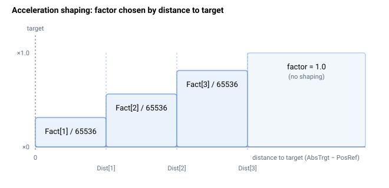

# AccShapeOn

通过整形后的加速度曲线启用加速度整形以降低振动。

## 概述

`AccShapeOn` 启用加速度整形功能，该功能通过施加一条整形（滤波）后的加速度曲线来修改加速度曲线，从而降低机械振动。当设置为 `1` 时，[AccShapeDist](AccShapeDist.md) 和 [AccShapeFact](AccShapeFact.md) 数组定义了叠加在基础 [Accel](Accel.md) 斜坡之上的整形曲线。它是一个保存至闪存的轴相关参数，可在任意时刻更改，包括在运动过程中。

## 工作原理

加速度整形将运动规划器所使用的加速度（及减速度）按照**到目标的剩余距离**进行缩放，使用一个 10 项的查找表。当 `AccShapeOn != 0` 时，每个控制周期运动规划器都会计算到目标的距离 `d = |AbsTrgt − PosRef|`，并查找第一个距离阈值超过 `d` 的表段：

```text
if d < AccShapeDist[1]      factor = AccShapeFact[1]  / 65536
else if d < AccShapeDist[2] factor = AccShapeFact[2]  / 65536
   ... up to ...
else if d < AccShapeDist[10] factor = AccShapeFact[10] / 65536
else                         factor = 1.0
```

随后所选的 `factor` 会同时乘以该周期的加速度限值和减速度限值：

```text
AccelFinal = Accel × AccelFact × factor
DecelFinal = Decel × AccelFact × factor
```

因此各表段是以*到目标的距离*为键的（查表从最接近目标处开始），使你能够在轴接近目标时逐渐减小加速度，从而柔化接近过程并抑制残余振动。在超过最大距离阈值之后，因子为 `1.0`，即不进行整形——在运动的主体阶段使用完整的加速度。

[AccShapeFact](AccShapeFact.md) 各项为**按 65536 缩放的定点小数**，因此 `65536` 表示 ×1.0，`32768` 表示 ×0.5，`0` 表示该区段内无加速度。每当写入 [AccShapeDist](AccShapeDist.md) 或 [AccShapeFact](AccShapeFact.md) 的任意元素时，控制器都会将 (distance, factor) 对按距离升序重新排序，使上述查表过程始终从最小距离向上扫描——你无需预先排序后再录入该表。



### 边界情况

- **电机失能：** 数值保持不变；不运行运动规划器计算。
- **越界写入：** 参数系统拒绝 `0`–`1` 之外的值。
- **仿真模式（`MotorType` = 5）：** 行为不变。
- **ModRev 环绕：** 距离 `|AbsTrgt − PosRef|` 是在环绕将两个值一起平移之后计算的，因此整形在环绕过程中保持一致的行为。
- **存在活动故障：** 轴被禁用；重新使能并下一次 `Begin` 时会重新读取 `AccShapeOn`。
- **其他运动模式：** 仅由 PTP / 重复 PTP 运动规划器以及间接位置跟随和间接齿轮跟随运动规划器查询。点动、操纵杆速度模式以及所有直接模式**不会**查询整形表，并忽略 `AccShapeOn`。在应用整形之处，整形因子会在运动规划器依据 [JerkMode](../02-motion-configuration/JerkMode.md) 分支之前对加速度/减速度进行缩放，因此对于这些运动它也会影响三阶加加速度规划器（`JerkMode = 1`）。
- **运动中实时更改：** 允许；在下一个控制周期生效。
- **整形与 EmrgDec：** 当 [EmrgDec](EmrgDec.md) 在限位/受控停止的停车中替代 `Decel` 时，**不**施加整形因子（停车使用未整形的 `EmrgDec × AccelFact`）。

## 示例

```text
AAccShapeOn=1        ; enable acceleration shaping
AAccShapeOn=0        ; disable acceleration shaping
AAccShapeOn         ; query state
```

## 参见

- [AccShapeDist](AccShapeDist.md) — 各表段的整形距离
- [AccShapeFact](AccShapeFact.md) — 各表段的整形因子
- [Accel](Accel.md) — 整形所修改的基础加速度
