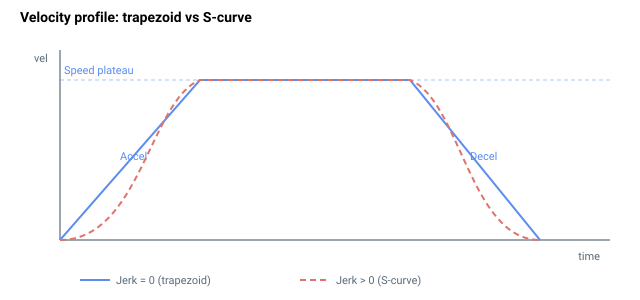

# Decel

点到点运动的减速度，单位为用户单位每秒平方。

## 概述

`Decel` 是轨迹规划器用于在运动结束时将轴从指令 [Speed](Speed.md) 减速至静止的减速度限值。它是 [Accel](Accel.md) 的对应参数，同时也是受控 [Stop](../04-motion-command/Stop.md) 时所使用的速率。在限位开关（RLS/FLS）、软件位置限位（FwdPLim/RevPLim）或受控停止输入触发时，规划器会以单独设置的、通常更大的 [EmrgDec](EmrgDec.md) 替代本参数。而 [Abort](../04-motion-command/Abort.md) 与此不同，它**不**使用任何速率——它立即清除运动中状态位，由位置环保持最后一个参考位置。与 `Accel` 一样，`Decel` 受 [AccelFact](AccelFact.md) 缩放，并根据 [JerkMode](../02-motion-configuration/JerkMode.md) 由 [Jerk](Jerk.md) / [JerkInDec](JerkInDec.md) 进行平滑处理。

`Decel` 为读写型、轴作用域，并保存至闪存。可在任意时刻更改，包括运动过程中——规划器每个控制周期重新读取该值。



## 工作原理

### 每个周期的有效减速度

每个控制周期，规划器将 `Decel` 与 [AccelFact](AccelFact.md) 的乘积作为有效减速度：

$$
\text{Decel}_{\text{eff}} = \text{Decel} \cdot \text{AccelFact}
$$

### 减速距离超前计算

`Decel` 是规划器规划停止点所使用的速率。规划器每个周期计算轴在当前位置能够使用 `Decel_eff` 恰好停止于 [AbsTrgt](../13-motion-mode-ptp/AbsTrgt.md) 处的最大速度：

$$
v_{\text{dec}} = -\text{Decel}_{\text{eff}}\,T_s + \sqrt{\text{Decel}_{\text{eff}}^{2}\,T_s^{2} + 2\,\text{Decel}_{\text{eff}}\,(\text{target} - \text{PosRef})\,T_s}
$$

当上升阶段的规划器速度超过此 `v_dec` 时，规划器将速度钳位至 `v_dec`，运动进入减速阶段（减速运动状态位被置位）。因此，`Decel` 设定梯形速度曲线的**后沿斜率**。较大的 `Decel` 使轴可以更长时间保持 `Speed`，制动更晚；较小的 `Decel` 则更早开始制动，且制动起始速度更低。

`Decel` 也用作规划器速度与请求方向相反时（即反向运动时）的制动速率。

### 软件限位制动

在点动/摇杆运动中，对软件位置限位（[FwdPLim](../../06-protections/03-motion/position-limit-protection/FwdPLim.md)/[RevPLim](../../06-protections/03-motion/position-limit-protection/RevPLim.md)）同样进行基于 `Decel` 的超前计算，以使轴在限位处减速至静止。

### EmrgDec 替代 Decel 的情形

当运动因限位开关（RLS/FLS）、软件位置限位（[FwdPLim](../../06-protections/03-motion/position-limit-protection/FwdPLim.md)/[RevPLim](../../06-protections/03-motion/position-limit-protection/RevPLim.md)）或受控停止输入而结束时，规划器以 [EmrgDec](EmrgDec.md) 替代 `Decel`，并在该停止过程中禁用急动度平滑（`JerkMode` 强制为 `0`）。正常的 [Stop](../04-motion-command/Stop.md) 指令仍使用 `Decel`。[Abort](../04-motion-command/Abort.md) 则完全不同——它不进行任何斜坡减速（运动中状态位立即清除，位置环保持最后一个参考位置）；`Decel` 和 `EmrgDec` 均不被参考。

### 三阶模式

在三阶模式（[JerkMode](../02-motion-configuration/JerkMode.md) = 1）下，`Decel` 是传递给结构化急动度规划器的**峰值减速度**约束；减速度本身以 [JerkInDec](JerkInDec.md) 设定的速率进行斜坡变化。

### 边界情况

- **电机关闭：** 参数值保持不变；规划器不运行。
- **超范围写入：** 参数系统将写入值钳位至 `100`–`2,000,000,000`；超出范围的值将被拒绝。
- **仿真模式（`MotorType` = 5）：** 行为不变；规划器在仿真中运行。
- **ModRev 环绕：** 与此参数无关——`Decel` 是运动学速率，而非位置。
- **激活故障：** 轴被禁用，规划器停止；下一次 `Begin` 将重新读取 `Decel`。
- **其他运动模式：** 适用于点动、PTP、重复 PTP、PD 间接、电子齿轮间接和摇杆间接模式。直接模式直接驱动位置指令，忽略 `Decel`，但受控停止期间除外。
- **摇杆速度直接模式（`MotionMode = 14`）：** 内部减速度设置为极大值（近似瞬时）；用户 `Decel` 仅在停止斜坡期间使用。
- **回零期间：** 当回零序列启动时，控制器保存当前 `Decel`（连同 `Speed`、`Accel`、`EmrgDec` 和 `JerkMode`），并可能以回零定义中的各步骤减速度覆盖；回零完成后恢复保存的值，回零期间急动度平滑强制关闭。
- **不能为零：** 最小值为 `100` 用户单位/s²，以保证规划器运算有限。

## 示例

```text
ADecel=200000        ; set deceleration to 200000 user units/s^2
ADecel               ; read current deceleration
```

## 版本变更

在 **v4** 中，`Decel` 为 32 位整数；在 **v5 (central-i)** 中，为单精度浮点数。超前计算、`AccelFact` 缩放、`EmrgDec` 替代以及急动度交互行为保持不变。**v5 仅适用于 central-i。**

## 另请参阅

- [Accel](Accel.md) — 加速度（梯形曲线的前沿斜率）
- [Speed](Speed.md) — 减速前的巡航速度
- [AccelFact](AccelFact.md) — 作用于 `Decel` 的整数乘数
- [EmrgDec](EmrgDec.md) — 限位开关/软件限位/受控停止输入触发停止时使用的紧急减速度
- [Jerk](Jerk.md) — 斜坡的二阶 S 形平滑
- [JerkInDec](JerkInDec.md) — 三阶模式下减速阶段的急动度
- [JerkMode](../02-motion-configuration/JerkMode.md) — 选择二阶或三阶规划
- [Stop](../04-motion-command/Stop.md) — 受控停止（使用 `Decel`）
- [FwdPLim](../../06-protections/03-motion/position-limit-protection/FwdPLim.md) / [RevPLim](../../06-protections/03-motion/position-limit-protection/RevPLim.md) — 软件限位使用 `Decel` 超前计算进行预防性制动
