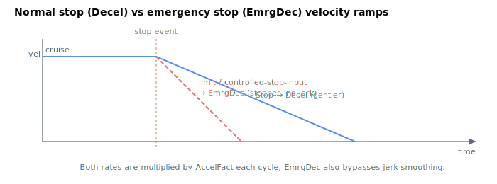

# EmrgDec

Emergency deceleration rate applied on a limit-switch, software-limit or controlled-stop-input halt, in user units per second squared.

## Overview

`EmrgDec` is the deceleration rate the profiler substitutes for [Decel](Decel.md) when a move is halted by a limit switch, a software position limit, or a controlled-stop input rather than by a normal [Stop](../04-motion-command/Stop.md). It is usually set higher than `Decel` so the axis comes to rest as quickly as it safely can. [Abort](../04-motion-command/Abort.md) is a separate path — it clears the in-motion bits instantly and does not consult `EmrgDec`. It is read/write, axis-scoped, saved to flash, and can be changed at any time, including during motion.

## How it works

`EmrgDec` is not used during a normal move. The profiler swaps it in for the deceleration rate only when the [MotionReason](../05-motion-status/MotionReason.md) is one of the emergency/limit cases:

| Stop condition ([MotionReason](../05-motion-status/MotionReason.md) value) | Stop rate used |
|---------------|----------------|
| Reverse / forward limit switch (`MotionReason` = 4 / 5) | `EmrgDec × AccelFact` |
| Reverse / forward software position limit (`MotionReason` = 6 / 7) | `EmrgDec × AccelFact` |
| Controlled stop by input signal (`MotionReason` = 28) | `EmrgDec × AccelFact` |
| Normal [Stop](../04-motion-command/Stop.md) / end of move (`MotionReason` = 1 / 0) | `Decel × AccelFact` |

When `EmrgDec` is selected, the profiler also forces `JerkMode` internally to OFF for that stop, so the emergency deceleration is applied **without jerk smoothing** — the priority is to stop quickly, not smoothly.



Like the other rates, `EmrgDec` is multiplied by [AccelFact](AccelFact.md) each cycle, and the deceleration-distance lookahead then uses this scaled value so the axis still decelerates to rest at the limit/target rather than overshooting.

### Relationship to Abort

An [Abort](../04-motion-command/Abort.md) halts motion immediately by clearing the in-motion bits — there is no profiler ramp at all, and neither `Decel` nor `EmrgDec` is consulted. The position loop holds at the last commanded reference; the motor stays enabled. The `EmrgDec`-rate path is therefore driven only by the [MotionReason](../05-motion-status/MotionReason.md) conditions above (limit switches = 4 / 5, software limits = 6 / 7, and controlled stop by input = 28); a normal `Stop` ([MotionReason](../05-motion-status/MotionReason.md) = 1) uses `Decel`. Set `EmrgDec ≥ Decel` so that any of these emergency stops is at least as aggressive as a normal one.

### Edge cases

- **Motor off:** value is held; the profiler does not run.
- **Out-of-range write:** the parameter system clamps to `100`–`2,000,000,000`; values outside are rejected.
- **Simulation mode (`MotorType` = 5):** unchanged; simulation runs the same profiler.
- **ModRev wrap:** unrelated; `EmrgDec` is a rate, not a position.
- **Active fault that disables the axis:** the motor is disabled immediately by the fault path (no profiler ramp); `EmrgDec` is only used for the *controlled* limit/software-limit/controlled-stop-input cases where the motor is intentionally kept enabled while ramping down.
- **Other motion modes:** the EmrgDec substitution is performed by the PTP-family profiler (jog/PTP/PTP-rep/joystick); direct modes (PD/gear/ECAM/CNC/vector/FIFO/spline/slave) handle stops in their own way and may not consult `EmrgDec`.
- **Cannot be zero:** the minimum is `100` user units/s² to keep the profiler arithmetic finite.

## Examples

```text
AEmrgDec=1000000     ; emergency deceleration (user units/s^2)
AEmrgDec             ; read current value
```

## Changes between versions

In **v4** `EmrgDec` is a 32-bit integer; in **v5 (central-i)** it is a single-precision float. The substitution logic and `AccelFact` scaling are unchanged. **v5 is central-i only.**

## See also

- [Decel](Decel.md) — normal deceleration rate (used by `Stop`)
- [Accel](Accel.md) — acceleration rate
- [AccelFact](AccelFact.md) — integer multiplier also applied to `EmrgDec`
- [Abort](../04-motion-command/Abort.md) — immediate stop command
- [Stop](../04-motion-command/Stop.md) — controlled stop (uses `Decel`, not `EmrgDec`)
- [MotionReason](../05-motion-status/MotionReason.md) — reason codes (4 / 5 / 6 / 7 / 28) that select the `EmrgDec` rate
