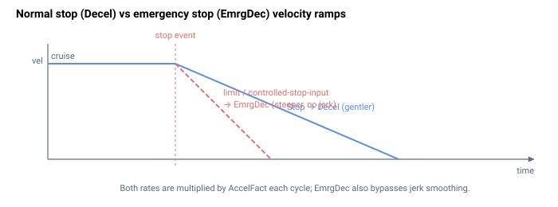

# EmrgDec

在限位开关、软件限位或受控停止输入触发停止时所应用的紧急减速率，单位为用户单位每平方秒。

## 概述

`EmrgDec` 是当一次运动由限位开关、软件位置限位或受控停止输入而非正常的 [Stop](../04-motion-command/Stop.md) 而停止时，规划器用以替代 [Decel](Decel.md) 的减速率。它通常设置得高于 `Decel`，使轴在安全前提下尽快停下。[Abort](../04-motion-command/Abort.md) 是一条独立的路径——它会立即清除运动中状态位，并不会查询 `EmrgDec`。该参数可读写、轴相关、保存至闪存，并可在任意时刻更改，包括在运动中更改。

## 工作原理

`EmrgDec` 在正常运动期间不会被使用。仅当 [MotionReason](../05-motion-status/MotionReason.md) 为紧急/限位情形之一时，规划器才会将其替换为减速率：

| 停止条件（[MotionReason](../05-motion-status/MotionReason.md) 值） | 所用停止速率 |
|---------------|----------------|
| 反向 / 正向限位开关（`MotionReason` = 4 / 5） | `EmrgDec × AccelFact` |
| 反向 / 正向软件位置限位（`MotionReason` = 6 / 7） | `EmrgDec × AccelFact` |
| 由输入信号触发的受控停止（`MotionReason` = 28） | `EmrgDec × AccelFact` |
| 正常 [Stop](../04-motion-command/Stop.md) / 运动结束（`MotionReason` = 1 / 0） | `Decel × AccelFact` |

当选用 `EmrgDec` 时，规划器还会在内部针对该次停止强制将 `JerkMode` 置为 OFF，因此紧急减速会在**不进行急动平滑**的情况下应用——优先目标是快速停止，而非平稳停止。



与其他速率一样，`EmrgDec` 每个周期都会乘以 [AccelFact](AccelFact.md)，随后减速距离前瞻使用该缩放后的值，使轴在到达限位/目标时仍减速至静止而不会过冲。

### 与 Abort 的关系

[Abort](../04-motion-command/Abort.md) 通过清除运动中状态位立即停止运动——完全没有规划器斜坡，也不会查询 `Decel` 或 `EmrgDec`。位置环保持在最后所指令的参考位置；电机保持使能。因此 `EmrgDec` 速率路径仅由上述 [MotionReason](../05-motion-status/MotionReason.md) 条件驱动（限位开关 = 4 / 5、软件限位 = 6 / 7，以及由输入触发的受控停止 = 28）；正常的 `Stop`（[MotionReason](../05-motion-status/MotionReason.md) = 1）使用 `Decel`。应设置 `EmrgDec ≥ Decel`，使任何此类紧急停止至少与正常停止一样积极。

### 边界情形

- **电机失能：** 数值被保留；规划器不运行。
- **越界写入：** 参数系统会钳位到 `100`–`2,000,000,000`；超出范围的值被拒绝。
- **仿真模式（`MotorType` = 5）：** 不变；仿真运行相同的规划器。
- **ModRev 环绕：** 不相关；`EmrgDec` 是一个速率，而非位置。
- **使轴禁用的活动故障：** 电机由故障路径立即禁用（无规划器斜坡）；`EmrgDec` 仅用于*受控*的限位/软件限位/受控停止输入情形，此类情形下电机在斜坡减速期间被有意保持使能。
- **其他运动模式：** 凡是通过减速规划器使轴停止的模式都会执行 `EmrgDec` 替换——点动、PTP、重复 PTP、操纵杆位置模式、间接齿轮模式和 P/D 间接模式，以及 FIFO 和 FIFO 位置跟踪模式。纯直接模式（P/D 直接、齿轮直接、ECAM 直接）和路径缓冲区模式（CNC、矢量、样条缓冲区、从轴）直接驱动位置指令，不会查询 `EmrgDec`。
- **不能为零：** 最小值为 `100` 用户单位/s²，以保持规划器运算有限。
- **回零期间：** 当回零序列开始时，控制器会保存当前的 `EmrgDec`（连同 `Speed`、`Accel`、`Decel` 和 `JerkMode`），并可能用回零定义中取得的逐步减速值将其覆盖；回零结束时恢复所保存的值。在回零期间也会强制关闭急动平滑。

## 示例

```text
AEmrgDec=1000000     ; emergency deceleration (user units/s^2)
AEmrgDec             ; read current value
```

## 版本间变更

在 **v4** 中 `EmrgDec` 是 32 位整数；在 **v5（central-i）** 中它是单精度浮点数。替换逻辑和 `AccelFact` 缩放保持不变。**v5 仅适用于 central-i。**

## 参见

- [Decel](Decel.md) — 正常减速率（由 `Stop` 使用）
- [Accel](Accel.md) — 加速率
- [AccelFact](AccelFact.md) — 同样应用于 `EmrgDec` 的整数乘子
- [Abort](../04-motion-command/Abort.md) — 立即停止指令
- [Stop](../04-motion-command/Stop.md) — 受控停止（使用 `Decel`，而非 `EmrgDec`）
- [MotionReason](../05-motion-status/MotionReason.md) — 选择 `EmrgDec` 速率的原因码（4 / 5 / 6 / 7 / 28）
