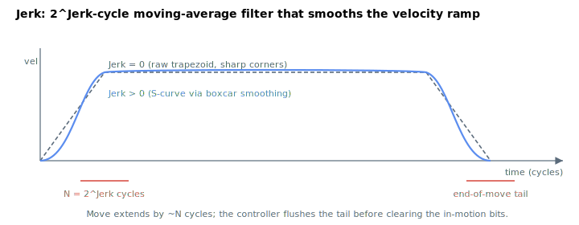

# Jerk

Rate of change of acceleration; a finite value produces an S-curve motion profile.

## Overview

`Jerk` is the second-order S-curve control. It is **not** a jerk rate in physical units — it is a power-of-two exponent that sets the **length of a moving-average filter** the controller runs over the profiler's position reference. A larger `Jerk` lengthens the filter, which softens the corners where the velocity ramp meets [Accel](Accel.md)/[Decel](Decel.md) and the cruise [Speed](Speed.md), turning the trapezoid into an S-curve and reducing mechanical vibration at the start/end of a move.

`Jerk` governs the **second-order** profiler ([JerkMode](../02-motion-configuration/JerkMode.md) = 0). The genuinely jerk-limited **third-order** profiler ([JerkMode](../02-motion-configuration/JerkMode.md) = 1) ignores `Jerk` and uses [JerkInAcc](JerkInAcc.md)/[JerkInDec](JerkInDec.md) instead.

Unlike most kinematic parameters, `Jerk` **cannot be changed while the axis is in motion**. It is read/write, axis-scoped and saved to flash. Range is 0–9 on standalone products (0–13 on central-i).


## How it works

### A moving-average (boxcar) filter, not a jerk rate

The profiler always produces a trapezoidal position reference. After the profiler, the controller runs that reference through a **circular-buffer moving-average filter** before it becomes the smoothed reference the loops follow. Each cycle the newest reference is pushed into a history buffer and a running sum is updated; the smoothed output is the sum divided by the window length:




$$
\text{PosRef}_{\text{smooth}} = \frac{1}{N}\sum_{i=0}^{N-1} \text{PosRef}_{k-i} ,\qquad N = 2^{\text{Jerk}}
$$

The division is implemented as a right shift by `Jerk` bits, so the window length is exactly **2^Jerk control cycles**.

### Window length and smoothing time

Because the filter is a boxcar of `2^Jerk` samples, the velocity ramp it produces is linear over that window — a constant-jerk S-curve segment. Its duration is the dominant tunable:

| `Jerk` | Window N = 2^Jerk (cycles) | Smoothing time at 16,384 Hz |
|--------|----------------------------|------------------------------|
| 0 | 1 (no smoothing) | 0 |
| 1 | 2 | ≈ 0.12 ms |
| 2 | 4 | ≈ 0.24 ms |
| 3 | 8 | ≈ 0.49 ms |
| 4 | 16 | ≈ 0.98 ms |
| 5 | 32 | ≈ 1.95 ms |
| 6 | 64 | ≈ 3.9 ms |
| 7 | 128 | ≈ 7.8 ms |
| 8 | 256 | ≈ 15.6 ms |
| 9 | 512 | ≈ 31.3 ms |

(On central-i products the maximum is 13 and the history buffer extends to 8192 points.) `Jerk = 0` selects the no-smoothing case, where the smoothed reference equals the raw reference.

### Effect on the move

The S-curve smoothing **lengthens the move** by roughly the window time and **delays** the reference by half the window, because the average lags the trapezoid. It does not change the peak [Speed](Speed.md), [Accel](Accel.md) or [Decel](Decel.md) — it only rounds the transitions between phases. At the end of a move the controller also waits for the smoothing tail to flush: an end-of-move smoothing counter must exceed `2^Jerk` cycles before the motion is declared complete.

### Where smoothing is skipped

The moving-average is bypassed for motion modes that do not use the profiler (P/D direct, master direct, FIFO), and in current- or force-operation mode. During commutation/auto-phasing the controller temporarily forces `Jerk = 0`, restoring the user value afterward.

### Interaction with modulo

Under continuous-rotation modulo ([ModRev](../../03-encoder/04-modulo-mode/ModRev.md) ≠ 0) the history buffer can hold pre-wrap values; the controller tracks how many buffer entries are "wrong" because of a wrap and corrects the running sum accordingly, and only performs the modulo wrap once the jerk buffer is clear of such values.

### Edge cases

- **Motor off:** value is held; smoothing is bypassed while the axis is disabled.
- **Out-of-range write:** the parameter system rejects values outside `0`–`9` (standalone) or `0`–`13` (central-i).
- **Simulation mode (`MotorType` = 5):** smoothing runs identically.
- **ModRev wrap:** described above — the wrap is delayed until the buffer clears of pre-wrap samples.
- **Active fault:** the axis is disabled; the history buffer is cleared on next motion.
- **Other motion modes:** smoothing is bypassed for direct modes (PD-direct, gear-direct, ECAM-direct, FIFO, slave, CNC, vector, spline-buffer) and during current/force operation mode. It is also temporarily forced to `0` during commutation/auto-phasing, and restored afterward.
- **Cannot change in motion:** writes are rejected while the axis is in motion.
- **`Jerk = 0`:** filter window is 1 sample — the smoothed reference equals the raw reference and no smoothing is applied.
- **Third-order profiler:** `Jerk` is ignored entirely when [JerkMode](../02-motion-configuration/JerkMode.md) = 1; the structured jerk profiler uses [JerkInAcc](JerkInAcc.md)/[JerkInDec](JerkInDec.md) instead.

## Examples

```text
AJerk=5              ; second-order S-curve, 2^5 = 32-cycle smoothing window
AJerk=0              ; no smoothing (pure trapezoid)
AJerk                ; read current value
```

`Jerk` must be set while the axis is stationary (it is not accepted in motion).

## See also

- [Accel](Accel.md) — acceleration ramp the filter rounds
- [Decel](Decel.md) — deceleration ramp the filter rounds
- [Speed](Speed.md) — cruise velocity (unchanged by `Jerk`)
- [JerkMode](../02-motion-configuration/JerkMode.md) — selects second- (this) vs third-order profiling
- [JerkInAcc](JerkInAcc.md) — acceleration-phase jerk in the third-order profiler
- [JerkInDec](JerkInDec.md) — deceleration-phase jerk in the third-order profiler
