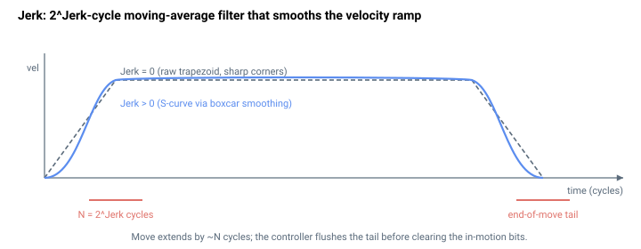

# Jerk

加速度的变化率；有限值会产生 S 曲线运动曲线。

## 概述

`Jerk` 是二阶 S 曲线控制。它**并非**物理单位下的加加速度速率——它是一个 2 的幂指数，用于设置控制器在规划器位置参考上所运行的**移动平均滤波器的长度**。更大的 `Jerk` 会延长滤波器，从而柔化速度斜坡与 [Accel](Accel.md)/[Decel](Decel.md) 以及巡航 [Speed](Speed.md) 相接处的拐角，把梯形变为 S 曲线，并降低运动起止时的机械振动。

`Jerk` 控制**二阶**规划器（[JerkMode](../02-motion-configuration/JerkMode.md) = 0）。真正受加加速度限制的**三阶**规划器（[JerkMode](../02-motion-configuration/JerkMode.md) = 1）会忽略 `Jerk`，转而使用 [JerkInAcc](JerkInAcc.md)/[JerkInDec](JerkInDec.md)。

与大多数运动学参数不同，`Jerk` **不能在轴运动时更改**。它可读写、轴相关、保存至闪存。在 standalone 产品上范围为 0–9（在 central-i 上为 0–13）。


## 工作原理

### 移动平均（boxcar）滤波器，而非加加速度速率

规划器始终产生梯形位置参考。在规划器之后，控制器将该参考通过一个**循环缓冲区移动平均滤波器**，使其成为各环路所跟随的平滑参考。每个周期将最新的参考压入历史缓冲区并更新累加和；平滑后的输出即累加和除以窗口长度：




$$
\text{PosRef}_{\text{smooth}} = \frac{1}{N}\sum_{i=0}^{N-1} \text{PosRef}_{k-i} ,\qquad N = 2^{\text{Jerk}}
$$

该除法以右移 `Jerk` 位实现，因此窗口长度恰好为 **2^Jerk 个控制周期**。

### 窗口长度与平滑时间

由于该滤波器是 `2^Jerk` 个采样的 boxcar，它产生的速度斜坡在该窗口上是线性的——即恒定加加速度的 S 曲线段。其持续时间是主要的可调量：

| `Jerk` | 窗口 N = 2^Jerk（周期数） | 16,384 Hz 下的平滑时间 |
|--------|----------------------------|------------------------------|
| 0 | 1（无平滑） | 0 |
| 1 | 2 | ≈ 0.12 ms |
| 2 | 4 | ≈ 0.24 ms |
| 3 | 8 | ≈ 0.49 ms |
| 4 | 16 | ≈ 0.98 ms |
| 5 | 32 | ≈ 1.95 ms |
| 6 | 64 | ≈ 3.9 ms |
| 7 | 128 | ≈ 7.8 ms |
| 8 | 256 | ≈ 15.6 ms |
| 9 | 512 | ≈ 31.3 ms |

（在 central-i 产品上最大值为 13，历史缓冲区扩展至 8192 点。）`Jerk = 0` 选择无平滑情形，此时平滑后的参考等于原始参考。

### 对运动的影响

S 曲线平滑会使运动**延长**大约一个窗口时间，并将参考**延迟**半个窗口，因为平均值滞后于梯形。它不会改变峰值 [Speed](Speed.md)、[Accel](Accel.md) 或 [Decel](Decel.md)——只圆滑各阶段之间的过渡。在运动结束时，控制器还会等待平滑拖尾刷新完毕：运动结束平滑计数器必须超过 `2^Jerk` 个周期，运动才被宣告完成。

### 何处跳过平滑

对于不使用规划器的运动模式（P/D 直接、主直接、FIFO），以及在电流或力运行模式下，移动平均会被旁路。在换相/自动定相期间，控制器会临时强制 `Jerk = 0`，之后恢复用户值。

### 与取模的交互

在连续旋转取模（[ModRev](../../03-encoder/04-modulo-mode/ModRev.md) ≠ 0）下，历史缓冲区可能保留环绕前的值；控制器会跟踪有多少缓冲区条目因环绕而"错误"，并相应修正累加和，且只有在加加速度缓冲区清除掉此类值后才执行取模环绕。

### 边界情形

- **电机失能：** 数值被保留；轴禁用期间平滑被旁路。
- **越界写入：** 参数系统拒绝超出 `0`–`9`（standalone）或 `0`–`13`（central-i）范围的值。
- **仿真模式（`MotorType` = 5）：** 平滑以相同方式运行。
- **ModRev 环绕：** 如上所述——环绕会延迟，直到缓冲区清除掉环绕前采样。
- **活动故障：** 轴被禁用；历史缓冲区在下次运动时清除。
- **其他运动模式：** 对于直接模式（PD 直接、齿轮直接、ECAM 直接、FIFO、从轴、CNC、矢量、样条缓冲区）以及在电流/力运行模式期间，平滑被旁路。在换相/自动定相期间也会临时强制为 `0`，之后恢复。
- **运动中不能更改：** 轴运动时写入被拒绝。
- **`Jerk = 0`：** 滤波器窗口为 1 个采样——平滑后的参考等于原始参考，不应用任何平滑。
- **三阶规划器：** 当 [JerkMode](../02-motion-configuration/JerkMode.md) = 1 时 `Jerk` 被完全忽略；结构化加加速度规划器转而使用 [JerkInAcc](JerkInAcc.md)/[JerkInDec](JerkInDec.md)。

## 示例

```text
AJerk=5              ; second-order S-curve, 2^5 = 32-cycle smoothing window
AJerk=0              ; no smoothing (pure trapezoid)
AJerk                ; read current value
```

`Jerk` 必须在轴静止时设置（运动中不接受）。

## 参见

- [Accel](Accel.md) — 滤波器圆滑的加速斜坡
- [Decel](Decel.md) — 滤波器圆滑的减速斜坡
- [Speed](Speed.md) — 巡航速度（不受 `Jerk` 影响）
- [JerkMode](../02-motion-configuration/JerkMode.md) — 选择二阶（本参数）还是三阶规划
- [JerkInAcc](JerkInAcc.md) — 三阶规划器中加速阶段的加加速度
- [JerkInDec](JerkInDec.md) — 三阶规划器中减速阶段的加加速度
