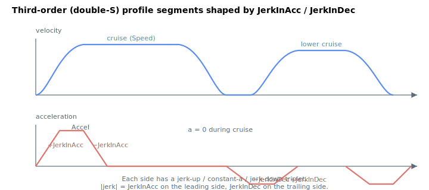

# JerkInAcc

Jerk applied during the acceleration phase of a third-order (infinite-snap) profile.

## Overview

`JerkInAcc` is the jerk constraint applied during the **acceleration** phase of the third-order trajectory profiler, used when [JerkMode](../02-motion-configuration/JerkMode.md) = 1. Unlike the second-order [Jerk](Jerk.md) (a moving-average exponent), `JerkInAcc` is a genuine jerk limit: it bounds how fast the acceleration itself may rise to and fall from the peak [Accel](Accel.md) during a move, rounding the corners of the acceleration ramp. Its deceleration-phase counterpart is [JerkInDec](JerkInDec.md). It is read/write, axis-scoped, saved to flash, and can be changed at any time, including during motion.

This third-order ("infinite-snap") profiler is a structured, segment-based generator built around the double-S velocity profile. `JerkInAcc` is only consulted when `JerkMode = 1`; in the default second-order mode it has no effect.

## How it works

When `JerkMode = 1`, the profiler runs the structured jerk profiler each cycle, using `JerkInAcc` (and `JerkInDec`) as the jerk constraints alongside the [Speed](Speed.md), [Accel](Accel.md) and [Decel](Decel.md) limits. The profiler advances through a fixed sequence of segments, and `JerkInAcc` is the magnitude of the jerk applied in the positive- and negative-jerk acceleration segments. It shapes the leading half of the move:

| Segment | Jerk used |
|---------|-----------|
| Acceleration, jerk-up | `+JerkInAcc` — acceleration rises toward `Accel` |
| Acceleration, constant | 0 — acceleration held at `Accel` |
| Acceleration, jerk-down | `−JerkInAcc` — acceleration falls back to 0 at cruise |

A larger `JerkInAcc` makes acceleration reach the `Accel` limit faster (sharper, shorter S transition); a smaller value spreads the transition over more time for gentler motion.



### Units and internal scaling (v4)

On v4 `JerkInAcc` is a dimensionless integer with range 100–1,000,000,000 (default 1,000,000). The controller multiplies the value by a fixed factor of 1000 before applying it in the profiler, so the effective jerk constraint in counts/s³ is:

$$
\text{jerk}_{\text{acc}} = \text{JerkInAcc} \cdot 1000
$$

### Emergency stops

The third-order profiler is bypassed for emergency/limit stops: those force the internal jerk mode OFF and decelerate with [EmrgDec](EmrgDec.md) without jerk shaping, so `JerkInAcc` does not apply to an emergency stop.

## Examples

```text
AJerkInAcc=2000000   ; acceleration-phase jerk (× 1000 internally on v4)
AJerkInAcc           ; read current value
```

`JerkInAcc` only affects motion when [JerkMode](../02-motion-configuration/JerkMode.md) = 1.

## Changes between versions

| | v4 (standalone & central-i) | v5 (central-i) |
|---|---|---|
| Command code | 720 | 565 |
| Data type | 32-bit integer | float |
| Units | none, value × 1000 internally | user units (jerk in user units/s³, used directly) |

In **v5** `JerkInAcc` is a floating-point value expressed directly in user jerk units and passed to the same structured profiler without the ×1000 factor. **v5 is central-i only.**

## See also

- [JerkInDec](JerkInDec.md) — jerk during the deceleration phase
- [Jerk](Jerk.md) — second-order S-curve setting (different mechanism)
- [JerkMode](../02-motion-configuration/JerkMode.md) — must be 1 for `JerkInAcc` to apply
- [Accel](Accel.md) — peak acceleration the jerk ramps to
- [EmrgDec](EmrgDec.md) — emergency stops bypass the jerk profiler
