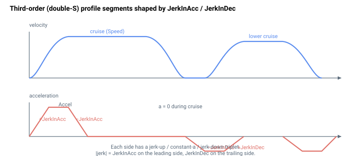

# JerkInDec

在三阶（无限 snap）曲线的减速阶段所应用的加加速度。

## 概述

`JerkInDec` 是在三阶轨迹规划器的**减速**阶段所应用的加加速度约束，当 [JerkMode](../02-motion-configuration/JerkMode.md) = 1 时使用。它是 [JerkInAcc](JerkInAcc.md) 的减速侧对应参数：它限定减速度上升到峰值 [Decel](Decel.md) 以及从峰值回落的速度，从而圆滑制动斜坡的拐角，使轴平稳地停下。该参数可读写、轴相关、保存至闪存，并可在任意时刻更改，包括在运动中更改。

与 `JerkInAcc` 一样，这是真正的加加速度限制（而非二阶 [Jerk](Jerk.md) 所控制的移动平均指数），并且仅在 `JerkMode = 1` 时被查询。

## 工作原理

当 `JerkMode = 1` 时，规划器每个周期在结构化加加速度规划器中使用 `JerkInDec`。它是用于包围恒定减速阶段的减速段中的加加速度幅值，并且当轴必须减速到较低目标速度时，它还控制受控的减速到巡航过渡：

| 段 | 所用加加速度 |
|---------|-----------|
| 巡航（恒定速度） | 0 —— 速度保持在 `Speed` |
| 减速到设定速度 | `±JerkInDec` —— 减速到较低目标 `Speed` |
| 减速，加加速上升 | `−JerkInDec` —— 减速度向 `Decel` 上升 |
| 减速，恒定 | 0 —— 减速度保持在 `Decel` |
| 减速，加加速下降 | `+JerkInDec` —— 减速度在目标处回落到 0 |

只要当前速度比（可能已降低的）`Speed` 目标高出 0.1% 以上，且运动尚未到达其减速点，减速到设定速度段就会运行：规划器先应用 `−JerkInDec` 以减小加速度，再应用 `+JerkInDec` 在新的巡航速度上趋平，然后返回零加加速度的巡航段。更大的 `JerkInDec` 更快达到 `Decel` 限值（更陡、更短的制动过渡）；更小的值则将其分散到更长的时间，以获得更平缓的停止。



### 内部加加速度上限

与加速阶段一样，减速阶段的加加速度在使用前会被钳位，使减速度无法在单个控制周期内过冲 [Decel](Decel.md) 限值。有效加加速度被限制为

$$
\dot{a}_{\max}^{\,\text{dec}} = \tfrac{1}{2}\,\lvert\text{Decel}\rvert\cdot f_s
$$

其中 $f_s$ 是控制环采样率。在该上限处，减速度在约两个控制周期内从 0 上升到 `Decel`，因此设置高于该上限的 `JerkInDec` 不会进一步影响制动斜坡的持续时间。

### 单位与内部缩放（v4）

在 v4 上，`JerkInDec` 是一个无量纲整数，范围为 100–1,000,000,000（默认 1,000,000）。控制器在使用前将其乘以固定因子 1000，因此以 counts/s³ 为单位的有效加加速度约束为：

$$
\text{jerk}_{\text{dec}} = \text{JerkInDec} \cdot 1000
$$

### 紧急停止

`JerkInDec` 不会整形紧急停止：限位开关（RLS/FLS）、软件限位和受控停止输入触发的停止会强制内部加加速度模式 OFF，并直接以 [EmrgDec](EmrgDec.md) 制动，而不进行加加速度限制。[Abort](../04-motion-command/Abort.md) 完全不进行斜坡减速，也不受 `JerkInDec` 影响。

### 边界情形

- **电机失能：** 数值被保留；规划器不运行。
- **越界写入：** 超出 `100`–`1,000,000,000` 范围的值会以越界错误被拒绝，所存储的值保持不变（不会被钳位）。
- **仿真模式（`MotorType` = 5）：** 不变。
- **ModRev 环绕：** 三阶规划器通过其内部状态跟踪环绕；加加速度约束不受影响。
- **活动故障：** 轴被禁用；重新使能并下一次 `Begin` 时，会重新读取 `JerkInDec`。
- **其他运动模式：** 仅当 [JerkMode](../02-motion-configuration/JerkMode.md) = 1 时，在 PTP / 重复 PTP 下由结构化加加速度规划器消耗。点动、间接模式和直接模式都会忽略它。
- **运动中实时更改：** 允许，但在下一个规划器段开始时生效，而非段中途生效。

## 示例

```text
AJerkInDec=2000000   ; deceleration-phase jerk (× 1000 internally on v4)
AJerkInDec           ; read current value
```

`JerkInDec` 仅在 [JerkMode](../02-motion-configuration/JerkMode.md) = 1 时影响运动。

## 版本间变更

| | v4（standalone 与 central-i） | v5（central-i） |
|---|---|---|
| 命令码 | 721 | 566 |
| 数据类型 | 32 位整数 | 浮点数 |
| 单位 | 无，内部值 × 1000 | 用户单位（加加速度以用户单位/s³ 表示，直接使用） |

在 **v5** 中 `JerkInDec` 是以用户加加速度单位表示的浮点值，并传入同一结构化规划器，不带 ×1000 因子。**v5 仅适用于 central-i。**

## 参见

- [JerkInAcc](JerkInAcc.md) — 加速阶段的加加速度
- [Jerk](Jerk.md) — 二阶 S 曲线设置（机制不同）
- [JerkMode](../02-motion-configuration/JerkMode.md) — 必须为 1，`JerkInDec` 才生效
- [Decel](Decel.md) — 加加速度所上升到的峰值减速度
- [EmrgDec](EmrgDec.md) — 紧急停止会旁路加加速度规划器
