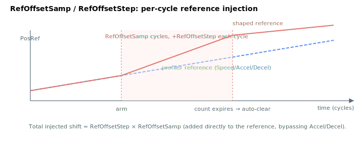

# RefOffsetSamp

Number of servo samples over which a reference position offset is ramped in.

## Overview

`RefOffsetSamp` sets the number of servo samples over which a reference offset is applied when ramping in a position correction. It works together with [RefOffsetStep](RefOffsetStep.md), which sets the per-sample offset magnitude, so the two together control how gradually a position correction is introduced into the reference trajectory. It is an axis-related parameter, not saved to flash, and can be changed at any time, including during motion.

## How it works

`RefOffsetSamp` is a **countdown of how many servo cycles still inject the offset**. While `RefOffsetSamp > 0` and the axis is in motion (and not in a stop/abort process), each control cycle the controller:

1. decrements `RefOffsetSamp` by one, and
2. adds [RefOffsetStep](RefOffsetStep.md) to the high-precision reference accumulator (then re-derives [PosRef](../01-kinematics-status/PosRef.md) from it).

So the total position shift injected is approximately `RefOffsetStep × RefOffsetSamp` (in the units of the accumulator), spread one step per cycle, riding on top of whatever the profiler is generating. The injection is added directly to the reference and is therefore **not** rate-limited by [Accel](Accel.md)/[Decel](Decel.md) — keep `RefOffsetStep` small so the resulting velocity bump stays within the servo's capability.

The correction is applied **only during active motion**. If the motion ends (or a stop is requested) before the count expires, the controller sets `RefOffsetSamp = 0` so a leftover offset is not carried into the next motion.

Writing a fresh `RefOffsetSamp` (with a non-zero [RefOffsetStep](RefOffsetStep.md)) re-arms the correction.



## Examples

```text
ARefOffsetSamp=100   ; spread the offset over 100 servo samples
ARefOffsetSamp      ; query current value
```

## See also

- [RefOffsetStep](RefOffsetStep.md) — per-sample offset magnitude
- [PosRef](../01-kinematics-status/PosRef.md) — the reference the offset is injected into
