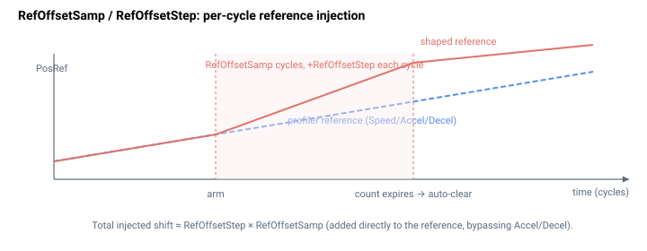

# RefOffsetSamp

将参考位置偏置斜坡接入所经历的伺服采样数。

## 概述

`RefOffsetSamp` 设置在斜坡接入位置修正时，施加参考偏置所经历的伺服采样数。它与 [RefOffsetStep](RefOffsetStep.md)（设置每采样偏置量）配合工作，二者共同控制将位置修正逐步引入参考轨迹的渐进程度。它是轴相关参数，不保存至闪存，可在任意时刻更改，包括运动期间。

## 工作原理

`RefOffsetSamp` 是**仍需注入偏置的伺服周期数的倒计数**。当 `RefOffsetSamp > 0` 且轴处于运动中（且未处于停止/中止过程）时，控制器在每个控制周期会：

1. 将 `RefOffsetSamp` 减一，且
2. 将 [RefOffsetStep](RefOffsetStep.md) 累加至高精度参考累加器（然后据此重新导出 [PosRef](../01-kinematics-status/PosRef.md)）。

因此注入的总位置偏移约为 `RefOffsetStep × RefOffsetSamp`（以累加器单位计），按每周期一步分摊，叠加在规划器生成的内容之上。该注入直接加到参考上，因此**不**受 [Accel](Accel.md)/[Decel](Decel.md) 的速率限制——应保持 `RefOffsetStep` 较小，使由此产生的速度突变保持在伺服的能力范围内。

该修正**仅在运动进行期间**施加。若在计数耗尽前运动结束（或请求停止），控制器会将 `RefOffsetSamp = 0`，以免残留偏置带入下一次运动。

写入一个新的 `RefOffsetSamp`（且 [RefOffsetStep](RefOffsetStep.md) 非零）会重新置位该修正。



### 边界情形

- **电机失能：** 注入仅在轴运动中且未处于停止过程时运行；电机失能时没有运动，因此不会发生注入。倒计数被保留。
- **越界写入：** 参数系统拒绝负值；范围为 `0`–`2³¹−1`。
- **仿真模式（`MotorType` = 5）：** 注入在仿真中运行；合成反馈跟随偏置后的参考。
- **ModRev 环绕：** 偏置直接加到高精度参考累加器；若由此产生的参考越过取模边界，环绕将正常触发，且偏置在环绕后的坐标系中保持。
- **活动故障：** 轴被禁用——运动停止，固件的检查会清除倒计数，因此残留偏置不会带入下一次运动。
- **注入期间停止/中止：** 控制器检测到任何停止请求即立即将 `RefOffsetSamp` 清为 `0`，放弃剩余的注入。
- **其他运动模式：** 注入在任何置位运动中位的模式下运行；它绕过规划器的 `Accel`/`Decel` 限制。
- **运动中重新置位：** 在 `RefOffsetStep` 非零时写入新的 `RefOffsetSamp`，会在下一周期立即开始注入。

## 示例

```text
ARefOffsetSamp=100   ; spread the offset over 100 servo samples
ARefOffsetSamp      ; query current value
```

## 参见

- [RefOffsetStep](RefOffsetStep.md) — 每采样偏置量
- [PosRef](../01-kinematics-status/PosRef.md) — 偏置注入的目标参考
