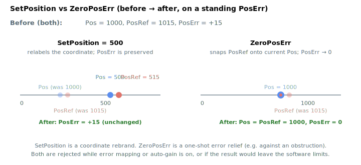

# SetPosition

Redefines the axis position to a given value without moving the motor.

## Overview

`SetPosition` immediately sets the axis position reference and feedback registers to the specified value without commanding any motion. It is used to define a new coordinate origin or to recover from a position discrepancy. Because it rewrites the reference, it cannot be issued while the axis is in motion. To clear an accumulated position error instead of redefining the coordinate, see [ZeroPosErr](ZeroPosErr.md). It is an axis-related command function.

## How it works

`SetPosition` writes the requested value into **both the feedback chain and the entire reference chain in the same atomic step**, so the coordinate is redefined without any jump in following error:

- Feedback side: the encoder position, [Pos](../01-kinematics-status/Pos.md) and its previous-sample value are all set to the value.
- Reference side: [PosRef](../01-kinematics-status/PosRef.md), the shaped and shaped-filtered references and all of their 64-bit history/previous-sample values are set to the value, and the high-precision reference accumulator is rebuilt from it.

Because [Pos](../01-kinematics-status/Pos.md) and [PosRef](../01-kinematics-status/PosRef.md) are moved by the **same offset**, the position error [PosErr](../01-kinematics-status/PosErr.md) (`PosRef − Pos`) is **preserved**, not zeroed — `SetPosition` relabels the coordinate, it does not pull the reference onto the feedback. (To instead zero the error by snapping the reference to the feedback, use [ZeroPosErr](ZeroPosErr.md).)



When the motor is **on**, the smoothing buffer must also be re-seeded with the new value; to do so without disrupting the control loop the controller temporarily forces [Jerk](Jerk.md) to `0`, refills the `2^Jerk` moving-average history with the new value, then restores `Jerk`. When the motor is **off** this is unnecessary because the reference already tracks the feedback.

### Conditions

`SetPosition` is rejected (no change made) if any of the following hold:

- Encoder **error mapping** is active — disable it first ([MapType](../../04-error-mapping/MapType.md)).
- **Auto-gain** is on (it uses the position filter).
- The requested value is **outside the software position limits** [RevPLim](../../06-protections/03-motion/position-limit-protection/RevPLim.md) … [FwdPLim](../../06-protections/03-motion/position-limit-protection/FwdPLim.md).
- The motor is **on** and **input shaping** is on (its buffers are too large to re-seed).

It is also blocked while the axis is in motion (`ok_in_motion: false`).

### Edge cases

- **Motor off:** allowed; the reference re-seed of the smoothing buffer is skipped because the buffer is already tracking the feedback.
- **Motor on:** allowed; the controller temporarily forces [Jerk](Jerk.md) to `0` to re-seed the moving-average history with the new value, then restores `Jerk`. Input shaping must be off (rejected with error if not).
- **Out-of-range write:** rejected if the value falls outside `[RevPLim, FwdPLim]` (the parameter system also clamps to the data-type range).
- **Simulation mode (`MotorType` = 5):** allowed; feedback follows reference, so the offset shows up in both immediately.
- **ModRev wrap:** `SetPosition` writes raw values into the reference and feedback; the value may need to be inside `[0, ModRev)` to make sense for a continuous-rotary axis. Writing outside that range will be wrapped by the controller on the next cycle that satisfies the wrap conditions.
- **Active fault:** the axis is disabled but `SetPosition` is still allowed (the in-motion check is satisfied — there is no motion). The new value persists across re-enable.
- **Other motion modes:** the keyword is mode-independent; it operates directly on the reference/feedback registers.
- **Error mapping / auto-gain / input shaping active:** rejected (see conditions above) — disable, set, then re-enable.

## Examples

```text
ASetPosition=0       ; redefine current position as zero
ASetPosition=50000   ; redefine current position as 50000
```

## See also

- [ZeroPosErr](ZeroPosErr.md) — zero the position error (snap reference to feedback) rather than redefine the coordinate
- [Pos](../01-kinematics-status/Pos.md) / [PosRef](../01-kinematics-status/PosRef.md) — both moved together by `SetPosition`
- [PosErr](../01-kinematics-status/PosErr.md) — preserved (not zeroed) by `SetPosition`
- [MapType](../../04-error-mapping/MapType.md) — error mapping must be off
- [FwdPLim](../../06-protections/03-motion/position-limit-protection/FwdPLim.md) / [RevPLim](../../06-protections/03-motion/position-limit-protection/RevPLim.md) — value must lie within these
