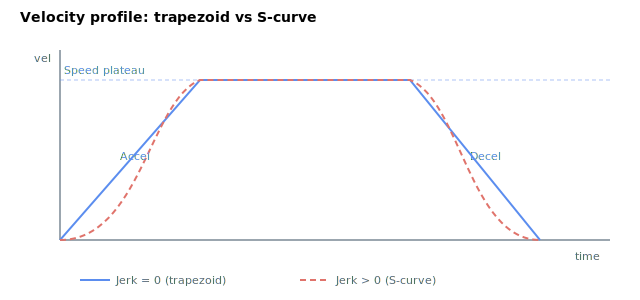

# Speed

Target (maximum) velocity for point-to-point and jog motion, in user units per second.

## Overview

`Speed` is the cruise (target) velocity the trajectory profiler ramps the axis toward, in user units per second. The axis accelerates up to `Speed` at the rate set by [Accel](Accel.md) and brakes to rest at the rate set by [Decel](Decel.md), producing a trapezoidal (or, on a short move, triangular) velocity profile. It is read/write, axis-scoped, saved to flash, and can be changed at any time, including during motion.



## How it works

### Point-to-point: magnitude is the cruise cap

In point-to-point motion the profiler takes the **magnitude** of `Speed` as the cruise ceiling; the travel direction is set by the relation between [AbsTrgt](../13-motion-mode-ptp/AbsTrgt.md) and the current reference, not by the sign of `Speed`. Each cycle the profiler increments its velocity by `Accel × AccelFact × Ts` until it reaches the cruise ceiling, then holds it there until the deceleration-distance lookahead (using `Decel`) forces the braking phase:

$$
v_k \le |\text{Speed}| ,\qquad
v_k = v_{k-1} + \text{Accel}_{\text{eff}} \cdot T_s \ \ \text{(accel phase)}
$$

If the move is too short to reach `Speed`, the profile becomes triangular and `Speed` is never attained.

### Jog: sign sets the direction

In jog (and joystick-indirect velocity) mode the **signed** `Speed` is used directly as the target velocity, so a negative `Speed` jogs in the negative direction. The axis ramps to this signed target using `Accel`, and decelerates with `Decel` when approaching a software limit or on a stop request.

### Relation to MaxVel

`Speed` is the *commanded* cruise velocity for the profiler. It is distinct from the hard velocity-loop clamp [MaxVel](../../06-protections/03-motion/general-maximum-limits/MaxVel.md), which limits the velocity **reference** ([VelRef](../01-kinematics-status/VelRef.md)) downstream regardless of how the profile was generated. The frontmatter range (±1.3 × 10⁹) is the maximum allowed speed; keep `Speed` at or below `MaxVel` so the profile is not silently clamped by the velocity loop. When the velocity reference is clamped to `MaxVel`, the velocity-saturation bit of [StatReg](../../07-status-and-faults/StatReg.md) (bit 23) is set, so you can detect the condition.

### Live changes

The profiler reads `Speed` every cycle, so raising or lowering it mid-move makes the axis accelerate or decelerate toward the new cruise value on the next cycle. (For position-triggered speed changes during a move, see [SpeedChgNew](SpeedChgNew.md)/[SpeedChgOn](SpeedChgOn.md)/[SpeedChgPos](SpeedChgPos.md).)

### Edge cases

- **Motor off:** value is held; no profiler computation runs.
- **Out-of-range write:** the parameter system clamps writes to ±1.3 × 10⁹; values outside are rejected.
- **Simulation mode (`MotorType` = 5):** unchanged.
- **ModRev wrap:** unrelated — `Speed` is a rate, not a position.
- **Active fault:** the axis is disabled; the next `Begin` re-reads `Speed` and re-checks against `MaxVel`.
- **`Speed = 0`:** for jog, the axis just decelerates/stays at rest; for PTP, the `Begin` is accepted and the move enters the in-motion state, but the axis does not advance because the cruise speed is zero — it remains stalled until `Speed` is raised.
- **`|Speed| > MaxVel` at `Begin`:** rejected for indirect modes (jog, PTP, repetitive PTP, PD-indirect, gear-indirect, joystick-position-indirect) with instruction error 271 (commanded `Speed` exceeds the `MaxVel` limit); the user must lower `Speed` or raise [MaxVel](../../06-protections/03-motion/general-maximum-limits/MaxVel.md). Direct modes accept any `Speed` because the user supplies position commands directly.
- **Live raise above `MaxVel` during a move:** the profiler will ramp toward the new value, but the velocity loop will clamp [VelRef](../01-kinematics-status/VelRef.md) to `MaxVel` and set the velocity-saturation bit; the system does not fault.
- **Jog with `Speed = 0` mid-move:** the axis decelerates to rest at `Decel`.

## Examples

```text
ASpeed=500000        ; cruise velocity 500000 user units/s
ASpeed=-500000       ; jog in the negative direction
ASpeed               ; read current value
```

### Worked example

With `Speed = 500000`, `Accel = 1000000` and `Decel = 1000000` (all in user units), a long PTP move spends `500000 / 1000000 = 0.5 s` accelerating, then cruises at 500000 until the deceleration-distance lookahead pulls it down over another 0.5 s. Travel during the accel ramp is `½ × 500000 × 0.5 = 125000` user units; the same on the decel side. If the requested travel is less than `2 × 125000 = 250000` units, the move never reaches `Speed` and is triangular instead.

## Changes between versions

In **v4** `Speed` is a 32-bit integer. In **v5 (central-i)** it is a 64-bit integer, matching the 64-bit position pipeline. The profiler's use of `Speed` (magnitude in PTP, signed in jog) is unchanged. **v5 is central-i only** — on standalone `Speed` remains the v4 32-bit value.

## See also

- [Accel](Accel.md) — acceleration rate toward this speed
- [Decel](Decel.md) — deceleration rate from this speed
- [AccelFact](AccelFact.md) — scales the accel/decel ramps (not `Speed`)
- [Jerk](Jerk.md) — S-curve smoothing of the ramps
- [MaxVel](../../06-protections/03-motion/general-maximum-limits/MaxVel.md) — hard velocity-loop clamp (distinct from `Speed`); `Begin` rejects `Speed > MaxVel` in indirect modes
- [StatReg](../../07-status-and-faults/StatReg.md) — bit 23 reports velocity saturation against `MaxVel`
- [SpeedChgNew](SpeedChgNew.md) — position-triggered speed change during a move
- [Begin](../04-motion-command/Begin.md) — reads `Speed` and arms the move
