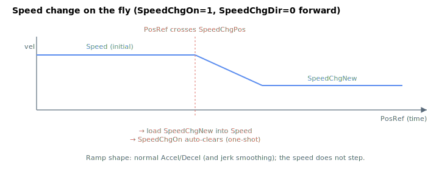

# SpeedChgOn

Enables the speed-change-on-the-fly feature for the axis.

## Overview

`SpeedChgOn` enables the speed-change-on-the-fly feature. When set to `1`, the controller monitors the axis position and, upon reaching [SpeedChgPos](SpeedChgPos.md), changes the commanded velocity to [SpeedChgNew](SpeedChgNew.md) in the direction specified by [SpeedChgDir](SpeedChgDir.md). It is an axis-related parameter, not saved to flash, and can be changed at any time, including during motion.

## How it works

Each control cycle, while `SpeedChgOn != 0`, the controller compares the post-shaping position reference against [SpeedChgPos](SpeedChgPos.md):

- [SpeedChgDir](SpeedChgDir.md) `= 0` — wait for the reference to rise **above** `SpeedChgPos` (forward crossing).
- [SpeedChgDir](SpeedChgDir.md) `= 1` — wait for the reference to fall **below** `SpeedChgPos` (reverse crossing).

When the crossing is detected the controller writes [SpeedChgNew](SpeedChgNew.md) straight into the active [Speed](Speed.md) setting, and **clears `SpeedChgOn` to `0`** in the same step so the change happens exactly once. Because the new value is loaded into `Speed`, the profiler re-targets the velocity and ramps to it under the normal [Accel](Accel.md)/[Decel](Decel.md) (and jerk) limits — the speed does not step.

This is a **one-shot** trigger: to arm another change you must set `SpeedChgOn = 1` again (typically after also updating `SpeedChgPos`/`SpeedChgNew`). The trigger uses the *reference* position, not the feedback, so it fires deterministically with the planned trajectory rather than waiting for the load to physically arrive. The comparison behaves the same for single-axis moves and grouped (coordinated) motion.



### Worked example

To slow a forward jog from 500000 to 100000 user units/s when the axis crosses position 80000:

```text
ASpeedChgNew=100000  ; new cruise speed
ASpeedChgPos=80000   ; trigger position
ASpeedChgDir=0       ; fire on forward crossing
ASpeedChgOn=1        ; arm (auto-clears when it fires)
```

The axis decelerates from 500000 to 100000 at `Decel × AccelFact` and `SpeedChgOn` reads back as `0` after the change.

## Examples

```text
ASpeedChgOn=1        ; enable speed change on the fly
ASpeedChgOn=0        ; disable
ASpeedChgOn         ; query state
```

## See also

- [SpeedChgPos](SpeedChgPos.md) — position that triggers the change
- [SpeedChgNew](SpeedChgNew.md) — new speed applied at the trigger
- [SpeedChgDir](SpeedChgDir.md) — direction in which the trigger is active
- [Speed](Speed.md) — the active speed setting that the trigger overwrites
