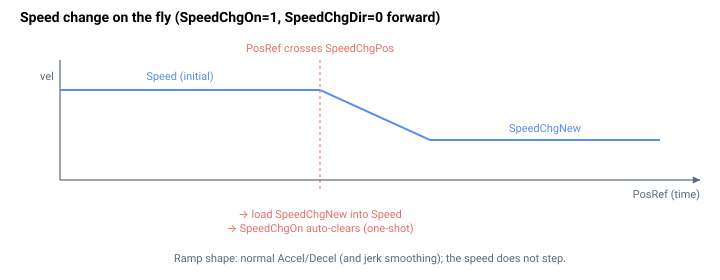

# SpeedChgOn

为该轴启用动态速度更改功能。

## 概述

`SpeedChgOn` 启用动态速度更改功能。当设置为 `1` 时，控制器监测轴位置，并在到达 [SpeedChgPos](SpeedChgPos.md) 时，按 [SpeedChgDir](SpeedChgDir.md) 指定的方向将指令速度更改为 [SpeedChgNew](SpeedChgNew.md)。它是轴相关参数，不保存至闪存，并可在任意时刻更改，包括运动期间。

## 工作原理

每个控制周期，当 `SpeedChgOn != 0` 时，控制器将整形后的位置参考与 [SpeedChgPos](SpeedChgPos.md) 进行比较：

- [SpeedChgDir](SpeedChgDir.md) `= 0` — 等待参考**升高至**超过 `SpeedChgPos`（正向越界）。
- [SpeedChgDir](SpeedChgDir.md) `= 1` — 等待参考**降低至**低于 `SpeedChgPos`（反向越界）。

当检测到越界时，控制器将 [SpeedChgNew](SpeedChgNew.md) 直接写入当前的 [Speed](Speed.md) 设置，并在同一步骤中**将 `SpeedChgOn` 清零为 `0`**，使更改恰好发生一次。由于新值被加载到 `Speed`，规划器会重新设定速度目标并在正常的 [Accel](Accel.md)/[Decel](Decel.md)（以及 jerk）限值下斜坡逼近——速度不会阶跃。

这是一个**一次性**触发器：要准备另一次更改，必须再次设置 `SpeedChgOn = 1`（通常还需先更新 `SpeedChgPos`/`SpeedChgNew`）。触发器使用*参考*位置，而非反馈，因此它随规划轨迹确定性地触发，而不是等待负载物理到达。该比较对单轴运动和分组（协调）运动的行为相同。



### 实例演算

要在轴越过位置 80000 时将正向点动从 500000 减速到 100000 用户单位/秒：

```text
ASpeedChgNew=100000  ; new cruise speed
ASpeedChgPos=80000   ; trigger position
ASpeedChgDir=0       ; fire on forward crossing
ASpeedChgOn=1        ; arm (auto-clears when it fires)
```

轴按 `Decel × AccelFact` 从 500000 减速到 100000，且更改后 `SpeedChgOn` 回读为 `0`。

### 边界情况

- **电机失能：** 比较仍运行，但 `Speed` 无效；如果参考恰好越界，触发器可能触发，使 `SpeedChgOn = 0`。实践中，请仅在运动期间准备此触发。
- **超范围写入：** 参数系统拒绝 `0`–`1` 之外的值。
- **仿真模式（`MotorType` = 5）：** 仿真中参考正常运动，触发器正常触发。
- **ModRev 环绕：** 比较使用环绕移位后的整形后参考，因此触发位置在与当前参考相同的取模坐标系中被解释。`[0, ModRev)` 之外的触发位置，除非旋转累积足以越过它，否则不会被到达。
- **存在故障：** 轴被禁用且比较继续，但由于无运动，触发器通常不会触发；`SpeedChgOn` 的值在重新使能后被保留。
- **准备时已越过触发点：** 触发器在下一个周期触发（比较是“高于”/“低于”，而非“边沿越界”）。
- **其他运动模式：** 触发器会覆盖 `Speed`，因此它仅在使用 `Speed` 的模式（点动、PTP、重复 PTP、间接模式）中有可见效果。在直接模式中不使用 `Speed`，因此触发器写入的值会被忽略。
- **运动中实时更改：** 允许；运动期间准备触发是其预期用法。
- **一次性：** 每次准备恰好触发一次；重新设置 `SpeedChgOn = 1` 以重新准备。

## 示例

```text
ASpeedChgOn=1        ; enable speed change on the fly
ASpeedChgOn=0        ; disable
ASpeedChgOn         ; query state
```

## 另请参阅

- [SpeedChgPos](SpeedChgPos.md) — 触发更改的位置
- [SpeedChgNew](SpeedChgNew.md) — 触发时应用的新速度
- [SpeedChgDir](SpeedChgDir.md) — 触发器生效的方向
- [Speed](Speed.md) — 被触发器覆盖的当前速度设置
