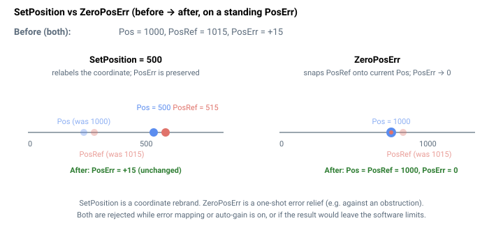

# ZeroPosErr

通过将位置参考对齐到当前反馈来将轴位置误差清零。

## 概述

`ZeroPosErr` 是一个命令函数（仅限 central-i，v5），它通过将位置参考 [PosRef](../01-kinematics-status/PosRef.md) 设置为等于当前反馈 [Pos](../01-kinematics-status/Pos.md) 来**清除累积的位置误差** [PosErr](../01-kinematics-status/PosErr.md)。这与 [SetPosition](SetPosition.md) 相反，后者重新标定坐标（同时移动 `Pos` 和 `PosRef`，并*保留* `PosErr`）：`ZeroPosErr` 将坐标保持在反馈所在之处，并将参考拉至该处，因此误差变为零。

典型用途是在负载被卡住或顶住物体时消除持续存在的位置误差——将参考拉至电机实际所在位置，从而使伺服停止对抗阻碍。



## 工作原理

当电机失能时，`ZeroPosErr` 不执行任何操作（在该状态下参考已经跟随反馈）。当电机使能时，它采样当前反馈 `Pos` 并将其写入**整个参考链**——`PosRef`、整形后及整形滤波后的参考以及它们的全部 64 位历史，加上高精度参考累加器——同时保持 `Pos` 不变。结果为 `PosRef = Pos`，即 `PosErr = 0`。与 [SetPosition](SetPosition.md) 一样，它会暂时将 [Jerk](Jerk.md) 强制为 `0` 以重新填充平滑缓冲区，并重置参考滤波器历史。

如果在发出 `ZeroPosErr` 时轴正在运动，控制器首先执行一次 [Abort](../04-motion-command/Abort.md) 式的立即结束运动，然后将误差清零。它假定此刻电机实际并未移动；对运动中的轴发出该命令的行为类似于中止。

### 条件

- 仅在**位置运行模式**（[OperationMode](../../08-axis-operation/01-general-keywords/OperationMode.md)）下允许。
- **多轴运动期间不允许**——CNCA、CNCB、矢量或样条缓冲区模式将被拒绝；仅允许简单的单轴运动模式。
- 应用与 [SetPosition](SetPosition.md) 相同的检查：编码器误差映射关闭、自动增益关闭、（结果）位置处于软件限位之内、电机使能时输入整形关闭，且该轴不得为龙门轴对中的 Yaw（奇数编号）轴——对龙门 Yaw 轴会拒绝该命令。

### 边界情况

- **电机失能：** 该命令为空操作（参考已经跟随反馈）。
- **超范围：** 通过共享的 [SetPosition](SetPosition.md) 条件，对结果 `PosRef = Pos` 进行 `[RevPLim, FwdPLim]` 检查；如果 `Pos` 恰好超出限位，则拒绝该命令。
- **仿真模式（`MotorType` = 5）：** `Pos` 被强制跟随 `PosRef`，因此 `PosErr` 已为零，该操作无副作用。
- **ModRev 环绕：** 如果操作期间发生环绕，环绕会同时移动两侧；结果 `PosRef = Pos` 得以保留。
- **存在故障：** 轴被禁用（电机失能），因此该命令为空操作。
- **运动中行为：** 进行中的单轴运动被**中止**（无斜坡），然后将 `PosRef` 对齐到 `Pos`。多轴运动模式被拒绝。用户有责任确保负载实际并未移动；如果在移动，对齐将在 `PosErr` 中产生一个阶跃，并可能引发故障。
- **其他运动模式：** 仅允许简单单轴模式（jog/PTP/PD/gear/ECAM/joystick/FIFO/slave）；CNCA/CNCB/矢量/样条被拒绝。

## 示例

```text
AZeroPosErr          ; clear axis A's position error (set PosRef = Pos)
```

## 版本间变更

`ZeroPosErr` 仅存在于 **v5（central-i）**。在 v4 中，CAN 码（669）是一个未使用的占位符，因此该功能在独立产品或 v4 central-i 上不可用。

## 另请参阅

- [SetPosition](SetPosition.md) — 重新定义坐标（保留 `PosErr`），而非将误差清零
- [PosErr](../01-kinematics-status/PosErr.md) — 此命令清零的误差
- [Pos](../01-kinematics-status/Pos.md) / [PosRef](../01-kinematics-status/PosRef.md) — `ZeroPosErr` 设置 `PosRef = Pos`
- [Abort](../04-motion-command/Abort.md) — `ZeroPosErr` 会先中止进行中的单轴运动
- [OperationMode](../../08-axis-operation/01-general-keywords/OperationMode.md) — 必须为位置控制
