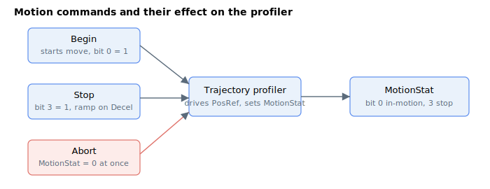

# Motion command

These keywords control the motion state. [Begin](Begin.md) starts a move and sets the in-motion bit of [MotionStat](../05-motion-status/MotionStat.md); [Stop](Stop.md) requests a controlled deceleration over [Decel](../03-kinematics-configuration/Decel.md); and [Abort](Abort.md) ends the move immediately by clearing the motion state. The mode-specific stop commands end repetitive ([StopRep](StopRep.md)) and spline-buffer ([StopBuff](StopBuff.md)) moves.

Below is the summary of keywords that can control the motion state.

| No. | Keyword | Summary |
|-----|---------|---------|
| 1 | [Begin](Begin.md) | Starts motion according to the current motion mode and targets. |
| 2 | [BeginDInOn](BeginDInOn.md) | Makes a `Begin` wait for a digital-input edge before starting. |
| 3 | [Stop](Stop.md) | Controlled stop; decelerates to rest using the `Decel` rate. |
| 4 | [Abort](Abort.md) | Immediately ends motion by clearing the motion state. |
| 5 | [StopRep](StopRep.md) | Ends repetitive point-to-point motion after the current repetition. |
| 6 | [StopBuff](StopBuff.md) | Ends spline-buffer motion at the end of the current playback cycle. |
| 7 | [CommitMotion](CommitMotion.md) | Commits a staged on-the-fly change to a running sine PTP move (`MotionMode` 20 / 21); central-i v5 only. |
