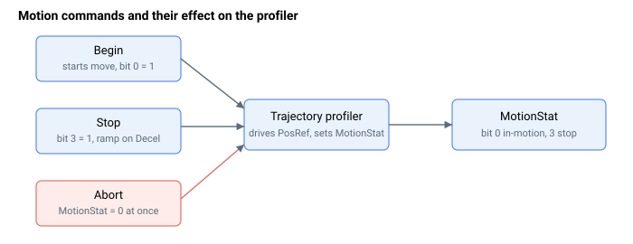

# Motion command

这些关键字控制运动状态。[Begin](Begin.md) 启动一次运动并置位 [MotionStat](../05-motion-status/MotionStat.md) 的运动中位；[Stop](Stop.md) 请求按 [Decel](../03-kinematics-configuration/Decel.md) 进行受控减速；[Abort](Abort.md) 通过清除运动状态立即结束运动。模式专用的停止命令用于结束重复（[StopRep](StopRep.md)）和样条缓冲区（[StopBuff](StopBuff.md)）运动。

下面是可控制运动状态的关键字汇总。

| No. | Keyword | Summary |
|-----|---------|---------|
| 1 | [Begin](Begin.md) | 根据当前运动模式和目标启动运动。 |
| 2 | [BeginDInOn](BeginDInOn.md) | 使 `Begin` 在启动前等待数字量输入边沿。 |
| 3 | [Stop](Stop.md) | 受控停止；使用 `Decel` 速率减速至静止。 |
| 4 | [Abort](Abort.md) | 通过清除运动状态立即结束运动。 |
| 5 | [StopRep](StopRep.md) | 在当前重复结束后结束重复式点到点运动。 |
| 6 | [StopBuff](StopBuff.md) | 在当前回放周期结束时结束样条缓冲区运动。 |
| 7 | [CommitMotion](CommitMotion.md) | 将暂存的飞行变更提交到运行中的正弦 PTP 运动（`MotionMode` 20 / 21）；仅限 central-i v5。 |
