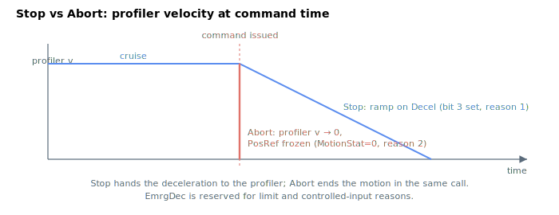

# Abort

Stops motion immediately by clearing the motion state, with no profiler deceleration ramp.

## Overview

`Abort` stops axis motion **immediately**. Unlike [Stop](Stop.md) — which sets a request bit and lets the profiler ramp the velocity down over a controlled [Decel](../03-kinematics-configuration/Decel.md) deceleration — `Abort` clears the whole [MotionStat](../05-motion-status/MotionStat.md) word to 0 (not in motion) in the same call. From the next control cycle the profiler is no longer in motion: it sets its internal velocity to zero and freezes [PosRef](../01-kinematics-status/PosRef.md) at its current value. The actual physical deceleration is then whatever the position/velocity loop produces while holding the now-frozen reference, not a planned `EmrgDec` ramp. `Abort` is an axis-related command function and may be issued at any time during motion.

> **Note on `EmrgDec`:** the profiler's emergency-deceleration rate [EmrgDec](../03-kinematics-configuration/EmrgDec.md) is selected by **motion-reason** codes — limit switches, software position limits and the controlled-stop digital input. The `Abort` command itself does not run that deceleration path; it ends the move at once. Use a controlled-stop input or a software limit if a planned `EmrgDec` ramp is required.

## How it works

### Single-axis motion

For a normal single-axis move, `Abort` (under interrupts disabled) ends the motion immediately, but only if the axis is in motion:

| Action by `Abort` | Effect |
|---|---|
| [MotionReason](../05-motion-status/MotionReason.md) = 2 | Records that the move ended because of `Abort` |
| [MotionStat](../05-motion-status/MotionStat.md) = 0 (not in motion) | Forces immediate end of motion — clears the in-motion bit and every other status bit at once |
| profiler sample count latched | Latches the profiler run time into [MotionSamples](../05-motion-status/MotionSamples.md) |

Clearing [MotionStat](../05-motion-status/MotionStat.md) to 0 is what makes the stop immediate: with no motion bit set, the profiler's no-motion branch zeroes its velocity and holds [PosRef](../01-kinematics-status/PosRef.md), so no further trajectory is generated.



### Group motion

If the axis belongs to a group, `Abort` tears the whole group down at once:

- **CNCA / CNCB member**: clears every member's motion bits and resets the CNC status to not-in-motion; the commanding axis gets [MotionReason](../05-motion-status/MotionReason.md) = 2 (Abort command), and on a CNCA group the other members get [MotionReason](../05-motion-status/MotionReason.md) = 20 (one CNCA member aborted). CNC step mode is disabled.
- **Vector member**: clears all member motion bits and sets the master vector status to not-in-motion; the commanding axis gets [MotionReason](../05-motion-status/MotionReason.md) = 2 (Abort command), the other members [MotionReason](../05-motion-status/MotionReason.md) = 32 (one vector member aborted).
- **Spline-buffer member**: forces each member's [MotionStat](../05-motion-status/MotionStat.md) to not in motion; the commanding axis gets [MotionReason](../05-motion-status/MotionReason.md) = 2 (Abort command), the other members [MotionReason](../05-motion-status/MotionReason.md) = 38 (one spline-buffer member aborted).

In all cases the profiler run time is latched into [MotionSamples](../05-motion-status/MotionSamples.md) for every affected axis.

### Edge cases

- **Motor off:** `Abort` is accepted but has no effect (no motion to end).
- **Not in motion:** `Abort` updates no state — the function checks the in-motion bit first.
- **Out-of-range "write":** function has no value.
- **Simulation mode (`MotorType` = 5):** allowed; the simulated motion ends immediately.
- **ModRev wrap:** the reference freezes at its current value; the wrap state is unchanged.
- **Active fault:** the motor is already disabled; `Abort` has no further effect.
- **`PTPKeepMoving = 1`:** `Abort` overrides the keep-moving flag (it clears `MotionStat` directly).
- **During dwell of repetitive PTP (`MotionMode = 2`):** the dwell is abandoned and the repetition is ended.
- **Member of CNCA / CNCB / vector / spline-buffer:** the whole group is torn down; per-axis reasons listed above.
- **Physical behaviour:** because the reference is frozen rather than ramped, the load decelerates only by the natural lag of the velocity loop while the loop holds the now-static reference. Inertial loads can carry significant kinetic energy past the freeze point; use [Stop](Stop.md) for a planned ramp.

## Examples

```text
AAbort               ; immediately end motion on axis A
```

## See also

- [Stop](Stop.md) — controlled stop that ramps down over `Decel`
- [Decel](../03-kinematics-configuration/Decel.md) — deceleration used by `Stop` (not by `Abort`)
- [EmrgDec](../03-kinematics-configuration/EmrgDec.md) — emergency rate, selected by limit/fault reasons rather than by `Abort`
- [MotionStat](../05-motion-status/MotionStat.md) — cleared to 0 by `Abort`
- [MotionReason](../05-motion-status/MotionReason.md) — reason code 2 set by `Abort`
