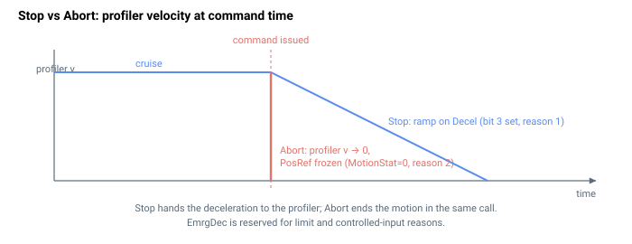

# Abort

通过清除运动状态立即停止运动，无规划器减速斜坡。

## 概述

`Abort` **立即**停止轴运动。与 [Stop](Stop.md) 不同——后者置位一个请求位并让规划器在受控的 [Decel](../03-kinematics-configuration/Decel.md) 减速过程中将速度降下来——`Abort` 在同一次调用中将整个 [MotionStat](../05-motion-status/MotionStat.md) 字清为 0（非运动中）。从下一个控制周期起，规划器不再处于运动中：它将其内部速度置零，并将 [PosRef](../01-kinematics-status/PosRef.md) 冻结在当前值。此后实际的物理减速取决于位置/速度环在保持这个已冻结参考时所产生的结果，而非规划的 `EmrgDec` 斜坡。`Abort` 是一个轴相关命令函数，可在运动过程中的任何时刻发出。

> **关于 `EmrgDec` 的说明：** 规划器的紧急减速速率 [EmrgDec](../03-kinematics-configuration/EmrgDec.md) 由**运动原因**码选择——限位开关、软件位置限位以及受控停止数字量输入。`Abort` 命令本身并不运行该减速路径；它立即结束运动。如果需要规划的 `EmrgDec` 斜坡，请使用受控停止输入或软件限位。

## 工作原理

### 单轴运动

对于正常的单轴运动，`Abort`（在禁用中断的情况下）立即结束运动，但仅当轴处于运动中时：

| `Abort` 的操作 | 效果 |
|---|---|
| [MotionReason](../05-motion-status/MotionReason.md) = 2 | 记录运动因 `Abort` 而结束 |
| [MotionStat](../05-motion-status/MotionStat.md) = 0（非运动中） | 强制立即结束运动——同时清除运动中位及所有其他状态位 |
| 锁存规划器采样计数 | 将规划器运行时间锁存到 [MotionSamples](../05-motion-status/MotionSamples.md) |

将 [MotionStat](../05-motion-status/MotionStat.md) 清为 0 是使停止立即生效的原因：在没有置位运动位的情况下，规划器的无运动分支会将其速度清零并保持 [PosRef](../01-kinematics-status/PosRef.md)，因此不再生成进一步的轨迹。



### 组运动

如果该轴属于某个组，`Abort` 会立即拆除整个组：

- **CNCA / CNCB 成员**：清除每个成员的运动位并将 CNC 状态重置为非运动中；发出命令的轴获得 [MotionReason](../05-motion-status/MotionReason.md) = 2（Abort 命令），在 CNCA 组中其他成员获得 [MotionReason](../05-motion-status/MotionReason.md) = 20（一个 CNCA 成员被中止）。CNC 步进模式被禁用。
- **矢量成员**：清除所有成员的运动位并将主矢量状态置为非运动中；发出命令的轴获得 [MotionReason](../05-motion-status/MotionReason.md) = 2（Abort 命令），其他成员获得 [MotionReason](../05-motion-status/MotionReason.md) = 32（一个矢量成员被中止）。
- **样条缓冲区成员**：将每个成员的 [MotionStat](../05-motion-status/MotionStat.md) 强制为非运动中；发出命令的轴获得 [MotionReason](../05-motion-status/MotionReason.md) = 2（Abort 命令），其他成员获得 [MotionReason](../05-motion-status/MotionReason.md) = 38（一个样条缓冲区成员被中止）。

在所有情况下，每个受影响轴的规划器运行时间都会被锁存到 [MotionSamples](../05-motion-status/MotionSamples.md)。

### 边界情况

- **电机失能：** `Abort` 被接受但无效果（没有运动可结束）。
- **非运动中：** `Abort` 不更新任何状态——该函数首先检查运动中位。
- **超范围"写入"：** 该函数无值。
- **仿真模式（`MotorType` = 5）：** 允许；仿真运动立即结束。
- **ModRev 环绕：** 参考冻结在当前值；环绕状态保持不变。
- **存在故障：** 电机已被禁用；`Abort` 无进一步效果。
- **`PTPKeepMoving = 1`：** `Abort` 覆盖保持运动标志（它直接清除 `MotionStat`）。
- **重复式 PTP（`MotionMode = 2`）的停顿期间：** 放弃停顿并结束该次重复。
- **CNCA / CNCB / 矢量 / 样条缓冲区成员：** 整个组被拆除；逐轴原因如上所列。
- **物理行为：** 由于参考是被冻结而非斜坡减速，负载仅靠速度环保持现已静止的参考时的自然滞后来减速。惯性负载可能携带大量动能越过冻结点；如需规划的斜坡，请使用 [Stop](Stop.md)。

## 示例

```text
AAbort               ; immediately end motion on axis A
```

## 另请参阅

- [Stop](Stop.md) — 在 `Decel` 上斜坡减速的受控停止
- [Decel](../03-kinematics-configuration/Decel.md) — `Stop` 使用的减速度（`Abort` 不使用）
- [EmrgDec](../03-kinematics-configuration/EmrgDec.md) — 紧急速率，由限位/故障原因选择，而非由 `Abort` 选择
- [MotionStat](../05-motion-status/MotionStat.md) — 被 `Abort` 清为 0
- [MotionReason](../05-motion-status/MotionReason.md) — `Abort` 置位的原因码 2
