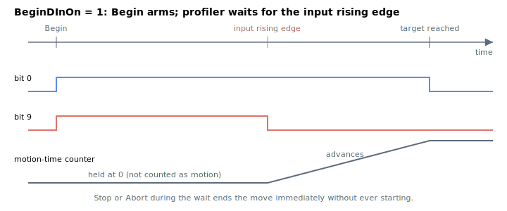

# BeginDInOn

Enables a digital-input trigger that automatically issues `Begin` on the axis.

## Overview

`BeginDInOn` makes a [Begin](Begin.md) command **wait for a digital-input rising edge** before the move actually starts. Issued by itself, `Begin` starts motion on the next control cycle; with `BeginDInOn = 1`, `Begin` instead arms the move and holds it suspended until the configured input rises. This lets a move be set up under software control but released by external hardware timing. It is an axis-related parameter (range 0–1, default 0) saved to flash, and may be changed at any time.

`BeginDInOn` is the *per-axis enable*. The input that releases the move is selected separately through [DInMode](../../05-inputs-outputs/04-digital-inputs/DInMode.md), which must assign the begin-motion functionality (functionality code 3) to a digital input for that axis. Both must be set: `BeginDInOn = 1` and a `DInMode` input configured as begin-motion.

## How it works

### Arming the wait

When `Begin` runs with `BeginDInOn = 1`, instead of just setting the in-motion bit it sets both the in-motion and wait-for-input bits in [MotionStat](../05-motion-status/MotionStat.md):

| [MotionStat](../05-motion-status/MotionStat.md) bit | When `BeginDInOn = 0` | When `BeginDInOn = 1` |
|---|---|---|
| bit 0 (in-motion) | set | set |
| bit 9 (wait-for-input) | clear | **set** |

All mode-specific initialization (profiler seeding, PD/initial-position capture, etc.) is done at `Begin` time, so the user must not change those inputs while waiting. While the wait bit is set the profiler holds the axis stationary and **does not advance the motion-time counter**, so the wait time is not counted as part of the move.

### Releasing on the edge

A digital input configured as begin-motion is evaluated in the control interrupt. On a rising edge the controller sets a per-axis flag requesting the move to start.

On the next cycle the profiler sees that flag, clears the wait-for-input bit and lets the motion start on the following sample. If a [Stop](Stop.md) or [Abort](Abort.md) arrives while still waiting, the move is ended immediately without ever starting.



The live input level can be observed through [DInPort-DInPortHigh](../../05-inputs-outputs/04-digital-inputs/DInPort-DInPortHigh.md); edge logic/inversion is set by [DInLog-DInLogHigh](../../05-inputs-outputs/04-digital-inputs/DInLog-DInLogHigh.md).

## Examples

```text
ABeginDInOn=1        ; arm: the next ABegin waits for the begin-motion input edge
ABeginDInOn=0        ; disarm: ABegin starts motion immediately
ABeginDInOn          ; read current state
```

Typical sequence — configure an input as begin-motion for axis A, arm, set up and issue the move (it starts on the input edge):

```text
ADInMode[3]=65539    ; digital input 3 = begin-motion (code 3) for axis A (bit 16)
ABeginDInOn=1        ; arm the trigger
AMotionMode=1        ; PTP
AAbsTrgt=100000      ; target
ABegin               ; arms the move; motion starts on the rising edge of input 3
```

### Edge cases

- **Motor off:** the value is held; the wait-for-input bit will be set on the next `Begin` once the motor is enabled.
- **Out-of-range write:** the parameter system rejects values outside `0`–`1`.
- **Simulation mode (`MotorType` = 5):** unchanged; the wait/release behaviour is unaffected.
- **ModRev wrap:** unrelated.
- **Active fault:** the axis is disabled; the arm is preserved on re-enable for the next `Begin`.
- **No begin-motion input configured:** if `BeginDInOn = 1` but no [DInMode](../../05-inputs-outputs/04-digital-inputs/DInMode.md) input is assigned code 3 for this axis, the move will wait indefinitely.
- **Stop/Abort while waiting:** ends the move immediately without starting; bit 9 is cleared along with bit 0.
- **Other motion modes:** the trigger applies to any mode — the input edge releases the wait regardless of `MotionMode`.
- **Edge already high at `Begin`:** the controller waits for a **rising edge**, not a level; an already-high input must drop and rise to release the wait.

## See also

- [Begin](Begin.md) — the command whose start this trigger defers
- [DInMode](../../05-inputs-outputs/04-digital-inputs/DInMode.md) — assigns the begin-motion functionality (code 3) to an input
- [DInPort-DInPortHigh](../../05-inputs-outputs/04-digital-inputs/DInPort-DInPortHigh.md) — digital input port status
- [DInLog-DInLogHigh](../../05-inputs-outputs/04-digital-inputs/DInLog-DInLogHigh.md) — input logic/inversion
- [MotionStat](../05-motion-status/MotionStat.md) — bit 9 (wait-for-input) set while waiting
