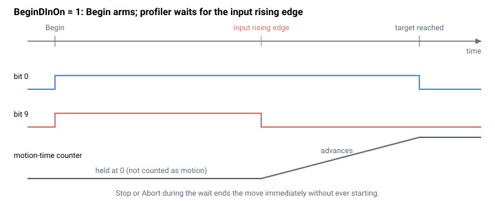

# BeginDInOn

启用一个数字量输入触发器，在该轴上自动发出 `Begin`。

## 概述

`BeginDInOn` 使一条 [Begin](Begin.md) 命令在运动实际启动之前**等待某个数字量输入上升沿**。单独发出时，`Begin` 会在下一个控制周期启动运动；当 `BeginDInOn = 1` 时，`Begin` 改为武装该次运动并将其挂起，直到所配置的输入上升。这使得运动可以在软件控制下完成设置，但由外部硬件时序来释放。它是一个轴相关参数（范围 0–1，默认 0），保存至闪存，可随时更改。

`BeginDInOn` 是*每轴使能*。释放该次运动的输入由 [DInMode](../../05-inputs-outputs/04-digital-inputs/DInMode.md) 单独选定，它必须为该轴的某个数字量输入分配启动运动功能（功能码 3）。两者都必须设置：`BeginDInOn = 1` 且有一个 `DInMode` 输入被配置为启动运动。

## 工作原理

### 武装等待

当 `Begin` 在 `BeginDInOn = 1` 的情况下运行时，它不只是设置运动中位，而是同时设置 [MotionStat](../05-motion-status/MotionStat.md) 中的运动中位和等待输入位：

| [MotionStat](../05-motion-status/MotionStat.md) 位 | 当 `BeginDInOn = 0` | 当 `BeginDInOn = 1` |
|---|---|---|
| bit 0（运动中） | 置位 | 置位 |
| bit 9（等待输入） | 清零 | **置位** |

所有特定于模式的初始化（规划器装填初值、PD/初始位置捕获等）都在 `Begin` 时完成，因此用户在等待期间不得更改那些输入。在等待位被置位期间，规划器将该轴保持静止，且**不推进运动时间计数器**，因此等待时间不计入该次运动。

### 在边沿上释放

被配置为启动运动的数字量输入会在控制中断中被求值。在上升沿上，控制器设置一个每轴标志，请求该次运动启动。

在下一个周期，规划器看到该标志，清除等待输入位，并在随后的采样上让运动启动。如果在仍处于等待时到来一条 [Stop](Stop.md) 或 [Abort](Abort.md)，则该次运动会立即结束而永不启动。



实时输入电平可通过 [DInPort-DInPortHigh](../../05-inputs-outputs/04-digital-inputs/DInPort-DInPortHigh.md) 观察；边沿逻辑/取反由 [DInLog-DInLogHigh](../../05-inputs-outputs/04-digital-inputs/DInLog-DInLogHigh.md) 设置。

## 示例

```text
ABeginDInOn=1        ; arm: the next ABegin waits for the begin-motion input edge
ABeginDInOn=0        ; disarm: ABegin starts motion immediately
ABeginDInOn          ; read current state
```

典型序列——为 A 轴将某个输入配置为启动运动，武装，设置并发出运动（它在输入边沿上启动）：

```text
ADInMode[3]=65539    ; digital input 3 = begin-motion (code 3) for axis A (bit 16)
ABeginDInOn=1        ; arm the trigger
AMotionMode=1        ; PTP
AAbsTrgt=100000      ; target
ABegin               ; arms the move; motion starts on the rising edge of input 3
```

### 边界情况

- **电机失能：** 该值被保留；一旦电机被使能，等待输入位将在下一次 `Begin` 时被置位。
- **超范围写入：** 参数系统拒绝 `0`–`1` 范围之外的值。
- **仿真模式（`MotorType` = 5）：** 不变；等待/释放行为不受影响。
- **ModRev 环绕：** 无关。
- **存在激活故障：** 该轴被禁用；该武装在重新使能后被保留，供下一次 `Begin` 使用。
- **未配置启动运动输入：** 若 `BeginDInOn = 1` 但本轴没有任何 [DInMode](../../05-inputs-outputs/04-digital-inputs/DInMode.md) 输入被分配功能码 3，则该次运动将无限期等待。
- **等待期间 Stop/Abort：** 立即结束该次运动而不启动；bit 9 与 bit 0 一同被清除。
- **其他运动模式：** 该触发器适用于任何模式——无论 `MotionMode` 如何，输入边沿都会释放等待。
- **`Begin` 时边沿已为高：** 控制器等待的是**上升沿**，而不是电平；已为高的输入必须先变低再变高才能释放等待。

## 另请参阅

- [Begin](Begin.md) — 本触发器所推迟启动的命令
- [DInMode](../../05-inputs-outputs/04-digital-inputs/DInMode.md) — 为某个输入分配启动运动功能（功能码 3）
- [DInPort-DInPortHigh](../../05-inputs-outputs/04-digital-inputs/DInPort-DInPortHigh.md) — 数字量输入端口状态
- [DInLog-DInLogHigh](../../05-inputs-outputs/04-digital-inputs/DInLog-DInLogHigh.md) — 输入逻辑/取反
- [MotionStat](../05-motion-status/MotionStat.md) — 等待期间被置位的 bit 9（等待输入）
