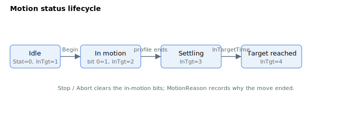

# Motion status

Motion status is updated while the motion is underway. [MotionStat](MotionStat.md) reports the detailed bit-mapped state, [MotionReason](MotionReason.md) records why the last move ended, and [InTargetStat](InTargetStat.md) tracks the settling state through to "target reached". The lifecycle below shows how these signals progress over a move.

The table below shows the summary of motion status keywords.

| No. | Keyword | Summary |
|-----|---------|---------|
| 1 | [MotionStat](MotionStat.md) | Bit-mapped detailed status of the current motion. |
| 2 | [MotionReason](MotionReason.md) | Numeric code recording why the last motion stopped. |
| 3 | [MotionSamples](MotionSamples.md) | Move and settle times of the last motion, in controller cycles. |
| 4 | [InTargetStat](InTargetStat.md) | Motion and settling state (disabled, moving, settling, reached). |
| 5 | [InTargetTol](InTargetTol.md) | Position settling window compared against `PosErr`. |
| 6 | [InTargetVelTh](InTargetVelTh.md) | Velocity settling window for current/force control. |
| 7 | [InTargetTime](InTargetTime.md) | Minimum dwell inside the window before target-reached. |
| 8 | [RptCounter](RptCounter.md) | Running count of completed repetitions. |
