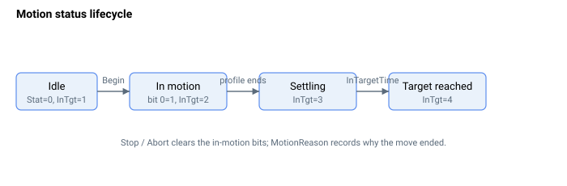

# 运动状态

运动状态在运动进行期间持续更新。[MotionStat](MotionStat.md) 报告详细的位映射状态，[MotionReason](MotionReason.md) 记录上次运动结束的原因，[InTargetStat](InTargetStat.md) 跟踪从整定过程到"到达目标"的状态。以下生命周期图展示了这些信号在一次运动过程中的变化过程。

下表汇总了运动状态关键字。

| 编号 | 关键字 | 说明 |
|-----|---------|---------|
| 1 | [MotionStat](MotionStat.md) | 当前运动的详细位映射状态。 |
| 2 | [MotionReason](MotionReason.md) | 记录上次运动停止原因的数值码。 |
| 3 | [MotionSamples](MotionSamples.md) | 上次运动的运动时间与整定时间，以控制器周期为单位。 |
| 4 | [InTargetStat](InTargetStat.md) | 运动与整定状态（禁用、运动中、整定中、已到达）。 |
| 5 | [InTargetTol](InTargetTol.md) | 与 `PosErr` 比较的位置整定窗口。 |
| 6 | [InTargetVelTh](InTargetVelTh.md) | 用于电流/力控制的速度整定窗口。 |
| 7 | [InTargetTime](InTargetTime.md) | 在窗口内保持的最短停留时间，满足后报告到位。 |
| 8 | [RptCounter](RptCounter.md) | 已完成重复次数的累计计数。 |
