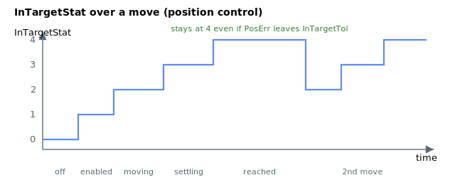

# InTargetStat

Reports the motion and settling state of the axis (disabled, moving, settling, reached).

## Overview

`InTargetStat` reports the motion and settling state of the axis as a single value 0–4. The exact meaning of each value depends on the [OperationMode](../../08-axis-operation/01-general-keywords/OperationMode.md): in position/velocity control the settling check uses [PosErr](../01-kinematics-status/PosErr.md) against [InTargetTol](InTargetTol.md), while in current/force control it uses [Vel](../01-kinematics-status/Vel.md) `[1]` against [InTargetVelTh](InTargetVelTh.md). In all cases the in-window condition must persist for at least [InTargetTime](InTargetTime.md) before the axis reports "target reached" (`InTargetStat = 4`).

The five values are:

| Value | Meaning |
|----|----|
| 0 | Motor disabled. Set when the axis is turned off. |
| 1 | Motor enabled, no motion yet. |
| 2 | In motion (position/velocity), or velocity above threshold (current/force). Set at `Begin`. |
| 3 | Inside the settling window but [InTargetTime](InTargetTime.md) has not yet elapsed. |
| 4 | Target reached — inside the window for at least InTargetTime. |

## How it works

After a position/velocity move the controller advances the settling state machine each cycle: on the first cycle after motion it moves `2 → 3` and clears the dwell counter; while in state 3 it increments the counter whenever `|PosErr| <= InTargetTol` and re-zeroes it the moment the error leaves the window; once the counter reaches `InTargetTime` it latches state 4. **In position/velocity control state 4 is sticky** — once reached it stays at 4 until the next motion is commanded or the axis is disabled, even if `|PosErr|` later exceeds `InTargetTol`.

In **current/force control** the check is recomputed every cycle from `|Vel[1]|` against `InTargetVelTh` and is **not** latched: if the velocity rises back above the threshold the state immediately drops from 4 (or 3) back to 2, and the dwell counter restarts. This is why value 2 in current/force mode reads as "velocity out of range" rather than "in motion".

| InTargetStat | Velocity control (`OperationMode = 2`) / Position control (`OperationMode = 3`) — monitors `PosErr`, window `InTargetTol` | Current control (`OperationMode = 1`) / Force control (`OperationMode = 4`) — monitors `Vel[1]`, window `InTargetVelTh` |
|---|---|---|
| 0 | **Motor disabled** | **Motor disabled** |
| 1 | **Motor enabled** | **Motor enabled** |
| 2 | **In motion** | **Velocity out of range** — `abs(Vel[1]) > InTargetVelTh` |
| 3 | **Settling** — axis is settling (or has settled but `InTargetTime` has not yet elapsed). | **Velocity within range** — `abs(Vel[1]) <= InTargetVelTh`, but `InTargetTime` has not yet elapsed. |
| 4 | **Target reached** — settled within `InTargetTol` for at least `InTargetTime`. Once `InTargetStat = 4` it stays there until the next motion is commanded or the axis is disabled, even if `abs(PosErr)` later exceeds `InTargetTol`. | **Target reached** — `abs(Vel[1]) <= InTargetVelTh` for at least `InTargetTime`. |

## Examples



The example shows how InTargetStat changes with different motion phases, under position control operation mode (OperationMode=3).

| Time \[s\] | InTargetStat | Descriptions |
|----|----|----|
| 0 to 0.1 | 0 | Motor disabled. |
| 0.1 to 0.2 | 1 | Motor enabled. |
| 0.2 to 0.27 | 2 | In motion (where dPosRef!=0). |
| 0.27 to 0.42 | 3 | InTargetStat=3 after motion, until the absolute value of PosErr is less than InTargetTol for at least InTargetTime. |
| 0.42 to 1.17 | 4 | Target reached. InTargetStat=4 even when absolute value PosErr is more than InTargetTol. |
| 1.17 to 1.24 | 2 | In motion (where dPosRef!=0). |
| 1.24 to 1.39 | 3 | Settling and waiting for InTargetTime to elapse. |
| 1.39 to 1.73 | 4 | Target reached. |

```text
AInTargetStat       ; read the current settling state
```

## See also

- [InTargetTol](InTargetTol.md) — settling window (position/velocity control)
- [InTargetVelTh](InTargetVelTh.md) — settling window (current/force control)
- [InTargetTime](InTargetTime.md) — minimum dwell time inside the window
- [OperationMode](../../08-axis-operation/01-general-keywords/OperationMode.md) — selects which signal/window the settling check uses
- [MotionStat](MotionStat.md) — detailed bit-mapped motion status
- [MotionSamples](MotionSamples.md) — settling times computed from the same state machine
