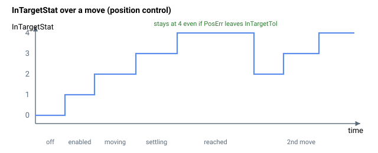

# InTargetStat

报告轴的运动与整定状态（禁用、运动中、整定中、已到达）。

## 概述

`InTargetStat` 以单一数值 0–4 报告轴的运动与整定状态。每个值的确切含义取决于 [OperationMode](../../08-axis-operation/01-general-keywords/OperationMode.md)：在位置/速度控制模式下，整定检查将 [PosErr](../01-kinematics-status/PosErr.md) 与 [InTargetTol](InTargetTol.md) 比较；在电流/力控制模式下，则将 [Vel](../01-kinematics-status/Vel.md) `[1]` 与 [InTargetVelTh](InTargetVelTh.md) 比较。在所有情况下，窗口内条件必须持续至少 [InTargetTime](InTargetTime.md) 时间，轴才会报告"到达目标"（`InTargetStat = 4`）。

五个值的含义如下：

| 值 | 含义 |
|----|----|
| 0 | 电机禁用。轴关闭时置位。 |
| 1 | 电机使能，尚无运动。 |
| 2 | 运动中（位置/速度），或速度超过阈值（电流/力）。在 `Begin` 时置位。 |
| 3 | 在整定窗口内，但 [InTargetTime](InTargetTime.md) 尚未到期。 |
| 4 | 到达目标——在窗口内持续至少 InTargetTime。 |

## 工作原理

位置/速度运动结束后，控制器每个周期推进整定状态机：运动结束后第一个周期，状态从 `2 → 3` 并清零停留计数器；在状态 3 中，每当 `|PosErr| <= InTargetTol` 时计数器递增，误差离开窗口时立即清零；一旦计数器达到 `InTargetTime`，状态锁存为 4。**在位置/速度控制中，状态 4 具有粘性**——一旦到达，将保持在 4，直到下一次运动指令或轴被禁用，即使此后 `|PosErr|` 超过 `InTargetTol`。

在**电流/力控制**中，每个周期都从 `|Vel[1]|` 与 `InTargetVelTh` 的比较重新计算，**不**锁存：若速度再次超过阈值，状态立即从 4（或 3）降回 2，停留计数器重新开始。这就是为什么在电流/力控制模式下，值 2 的含义是"速度超出范围"而非"运动中"。

| InTargetStat | 速度控制（`OperationMode = 2`）/ 位置控制（`OperationMode = 3`）——监测 `PosErr`，窗口为 `InTargetTol` | 电流控制（`OperationMode = 1`）/ 力控制（`OperationMode = 4`）——监测 `Vel[1]`，窗口为 `InTargetVelTh` |
|---|---|---|
| 0 | **电机禁用** | **电机禁用** |
| 1 | **电机使能** | **电机使能** |
| 2 | **运动中** | **速度超出范围** — `abs(Vel[1]) > InTargetVelTh` |
| 3 | **整定中** — 轴正在整定（或已整定但 `InTargetTime` 尚未到期）。 | **速度在范围内** — `abs(Vel[1]) <= InTargetVelTh`，但 `InTargetTime` 尚未到期。 |
| 4 | **到达目标** — 在 `InTargetTol` 内持续至少 `InTargetTime`。一旦 `InTargetStat = 4`，将保持在 4，直到下一次 `Begin` 或电机禁用，即使此后 `abs(PosErr)` 超过 `InTargetTol`。 | **到达目标** — `abs(Vel[1]) <= InTargetVelTh` 持续至少 `InTargetTime`。 |

## 示例



该示例展示了在位置控制运行模式（OperationMode=3）下，InTargetStat 随不同运动阶段的变化情况。

| 时间 \[s\] | InTargetStat | 说明 |
|----|----|----|
| 0 至 0.1 | 0 | 电机禁用。 |
| 0.1 至 0.2 | 1 | 电机使能。 |
| 0.2 至 0.27 | 2 | 运动中（dPosRef!=0）。 |
| 0.27 至 0.42 | 3 | 运动结束后 InTargetStat=3，直到 PosErr 绝对值小于 InTargetTol 且持续至少 InTargetTime。 |
| 0.42 至 1.17 | 4 | 到达目标。即使 PosErr 绝对值大于 InTargetTol，InTargetStat 仍保持为 4。 |
| 1.17 至 1.24 | 2 | 运动中（dPosRef!=0）。 |
| 1.24 至 1.39 | 3 | 整定中，等待 InTargetTime 到期。 |
| 1.39 至 1.73 | 4 | 到达目标。 |

```text
AInTargetStat       ; read the current settling state
```

### 边界情况

- **电机关闭：** 值强制为 `0`（电机禁用）。
- **超出范围的"写"操作：** `InTargetStat` 为只读。
- **仿真模式（`MotorType` = 5）：** 状态机运行方式相同（`PosErr` 被强制为零，因此轴始终在 `InTargetTol` 范围内）。
- **ModRev 环绕：** 环绕同时移动参考值与反馈，因此 `|PosErr|` 在环绕时保持不变，不会虚假地退出窗口。
- **活动故障：** 电机关闭，值降至 `0`。
- **位置/速度控制（OperationMode = 2 或 3）：** 值 4 具有粘性——一旦到达，状态保持在 4，直到下一次 `Begin` 或电机禁用，即使此后 `|PosErr|` 超过 `InTargetTol`。
- **电流/力控制（OperationMode = 1 或 4）：** 值**不**具有粘性——每个周期都从 `|Vel[1]|` 重新计算，因此若速度再次升高，状态可立即从 4 降回 3 或 2。
- **重复 PTP 段间：** 在停留期间，状态机由停留分支运行——若轴在停留期间整定完成，值可在停留内达到 4，然后在下一段开始时降回 2。

## 另请参阅

- [InTargetTol](InTargetTol.md) — 整定窗口（位置/速度控制）
- [InTargetVelTh](InTargetVelTh.md) — 整定窗口（电流/力控制）
- [InTargetTime](InTargetTime.md) — 在窗口内的最短停留时间
- [PosErr](../01-kinematics-status/PosErr.md) — 位置/速度模式下与 `InTargetTol` 比较的信号
- [Vel](../01-kinematics-status/Vel.md) — 电流/力模式下 `Vel[1]` 是与 `InTargetVelTh` 比较的信号
- [OperationMode](../../08-axis-operation/01-general-keywords/OperationMode.md) — 选择整定检查使用的信号/窗口
- [MotionStat](MotionStat.md) — 详细的位映射运动状态
- [MotionSamples](MotionSamples.md) — 由同一状态机计算的整定时间
