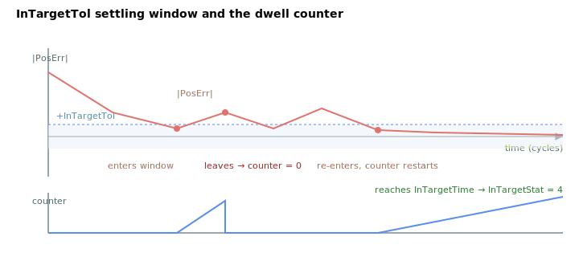

# InTargetTol

Position settling window (PosErr) used to declare target reached.

## Overview

In position or velocity control operation mode ([OperationMode](../../08-axis-operation/01-general-keywords/OperationMode.md) `= 2` or `3`), `InTargetTol` is the settling window that the absolute position error [PosErr](../01-kinematics-status/PosErr.md) must stay within for [InTargetTime](InTargetTime.md) before [InTargetStat](InTargetStat.md) signals that the target is reached (`InTargetStat = 4`). For current/force control the velocity-based window [InTargetVelTh](InTargetVelTh.md) is used instead.

## How it works

The settling check is a direct magnitude comparison done each control cycle:

$$
|\text{PosErr}| \le \text{InTargetTol}
$$

While the comparison is true the dwell counter is incremented; the moment `|PosErr|` leaves the window the counter is reset to 0. Only when the counter has accumulated `InTargetTime` worth of consecutive in-window cycles does `InTargetStat` latch to 4. `InTargetTol` is in user units (the same units as `PosErr`); the comparison is against the raw stored value, so a value of `0` requires an exact-zero position error. The default is `10` counts. It is saved to flash and may be changed while in motion.



A practical tuning rule: set `InTargetTol` to the largest position error your application can tolerate as "settled" — too tight and the dwell counter keeps resetting (the axis never reports reached); too loose and the system reports reached before the load has actually stopped moving. `InTargetTime` then governs how long the error must hold inside that band.

## Examples

```text
AInTargetTol=10      ; settling window in user units (default)
AInTargetTol        ; read current value
```

### Edge cases

- **Motor off:** value is held; `InTargetStat` is `0` and the comparison is not used.
- **Out-of-range write:** the parameter system clamps to `0`–`2³¹−1`; negative values are rejected.
- **Simulation mode (`MotorType` = 5):** `PosErr` is forced to zero, so the window is always satisfied.
- **ModRev wrap:** `PosErr` is preserved through the wrap, so the comparison is not falsely violated.
- **Active fault:** axis disabled, `InTargetStat = 0`.
- **Other motion modes:** the window applies to any mode in position/velocity OperationMode; in current/force mode [InTargetVelTh](InTargetVelTh.md) is used instead.
- **`InTargetTol = 0`:** requires exact-zero `PosErr` — practically unreachable on a real axis; use only with simulated drives.
- **Very large `InTargetTol`:** the axis can be declared "reached" while still moving — keep below the smallest tolerated stop error.

## See also

- [InTargetStat](InTargetStat.md) — settling state gated by this window
- [InTargetTime](InTargetTime.md) — minimum dwell time inside the window
- [InTargetVelTh](InTargetVelTh.md) — velocity settling window (current/force control)
- [PosErr](../01-kinematics-status/PosErr.md) — the signal compared against this window
- [OperationMode](../../08-axis-operation/01-general-keywords/OperationMode.md) — selects position- vs velocity-based settling
- [MaxPosErr](../../06-protections/03-motion/general-maximum-limits/MaxPosErr.md) — protection limit on the same signal (trip, not settle)
