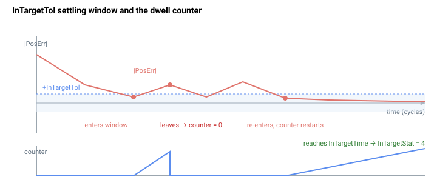

# InTargetTol

用于判定到位的位置整定窗口（PosErr）。

## 概述

在位置或速度控制运行模式（[OperationMode](../../08-axis-operation/01-general-keywords/OperationMode.md) `= 2` 或 `3`）下，`InTargetTol` 是整定窗口，绝对位置误差 [PosErr](../01-kinematics-status/PosErr.md) 必须在该窗口内持续保持 [InTargetTime](InTargetTime.md) 的时间，之后 [InTargetStat](InTargetStat.md) 才会发出到位信号（`InTargetStat = 4`）。对于电流/力控制，则改用基于速度的窗口 [InTargetVelTh](InTargetVelTh.md)。

## 工作原理

整定检查在每个控制周期进行直接幅值比较：

$$
|\text{PosErr}| \le \text{InTargetTol}
$$

比较结果为真时驻留计数器加 1；`|PosErr|` 一旦离开窗口，计数器立即重置为 0。只有当计数器积累了 `InTargetTime` 个连续窗口内周期后，`InTargetStat` 才会锁定为 4。`InTargetTol` 以用户单位表示（与 `PosErr` 单位相同）；比较针对原始存储值进行，因此值为 `0` 时要求位置误差恰好为零。默认值为 `10` 个计数。该参数保存至闪存，运动中也可修改。



实用整定建议：将 `InTargetTol` 设为应用能接受的最大"已整定"位置误差——设置过紧会使驻留计数器不断重置（轴始终无法报告到位）；设置过松则系统在负载实际停止前即报告到位。`InTargetTime` 则决定误差必须在该范围内保持多长时间。

## 示例

```text
AInTargetTol=10      ; 整定窗口（用户单位，默认值）
AInTargetTol        ; 读取当前值
```

### 边界情况

- **电机关闭：**值保持不变；`InTargetStat` 为 `0`，比较不被使用。
- **超范围写入：**参数系统钳位至 `0`–`2³¹−1`；负值被拒绝。
- **仿真模式（`MotorType` = 5）：**`PosErr` 被强制为零，因此窗口条件始终满足。
- **ModRev 环绕：**`PosErr` 在环绕时得以保留，比较不会出现误判违反。
- **活动故障：**轴被禁用，`InTargetStat = 0`。
- **其他运动模式：**该窗口适用于位置/速度 OperationMode 下的任何模式；在电流/力模式下改用 [InTargetVelTh](InTargetVelTh.md)。
- **`InTargetTol = 0`：**要求 `PosErr` 恰好为零——在实际轴上几乎不可达；仅在仿真驱动中使用。
- **`InTargetTol` 非常大：**轴在仍处于运动状态时即可被判定为"到位"——应保持在可接受的最小停止误差以下。

## 另请参阅

- [InTargetStat](InTargetStat.md) — 由该窗口门控的整定状态
- [InTargetTime](InTargetTime.md) — 窗口内的最短驻留时间
- [InTargetVelTh](InTargetVelTh.md) — 速度整定窗口（电流/力控制）
- [PosErr](../01-kinematics-status/PosErr.md) — 与该窗口比较的信号
- [OperationMode](../../08-axis-operation/01-general-keywords/OperationMode.md) — 选择基于位置还是基于速度的整定
- [MaxPosErr](../../06-protections/03-motion/general-maximum-limits/MaxPosErr.md) — 同一信号的保护限值（跳闸而非整定）
