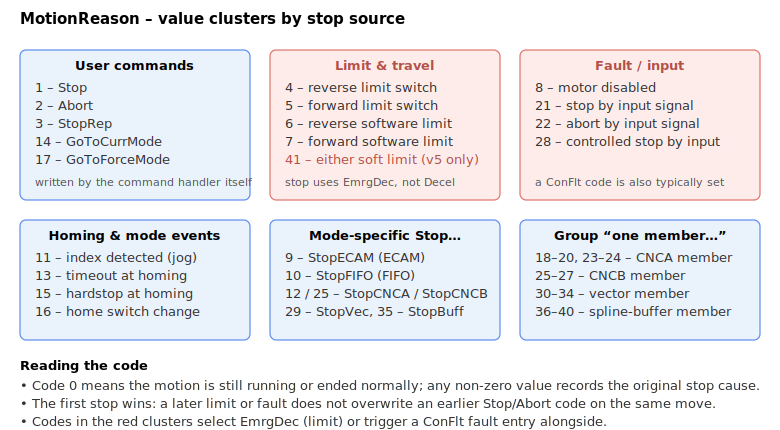

# MotionReason

Records why the last motion stopped, encoded as a numeric reason code.

## Overview

`MotionReason` stores the reason the last motion stopped, as a numeric code. It is reset to `0` when a new motion starts (`Begin`, homing, or a profile restart). It records the *original* stopping cause: the code is written at the moment a stop is first requested and the same move keeps decelerating, so if several stop conditions occur in sequence, only the first is reported. Use it together with [MotionStat](MotionStat.md) to diagnose how and why a move ended.

> **Documentation pending:** `MotionReason` is `implemented: partial`; some reason codes may not yet be fully implemented in all firmware versions.

## How it works

Each code is written by a distinct stop path. Codes 4–7 come from the controller's limit handling (hardware RLS/FLS and software [RevPLim](../../06-protections/03-motion/position-limit-protection/RevPLim.md)/[FwdPLim](../../06-protections/03-motion/position-limit-protection/FwdPLim.md) checks), homing codes 13/15/16 come from the homing sequence, and the CNCA/CNCB/vector/spline "one member …" codes (18–40) are written when a group-member axis stops, aborts, or hits a limit.

The codes cluster into a handful of families, and reading the cluster usually tells you what to look at next (the limit/fault clusters in red are also the ones that select [EmrgDec](../03-kinematics-configuration/EmrgDec.md) and typically pair with a [ConFlt](../../07-status-and-faults/ConFlt.md) entry):



| Value | Meaning |
|----|----|
| 0 | Current motion still not ended, or motion ended normally. |
| 1 | Motion ended due to Stop command. |
| 2 | Motion ended due to Abort command. |
| 3 | Motion ended due to StopRep command. |
| 4 | Motion ended due to reverse limit switch detection. |
| 5 | Motion ended due to forward limit switch detection. |
| 6 | Motion ended due to reverse software limit. |
| 7 | Motion ended due to forward software limit. |
| 8 | Motion ended due to disabled motor. |
| 9 | Motion ended due to StopECAM command (for ECAM motions only). |
| 10 | Motion ended due to StopFIFO command (for FIFO motions only). |
| 11 | Motion ended due to detected index (for jogging only). |
| 12 | Motion ended due to StopCNCA command (for CNCA motions only). |
| 13 | Motion ended due to timeout at homing. |
| 14 | Motion ended due to GoToCurrMode command. |
| 15 | Motion ended due to hardstop at homing. |
| 16 | Motion ended due to home switch change. |
| 17 | Motion ended due to GoToForceMode command. |
| 18 | Motion ended due to one member of CNCA being disabled. |
| 19 | Motion ended due to one member of CNCA being stopped. |
| 20 | Motion ended due to one member of CNCA being aborted. |
| 21 | Motion ended due to stop by input signal. |
| 22 | Motion ended due to abort by input signal. |
| 23 | Motion ended due to one member of CNCA hitting the forward/reverse limit switch. |
| 24 | Motion ended due to one member of CNCA hitting the forward/reverse software limit. |
| 25 | Motion ended due to StopCNCB command / one member of CNCB stopped. |
| 26 | Motion ended due to one member of CNCB hitting the forward/reverse limit switch. |
| 27 | Motion ended due to one member of CNCB hitting the forward/reverse software limit. |
| 28 | Motion ended due to controlled stop by input signal. |
| 29 | Motion ended due to StopVec command. |
| 30 | Motion ended due to one member of vector being disabled. |
| 31 | Motion ended due to one member of vector being stopped. |
| 32 | Motion ended due to one member of vector being aborted. |
| 33 | Motion ended due to one member of vector hitting the forward/reverse limit switch. |
| 34 | Motion ended due to one member of vector hitting the forward/reverse software limit. |
| 35 | Motion ended due to StopBuff command. |
| 36 | Motion ended due to one member of spline buffer being disabled. |
| 37 | Motion ended due to one member of spline buffer being stopped. |
| 38 | Motion ended due to one member of spline buffer being aborted. |
| 39 | Motion ended due to one member of spline buffer hitting the forward/reverse limit switch. |
| 40 | Motion ended due to one member of spline buffer hitting the forward/reverse software limit. |

## Changes between versions

| | v4 (standalone &amp; central-i) | v5 (central-i) |
|---|---|---|
| Highest reason code | 40 | **41** |
| Value 41 | not defined | A jog move ended because it decelerated to a stop at a forward or reverse software position limit (the reason code paired with [MotionStat](MotionStat.md) bit 20). |

In **v5** a jog-specific software-limit reason code 41 was added (forward or reverse). Codes 0–40 are unchanged. **v5 is central-i only.**

## Examples

```text
AMotionReason       ; read why the last motion stopped
```

If the motion was ended by an abort command, but during deceleration the forward software limit was exceeded, and then the limit switch was encountered, `MotionReason` will have a value of `2`, indicating the original reason to stop and ignoring any following events that could have stopped the motion.

### Walk-through: confirm a soft-limit trip

A common diagnostic flow after a PTP move ends unexpectedly is to read `MotionReason` together with [LimitsStat](../../06-protections/03-motion/position-limit-protection/LimitsStat.md) and the motion-status bits in [MotionStat](MotionStat.md):

```text
AMotionStat                   ; expect 0 if motion ended; non-zero if a stop is still ramping
AMotionReason                 ; first stop cause for the move
ALimitsStat                   ; physical RLS/FLS state at the moment of inspection
```

Interpretation:

- `MotionReason = 7` and `LimitsStat = 0` — the move stopped at the **forward software limit** ([FwdPLim](../../06-protections/03-motion/position-limit-protection/FwdPLim.md)); no hardware switch was hit. The stop used [EmrgDec](../03-kinematics-configuration/EmrgDec.md).
- `MotionReason = 5` and `LimitsStat = 2` — the **forward limit switch** is active and stopped the move; the FLS bit is still set, so the axis is sitting on the switch.
- `MotionReason = 1` and `LimitsStat = 0` — the move ended normally via [Stop](../04-motion-command/Stop.md); no protection event.

### Edge cases

- **Motor off:** `MotionReason` is preserved from the last move (helpful for fault forensics).
- **Out-of-range "write":** `MotionReason` is read-only.
- **Simulation mode (`MotorType` = 5):** codes are written the same way.
- **ModRev wrap:** unrelated.
- **Active fault:** the reason captured before the fault is preserved; the fault path may also set `MotionReason = 8` (motor disabled).
- **Other motion modes:** reason codes 9–17 and 18–40 are mode-specific (ECAM, FIFO, homing, group members).
- **First-cause semantics:** once a non-zero value is written, subsequent stop conditions in the same move do not overwrite it; this matches the firmware "only the first stop cause is recorded" behaviour.
- **Reset by `Begin`:** `MotionReason` is forced to `0` at every `Begin` (and by homing), so a stale value never carries into the next move.

## See also

- [MotionStat](MotionStat.md) — detailed bit-mapped motion status
- [Begin](../04-motion-command/Begin.md) — resets `MotionReason` to 0
- [Stop](../04-motion-command/Stop.md) / [Abort](../04-motion-command/Abort.md) / [StopRep](../04-motion-command/StopRep.md) — commands that set reason codes 1 / 2 / 3
- [FwdPLim](../../06-protections/03-motion/position-limit-protection/FwdPLim.md) / [RevPLim](../../06-protections/03-motion/position-limit-protection/RevPLim.md) — software limits behind reason codes 6 / 7
- [LimitsStat](../../06-protections/03-motion/position-limit-protection/LimitsStat.md) — hardware limit switches behind reason codes 4 / 5
- [EmrgDec](../03-kinematics-configuration/EmrgDec.md) — substituted for `Decel` on limit-related reasons (4 / 5 / 6 / 7)
- [ConFlt](../../07-status-and-faults/ConFlt.md) — fault entry usually paired with the fault/disable cluster (reasons 8, 21, 22, 28)
