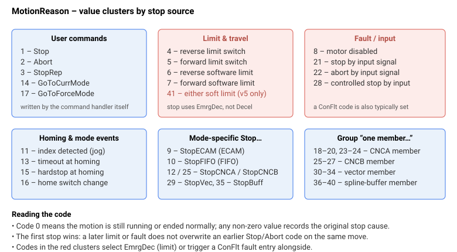

# MotionReason

记录上次运动停止的原因，以数字原因代码表示。

## 概述

`MotionReason` 以数字代码存储上次运动停止的原因。当新运动启动时（`Begin`、回零或曲线重启），该值重置为 `0`。它记录的是*最初*的停止原因：代码在首次请求停止的瞬间写入，相同的运动继续减速；因此，若同一运动中依次出现多个停止条件，仅记录第一个。结合 [MotionStat](MotionStat.md) 使用，可诊断运动结束的方式和原因。

> **文档待完善：**`MotionReason` 为 `implemented: partial`；某些原因代码在所有固件版本中可能尚未完全实现。

## 工作原理

每个代码由各自独立的停止路径写入。代码 4–7 来自控制器的限位处理（硬件 RLS/FLS 以及软件 [RevPLim](../../06-protections/03-motion/position-limit-protection/RevPLim.md)/[FwdPLim](../../06-protections/03-motion/position-limit-protection/FwdPLim.md) 检查），回零代码 13/15/16 来自回零序列，CNCA/CNCB/向量/样条"某成员……"代码（18–40）在组成员轴停止、中止或触发限位时写入。

这些代码归属于若干族群，读取所在族群通常即可确定后续检查方向（红色的限位/故障族群还会选择 [EmrgDec](../03-kinematics-configuration/EmrgDec.md)，通常与 [ConFlt](../../07-status-and-faults/ConFlt.md) 条目配对）：



| 值 | 含义 |
|----|----|
| 0 | 当前运动尚未结束，或运动正常结束。 |
| 1 | 运动因 Stop 指令结束。 |
| 2 | 运动因 Abort 指令结束。 |
| 3 | 运动因 StopRep 指令结束。 |
| 4 | 运动因检测到反向限位开关而结束。 |
| 5 | 运动因检测到正向限位开关而结束。 |
| 6 | 运动因反向软件限位而结束。 |
| 7 | 运动因正向软件限位而结束。 |
| 8 | 运动因电机被禁用而结束（禁用原因请参阅 [MotorReason](../../07-status-and-faults/MotorReason.md)）。 |
| 9 | 运动因 StopECAM 指令结束（仅限 ECAM 运动）。 |
| 10 | 运动因 StopFIFO 指令结束（仅限 FIFO 运动）。 |
| 11 | 运动因检测到索引脉冲而结束（仅限点动）。 |
| 12 | 运动因 StopCNCA 指令结束（仅限 CNCA 运动）。 |
| 13 | 运动因回零超时而结束。 |
| 14 | 运动因 GoToCurrMode 指令结束。 |
| 15 | 运动因回零时触碰机械硬限位而结束。 |
| 16 | 运动因原点开关状态变化而结束。 |
| 17 | 运动因 GoToForceMode 指令结束。 |
| 18 | 运动因 CNCA 某成员被禁用而结束。 |
| 19 | 运动因 CNCA 某成员被停止而结束。 |
| 20 | 运动因 CNCA 某成员被中止而结束。 |
| 21 | 运动因输入信号停止而结束。 |
| 22 | 运动因输入信号中止而结束。 |
| 23 | 运动因 CNCA 某成员触碰正向/反向限位开关而结束。 |
| 24 | 运动因 CNCA 某成员触碰正向/反向软件限位而结束。 |
| 25 | 运动因 StopCNCB 指令 / CNCB 某成员停止而结束。 |
| 26 | 运动因 CNCB 某成员触碰正向/反向限位开关而结束。 |
| 27 | 运动因 CNCB 某成员触碰正向/反向软件限位而结束。 |
| 28 | 运动因输入信号触发受控停止而结束。 |
| 29 | 运动因 StopVec 指令结束。 |
| 30 | 运动因向量组某成员被禁用而结束。 |
| 31 | 运动因向量组某成员被停止而结束。 |
| 32 | 运动因向量组某成员被中止而结束。 |
| 33 | 运动因向量组某成员触碰正向/反向限位开关而结束。 |
| 34 | 运动因向量组某成员触碰正向/反向软件限位而结束。 |
| 35 | 运动因 StopBuff 指令结束。 |
| 36 | 运动因样条缓冲区某成员被禁用而结束。 |
| 37 | 运动因样条缓冲区某成员被停止而结束。 |
| 38 | 运动因样条缓冲区某成员被中止而结束。 |
| 39 | 运动因样条缓冲区某成员触碰正向/反向限位开关而结束。 |
| 40 | 运动因样条缓冲区某成员触碰正向/反向软件限位而结束。 |

## 版本变更

| | v4（独立版 &amp; central-i） | v5（central-i） |
|---|---|---|
| 最高原因代码 | 40 | **41** |
| 值 41 | 未定义 | 点动运动因在正向或反向软件位置限位处减速停止而结束（与 [MotionStat](MotionStat.md) 位 20 配对的原因代码）。 |

**v5** 新增了点动专用软件限位原因代码 41（正向或反向）。代码 0–40 保持不变。**v5 仅限 central-i。**

## 示例

```text
AMotionReason       ; 读取上次运动停止的原因
```

若运动因 Abort 指令结束，但在减速过程中超过了正向软件限位，随后又遇到限位开关，则 `MotionReason` 的值为 `2`，表示最初的停止原因，忽略后续可能停止运动的事件。

### 演练：确认软限位触发

PTP 运动意外结束后，常见的诊断流程是将 `MotionReason` 与 [LimitsStat](../../06-protections/03-motion/position-limit-protection/LimitsStat.md) 及 [MotionStat](MotionStat.md) 中的运动状态位一并读取：

```text
AMotionStat                   ; 运动结束后应为 0；若停止过程仍在进行则为非零
AMotionReason                 ; 本次运动的首个停止原因
ALimitsStat                   ; 检查时刻的物理 RLS/FLS 状态
```

解读：

- `MotionReason = 7` 且 `LimitsStat = 0` — 运动在**正向软件限位**（[FwdPLim](../../06-protections/03-motion/position-limit-protection/FwdPLim.md)）处停止；未触及硬件开关。停止使用了 [EmrgDec](../03-kinematics-configuration/EmrgDec.md)。
- `MotionReason = 5` 且 `LimitsStat = 2` — **正向限位开关**有效并停止了运动；FLS 位仍置位，说明轴停在开关上。
- `MotionReason = 1` 且 `LimitsStat = 0` — 运动通过 [Stop](../04-motion-command/Stop.md) 正常结束；无保护事件。

### 边界情况

- **电机关闭：**`MotionReason` 保留上次运动的值（有助于故障取证）。
- **超范围"写入"：**`MotionReason` 为只读。
- **仿真模式（`MotorType` = 5）：**代码以相同方式写入。
- **ModRev 环绕：**无关。
- **活动故障：**故障前捕获的原因得以保留；故障路径也可能将 `MotionReason` 设置为 8（电机被禁用）。
- **其他运动模式：**原因代码 9–17 和 18–40 为模式专用（ECAM、FIFO、回零、组成员）。
- **首因语义：**一旦写入非零值，同一运动中后续的停止条件不会覆盖它；这与固件"仅记录第一个停止原因"的行为一致。
- **由 `Begin` 重置：**`MotionReason` 在每次 `Begin`（及回零）时强制置为 `0`，因此过期值不会带入下次运动。

## 另请参阅

- [MotionStat](MotionStat.md) — 详细的位映射运动状态
- [Begin](../04-motion-command/Begin.md) — 将 `MotionReason` 重置为 0
- [Stop](../04-motion-command/Stop.md) / [Abort](../04-motion-command/Abort.md) / [StopRep](../04-motion-command/StopRep.md) — 分别设置原因代码 1 / 2 / 3 的指令
- [FwdPLim](../../06-protections/03-motion/position-limit-protection/FwdPLim.md) / [RevPLim](../../06-protections/03-motion/position-limit-protection/RevPLim.md) — 原因代码 6 / 7 背后的软件限位
- [LimitsStat](../../06-protections/03-motion/position-limit-protection/LimitsStat.md) — 原因代码 4 / 5 背后的硬件限位开关
- [EmrgDec](../03-kinematics-configuration/EmrgDec.md) — 在限位相关及输入信号受控停止原因（4 / 5 / 6 / 7 / 28）下替代 `Decel`
- [ConFlt](../../07-status-and-faults/ConFlt.md) — 通常与故障/禁用族群（原因 8、21、22、28）配对的故障条目
- [MotorReason](../../07-status-and-faults/MotorReason.md) — 当 `MotionReason` = 8 时说明电机被禁用的原因
