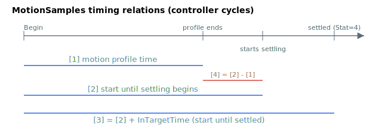

# MotionSamples

Move and settle times of the last completed motion, in controller cycles.

## Overview

`MotionSamples` reports the move and settle times of the last completed motion, used to characterise motion timing and settling performance. It is only meaningful in position or velocity control operation mode ([OperationMode](../../08-axis-operation/01-general-keywords/OperationMode.md) `= 2` or `3`). Each value is a count of controller cycles (the standard sampling rate is 16384 Hz, $T_{s} = \frac{1}{16384}\,\text{s} \approx 61.0\,\mu s$ per cycle), so multiply by $T_{s}$ to obtain SI time. The settling components depend on [InTargetTime](InTargetTime.md).

The array is 5 long but index 0 is unused — communication indexes start at 1, so only `[1]`…`[4]` carry data. Each element defaults to `-1`, which also matches the keyword's minimum/default; `-1` means "no motion has been performed yet" and the four entries are reset to `-1` when the motor is disabled.

## How it works

The controller runs a free-running cycle counter from the start of each motion and captures snapshots of it into the array as the move progresses. The counter is clamped at 2,000,000,000 to avoid overflow. Each array element represents a different time:

| Index | Descriptions |
|----|----|
| 1 | Motion profile time — captured when the motion profile (including the jerk-smoothing tail) finishes. |
| 2 | Time from the start of motion until the axis *starts* to settle into the target (i.e. first enters the window and then holds it for InTargetTime); computed as `counter − InTargetTime`. |
| 3 | Time from the start of motion until the axis *has settled* into the target for at least InTargetTime (the cycle `InTargetStat` reaches 4); equals the live counter value. |
| 4 | Settling time — from the end of the motion profile until the axis starts to settle; computed as `[2] − [1]`. |

Indexes 2–4 are written together in a single cycle when [InTargetStat](InTargetStat.md) latches to 4, so they are consistent. In summary,

$$
\text{MotionSamples}[2] = \text{MotionSamples}[1] + \text{MotionSamples}[4]
$$

$$
\text{MotionSamples}[3] = \text{MotionSamples}[2] + \frac{\text{InTargetTime}}{T_{s}}
$$

## Examples



The diagram above shows how the MotionSamples entries relate in time. Since MotionSamples is in controller cycles, multiplication by sampling time (here, $T_{s} \approx 61.0\,\mu s$) is needed to get the time in SI unit.

```text
AMotionSamples[1]   ; motion profile time of the last move (controller cycles)
AMotionSamples[3]   ; total time until settled for at least InTargetTime
```

## See also

- [InTargetTime](InTargetTime.md) — dwell time used in the `MotionSamples[3]` relation
- [InTargetStat](InTargetStat.md) — settling state; index 2–4 are captured when it reaches 4
- [InTargetTol](InTargetTol.md) — settling window that gates the settle timestamps
- [OperationMode](../../08-axis-operation/01-general-keywords/OperationMode.md) — only modes 2/3 produce meaningful samples
