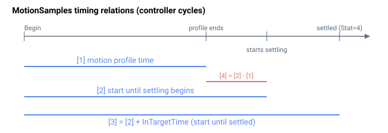

# MotionSamples

上次已完成运动的运动时间与整定时间，以控制器周期为单位。

## 概述

`MotionSamples` 报告上次已完成运动的运动时间与整定时间，用于表征运动时序和整定性能。该关键字仅在位置或速度控制运行模式（[OperationMode](../../08-axis-operation/01-general-keywords/OperationMode.md) `= 2` 或 `3`）下有意义。每个值均为控制器周期计数（标准采样率为 16384 Hz，$T_{s} = \frac{1}{16384}\,\text{s} \approx 61.0\,\mu s$ 每周期），乘以 $T_{s}$ 可得 SI 时间。整定分量取决于 [InTargetTime](InTargetTime.md)。

数组长度为 5，但索引 0 未使用——通信索引从 1 开始，因此只有 `[1]`…`[4]` 携带数据。每个元素默认值为 `-1`，也是该关键字的最小值/默认值；`-1` 表示"尚未执行任何运动"，电机被禁用时四个条目均重置为 `-1`。

## 工作原理

控制器从每次运动开始时运行一个自由运行周期计数器，并在运动推进过程中将计数器快照写入数组。计数器钳位于 2,000,000,000 以避免溢出。在轴处于运动状态及运动后整定等待期间（直至满足 InTargetTime 驻留条件），计数器每个周期递增；在等待 [BeginDInOn](../04-motion-command/BeginDInOn.md) 输入沿期间（[MotionStat](MotionStat.md) 位 9），计数器**不**递增，因此输入等待时间不计入运动时间。每个数组元素代表不同的时间：

| 索引 | 说明 |
|----|----|
| 1 | 运动曲线时间——在运动曲线（含急动平滑尾段）完成时捕获。 |
| 2 | 从运动开始到轴*开始*整定至目标（即首次进入窗口并保持 InTargetTime）的时间；计算方式为 `counter − InTargetTime`。 |
| 3 | 从运动开始到轴*已整定*至目标并至少保持 InTargetTime（`InTargetStat` 达到 4 的那个周期）的时间；等于实时计数器值。 |
| 4 | 整定时间——从运动曲线结束到轴开始整定的时间；计算方式为 `[2] − [1]`。 |

索引 2–4 在 [InTargetStat](InTargetStat.md) 锁定为 4 的同一个控制周期内一次性写入，因此三者相互一致。综上：

$$
\text{MotionSamples}[2] = \text{MotionSamples}[1] + \text{MotionSamples}[4]
$$

$$
\text{MotionSamples}[3] = \text{MotionSamples}[2] + \text{InTargetTime}
$$

此处 `InTargetTime` 指其内部以控制器周期（采样点数）表示的值——与 `MotionSamples` 其余部分单位相同——无需除以 $T_{s}$。注意，[InTargetTime](InTargetTime.md) 关键字以毫秒输入和显示，内部通过采样率换算因子转换为采样点数。

## 示例



上图展示了各 MotionSamples 条目在时间上的关系。由于 MotionSamples 以控制器周期为单位，需乘以采样时间（此处 $T_{s} \approx 61.0\,\mu s$）才能得到 SI 单位的时间。

```text
AMotionSamples[1]   ; 上次运动的曲线时间（控制器周期）
AMotionSamples[3]   ; 至少整定 InTargetTime 之前的总时间
```

### 边界情况

- **电机关闭：**全部四个条目重置为 `-1`（无效哨兵值）。
- **超范围"写入"：**`MotionSamples` 为只读。
- **索引 `[0]`：**未使用；该关键字从 1 开始索引。读取 `[0]` 返回错误。
- **仿真模式（`MotorType` = 5）：**条目从相同计数器写入；值反映仿真规划器的时序。
- **ModRev 环绕：**无关——`MotionSamples` 测量时间，而非位置。
- **活动故障：**轴被禁用（电机关闭路径），条目清零为 `-1`。
- **其他运动模式：**对于运行规划器并达到整定状态的任何模式，时序条目均可捕获。直接模式（PD/电子齿轮/ECAM/FIFO/CNC/向量/样条/从轴）及摇杆直接模式可能不会生成全部条目，因为它们没有明确定义的"曲线结束"段。
- **计数器饱和：**周期计数器钳位于 2,000,000,000（在 16,384 Hz 下约 33 小时）。超过此点后，报告的时间保持在上限值。
- **运动在整定前被中断：**`[2]`/`[3]`/`[4]` 可能保持为 `-1`（或在电机重新上电前保留上次运动的过期值）。

## 另请参阅

- [InTargetTime](InTargetTime.md) — 用于 `MotionSamples[3]` 关系的驻留时间
- [InTargetStat](InTargetStat.md) — 整定状态；索引 2–4 在其达到 4 时捕获
- [InTargetTol](InTargetTol.md) — 门控整定时间戳的整定窗口
- [OperationMode](../../08-axis-operation/01-general-keywords/OperationMode.md) — 仅模式 2/3 产生有意义的采样值
