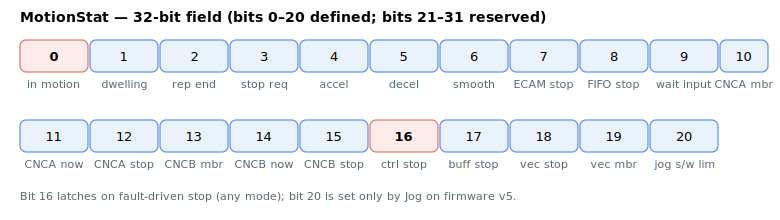
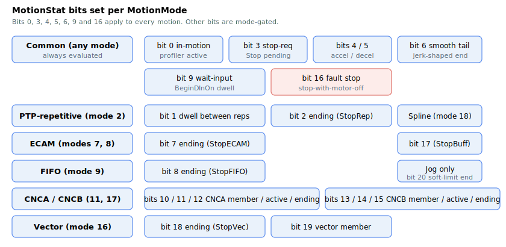

# MotionStat

Bit-mapped detailed status of the current motion (multiple bits can be set).

## Overview

`MotionStat` reports the detailed status of the current motion as a 32-bit field: each bit represents a specific motion state and multiple bits can be set at the same time. When the motor is not in motion the controller clears the whole word (`MotionStat = 0`), so a non-zero value always means there is an active or stopping motion. It is the per-axis companion to [MotionReason](MotionReason.md) (which records *why* the previous motion stopped) and to [InTargetStat](InTargetStat.md) (which reports the settling state).

The status word is rebuilt and stored every control cycle as the motion progresses through its phases. At the end of a motion the in-motion bits (0–17) are cleared together in a single operation.



## How it works

Each bit reports a motion state when set (`= 1`); when cleared (`= 0`) it represents the opposite. Only bits 0–20 are defined; bits 21–31 are reserved and read as 0.

| Bit | Set mask | Meaning when set (= 1) |
|----|----|----|
| 0 | 0x00000001 | Axis is in motion. Set at `Begin`; cleared when the motion (and any end-of-smoothing wait) completes. |
| 1 | 0x00000002 | Axis is dwelling between repetitions of point-to-point repetitive motion. Set when the previous repetition ends, cleared after [RptWait](../02-motion-configuration/RptWait.md) cycles. Only used when [MotionMode](../02-motion-configuration/MotionMode.md) `= 2`. |
| 2 | 0x00000004 | Axis is ending its repetitive motion following a [StopRep](../04-motion-command/StopRep.md) command. |
| 3 | 0x00000008 | A [Stop](../04-motion-command/Stop.md) (decelerate-to-stop) has been requested; the target speed is ramped to zero. |
| 4 | 0x00000010 | Axis is accelerating (profile speed rising). Bits 4 and 5 are mutually exclusive. |
| 5 | 0x00000020 | Axis is decelerating (profile speed falling). |
| 6 | 0x00000040 | Axis is in the profile-smoothing tail: the target has been reached but the jerk/smoothing filter is still flushing for `2^Jerk` cycles before the motion is declared finished. See [Jerk](../03-kinematics-configuration/Jerk.md). |
| 7 | 0x00000080 | Axis is ending its ECAM motion (following a StopECAM command). |
| 8 | 0x00000100 | Axis is ending its FIFO motion (following a StopFIFO command). |
| 9 | 0x00000200 | Motion is suspended until a rising edge on the configured digital input. Set by [BeginDInOn](../04-motion-command/BeginDInOn.md); cleared when the edge arrives. |
| 10 | 0x00000400 | Axis is a member of the CNCA group. |
| 11 | 0x00000800 | Axis is currently involved in an active CNCA motion. |
| 12 | 0x00001000 | Axis is ending its CNCA motion (following a StopCNCA command). |
| 13 | 0x00002000 | Axis is a member of the CNCB group. |
| 14 | 0x00004000 | Axis is currently involved in an active CNCB motion. |
| 15 | 0x00008000 | Axis is ending its CNCB motion (following a StopCNCB command). |
| 16 | 0x00010000 | A controlled stop with motor-off has been requested due to a fault condition (e.g. anomaly detection, fault from a digital input). |
| 17 | 0x00020000 | Axis is ending its spline-buffer motion (following a [StopBuff](../04-motion-command/StopBuff.md) command). |
| 18 | 0x00040000 | Axis is ending its vector motion (following a StopVec command). |
| 19 | 0x00080000 | Axis is a member of a vector-motion group. |
| 20 | 0x00100000 | Axis is ending its jog motion because it is approaching a software position limit. **v5 only** (see below). |

Several combined masks are useful: `0x00010009` (bits 0+3+16) tests "in motion but not yet stopping", and `0x00010008` (bits 3+16) tests for either a normal or controlled stop request.

To test a single bit, mask `MotionStat` with the bit value — e.g. "in motion" is `MotionStat & 0x1`, "decelerating" is `(MotionStat & 0x20) >> 5`.

### Which bits apply in which mode

Some bits are common to every motion; others appear only in specific [MotionMode](../02-motion-configuration/MotionMode.md) values (the "ending …" bits, repetitive-dwell bit 1, group bits 10–15/19, etc.). Use this map to predict which bits to expect when reading `MotionStat` for a given mode:



## Changes between versions

| | v4 (standalone &amp; central-i) | v5 (central-i) |
|---|---|---|
| Defined bits | 0–19 | 0–**20** |
| Bit 20 | not defined | **jog software-limit reached** (`0x00100000`) |
| End-of-motion clear mask | `0xFFFC0000` (clears bits 0–17) | `0xFFE00000` (clears bits 0–20) |

In **v5** a new bit 20 reports that a jog move is ending because it is approaching a software position limit, and the end-of-motion clear mask was widened accordingly. **v5 is central-i only.**

## Examples

```text
AMotionStat                       ; read the current motion status word
```

Check whether axis A is actively moving (not just stopping) by masking with `0x9` and comparing to `0x1`; detect the deceleration phase with `(AMotionStat & 0x20)`.

## See also

- [MotionReason](MotionReason.md) — reason the previous motion stopped (set when several of these stop bits trigger)
- [InTargetStat](InTargetStat.md) — motion and settling state (independent of these bits)
- [StatReg](../../07-status-and-faults/StatReg.md) — general axis status bitfield (faults, limits, saturations)
- [StopRep](../04-motion-command/StopRep.md) — ends repetitive PTP motion (bit 2)
- [Jerk](../03-kinematics-configuration/Jerk.md) — sets the smoothing-tail length that holds bit 6
