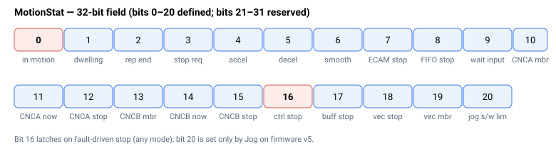
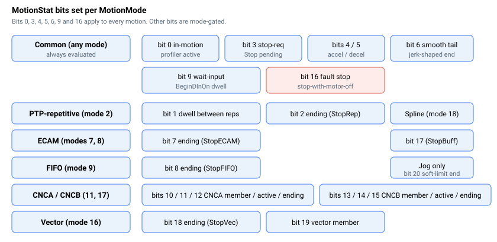

# MotionStat

当前运动的位映射详细状态（可同时置位多个位）。

## 概述

`MotionStat` 以 32 位字段报告当前运动的详细状态：每个位代表一种特定的运动状态，可同时置位多个位。当电机不处于运动状态时，控制器清除整个状态字（`MotionStat = 0`），因此非零值始终表示存在活动的或正在停止的运动。它是每轴的伴侣关键字，与 [MotionReason](MotionReason.md)（记录上次运动*停止的原因*）和 [InTargetStat](InTargetStat.md)（报告整定状态）配合使用。

状态字在每个控制周期随运动推进而重建并存储。运动结束时，运动中的各位（0–17）在单次操作中一并清除。



## 工作原理

每个位在置位（`= 1`）时报告一种运动状态；清零（`= 0`）时表示相反状态。仅定义位 0–20；位 21–31 为保留位，读取为 0。

| 位 | 置位掩码 | 置位（= 1）时的含义 |
|----|----|----|
| 0 | 0x00000001 | 轴处于运动中。在 `Begin` 时置位；运动（及任何平滑结束等待）完成后清除。 |
| 1 | 0x00000002 | 轴在点到点重复运动的两次重复之间驻留。上次重复结束时置位，经过 [RptWait](../02-motion-configuration/RptWait.md) 个周期后清除。仅在 [MotionMode](../02-motion-configuration/MotionMode.md) `= 2` 时使用。 |
| 2 | 0x00000004 | 轴在收到 [StopRep](../04-motion-command/StopRep.md) 指令后正在结束重复运动。 |
| 3 | 0x00000008 | 已请求 [Stop](../04-motion-command/Stop.md)（减速停止）；目标速度正在斜坡至零。 |
| 4 | 0x00000010 | 轴正在加速（曲线速度上升）。位 4 与位 5 互斥：在匀速巡航阶段（曲线速度已达到 [Speed](../03-kinematics-configuration/Speed.md) 且既不上升也不下降），两个位均清除。 |
| 5 | 0x00000020 | 轴正在减速（曲线速度下降，或反向朝向反向目标）。只要曲线速度被钳制至软件限位减速曲线，该位也强制置位——即即使未发出 [Stop](../04-motion-command/Stop.md) 指令，也会报告朝向 [FwdPLim](../../06-protections/03-motion/position-limit-protection/FwdPLim.md)/[RevPLim](../../06-protections/03-motion/position-limit-protection/RevPLim.md) 的预先制动。 |
| 6 | 0x00000040 | 轴处于曲线平滑尾段：目标已到达，但急动/平滑滤波器仍在冲刷 `2^Jerk` 个周期后才宣告运动完成。请参阅 [Jerk](../03-kinematics-configuration/Jerk.md)。 |
| 7 | 0x00000080 | 轴正在结束 ECAM 运动（在 StopECAM 指令之后）。 |
| 8 | 0x00000100 | 轴正在结束 FIFO 运动（在 StopFIFO 指令之后）。 |
| 9 | 0x00000200 | 运动已暂停，等待配置的数字量输入上的上升沿。由 [BeginDInOn](../04-motion-command/BeginDInOn.md) 置位；沿到达时清除。 |
| 10 | 0x00000400 | 轴是 CNCA 组的成员。 |
| 11 | 0x00000800 | 轴当前参与活动的 CNCA 运动。 |
| 12 | 0x00001000 | 轴正在结束 CNCA 运动（在 StopCNCA 指令之后）。 |
| 13 | 0x00002000 | 轴是 CNCB 组的成员。 |
| 14 | 0x00004000 | 轴当前参与活动的 CNCB 运动。 |
| 15 | 0x00008000 | 轴正在结束 CNCB 运动（在 StopCNCB 指令之后）。 |
| 16 | 0x00010000 | 因故障条件（如异常检测、数字量输入故障）请求了带电机关闭的受控停止。 |
| 17 | 0x00020000 | 轴正在结束样条缓冲区运动（在 [StopBuff](../04-motion-command/StopBuff.md) 指令之后）。 |
| 18 | 0x00040000 | 轴正在结束向量运动（在 StopVec 指令之后）。 |
| 19 | 0x00080000 | 轴是向量运动组的成员。 |
| 20 | 0x00100000 | 轴正在结束点动运动，因为正在接近软件位置限位。**仅限 v5**（见下文）。 |

几个组合掩码较为实用：`0x00010009`（位 0+3+16）测试"运动中但尚未停止"，`0x00010008`（位 3+16）测试正常停止请求或受控停止请求。

测试单个位时，用位值对 `MotionStat` 进行掩码运算——例如，"运动中"为 `MotionStat & 0x1`，"减速中"为 `(MotionStat & 0x20) >> 5`。

### 各模式下有效的位

部分位在所有运动中均通用；其他位仅在特定 [MotionMode](../02-motion-configuration/MotionMode.md) 值下出现（"结束……"位、重复驻留位 1、组位 10–15/19 等）。使用以下映射图预测在给定模式下读取 `MotionStat` 时应出现哪些位：



## 版本变更

| | v4（独立版 &amp; central-i） | v5（central-i） |
|---|---|---|
| 已定义位 | 0–19 | 0–**20** |
| 位 20 | 未定义 | **点动软件限位到达**（`0x00100000`） |
| 运动结束清除掩码 | `0xFFFC0000`（清除位 0–17） | `0xFFE00000`（清除位 0–20） |

**v5** 新增位 20，报告点动运动因接近软件位置限位而结束，同时运动结束清除掩码相应扩展。**v5 仅限 central-i。**

位 20 仅在点动运动时置位，在规划器速度被钳制至使轴恰好在 [FwdPLim](../../06-protections/03-motion/position-limit-protection/FwdPLim.md)/[RevPLim](../../06-protections/03-motion/position-limit-protection/RevPLim.md) 处停止的减速曲线的那个周期置位，并与减速位（5）一同置位。点动减速至规划器速度接近零（一个小的固定阈值）后，运动进入平滑结束等待，并以 [MotionReason](MotionReason.md) = 41 结束。在其他运动模式下，同样的软件限位钳制仅置位减速位（5），从不置位位 20。

## 示例

```text
AMotionStat                       ; 读取当前运动状态字
```

通过与 `0x9` 掩码并与 `0x1` 比较，检查轴 A 是否处于活动运动中（而非仅在停止）；用 `(AMotionStat & 0x20)` 检测减速阶段。

### 边界情况

- **电机关闭：**整个状态字清零为 `0`（无运动进行中）。
- **超范围"写入"：**`MotionStat` 为只读。
- **仿真模式（`MotorType` = 5）：**各位行为相同；仿真规划器同样驱动位转换。
- **ModRev 环绕：**无关；各位跟踪规划器状态，而非位置。
- **活动故障：**电机被禁用，所有位清除。
- **其他运动模式：**模式专用位仅在相关模式下出现（例如，位 2 仅在重复 PTP 中，位 10–15 仅在 CNCA/B 组中，位 17 仅在样条缓冲区中，位 20 仅在 v5 点动接近软件限位时）。
- **在停止斜坡过程中读取：**位 0（运动中）和位 3（停止请求）在规划器减速期间共存；位 0 仅在平滑尾段完成后清除。

## 另请参阅

- [MotionReason](MotionReason.md) — 上次运动停止的原因（在若干停止位触发时写入）
- [InTargetStat](InTargetStat.md) — 运动与整定状态（独立于这些位）
- [StatReg](../../07-status-and-faults/StatReg.md) — 通用轴状态位字段（故障、限位、饱和）
- [StopRep](../04-motion-command/StopRep.md) — 结束重复 PTP 运动（位 2）
- [Jerk](../03-kinematics-configuration/Jerk.md) — 设置保持位 6 的平滑尾段长度
