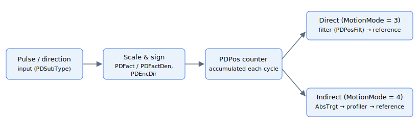
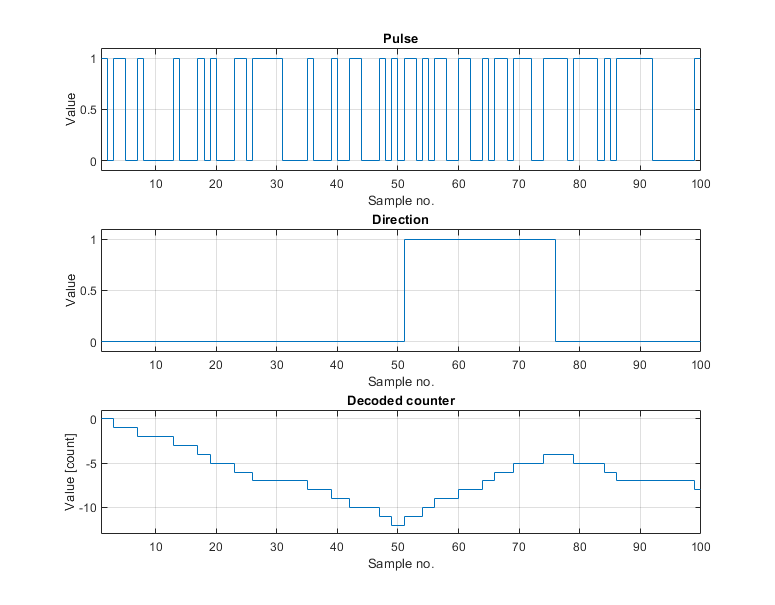
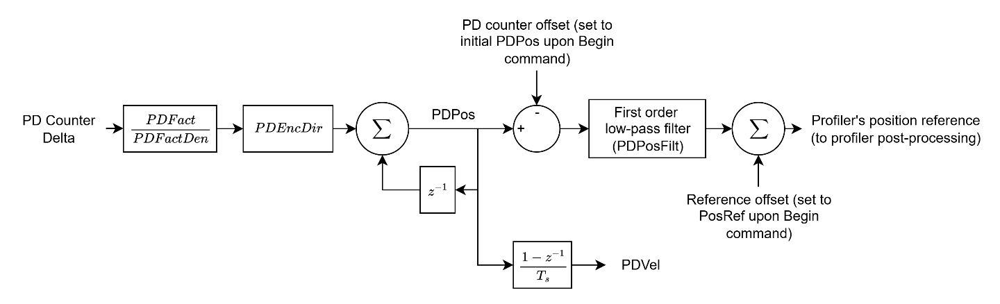
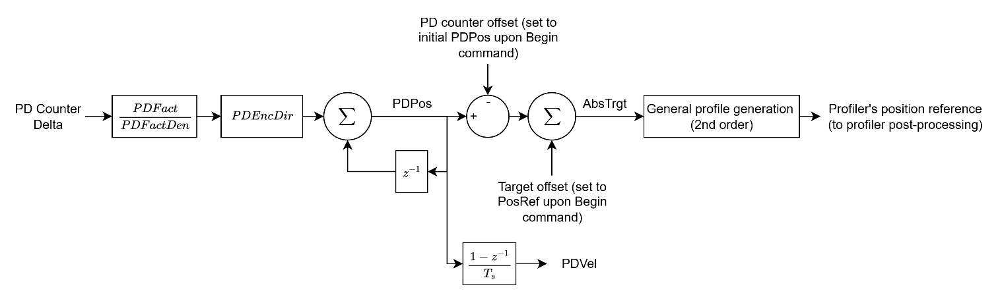

# Motion mode - Pulse and direction (PD)

This section extends from direct PD motion ([MotionMode](../../../02-keywords/10-motion/02-motion-configuration/MotionMode.md) = 3) and indirect PD motion ([MotionMode](../../../02-keywords/10-motion/02-motion-configuration/MotionMode.md) = 4). All the keywords in this section are only applicable under these motion modes.

Pulse and direction command is a traditional method to decouple the controller that does the profiling, from the amplifier that drives the motor.

With this, controllers with profiling algorithm for specific applications (e.g. CNC machine or laser cutter) can be used with any stage system that supports this mode of command. It allows for flexibility in pairing of drivers of different sizes and types.

**Note:**

1. The pulse-and-direction decoding hardware is implemented in the FPGA of the standalone drives only — namely AGD101EC, AGD155, AGD200 and AGD301. The PD-related keywords appear in the central-i (AGM800) parameter table as well, but the FPGA write-back of [PDSubType](PDSubType.md) is not yet implemented on central-i, so the feature is effectively limited to standalone products in current firmware.
2. The pulse and direction input pins are hard coded for each product, where the input pins must be of differential type. No DInMode setting is needed, as the following digital inputs will be automatically assumed as pulse and direction inputs.

There are 2 phases of pulse and direction command.

1.  Encoding (to generate pulse and direction outputs from position reference)

2.  Decoding (to generate position reference from digital inputs of pulse and direction)

This section discusses the decoding of pulse and direction commands (generating a position reference from incoming pulse/direction inputs).

In the decoding of the pulse-direction signals, each rising edge of the pulse will cause the counter to increment if direction signal is high, or decrement if direction signal is low. The decoded counter will be used as position reference or target position depending on motion mode.

The two input lines are first cleaned by a hardware debounce filter (set per axis by [DInFilt](../../../02-keywords/05-inputs-outputs/04-digital-inputs/DInFilt.md), range 0-15): a level change is accepted only after it has been held stable for a number of filter-clock periods, which rejects electrical noise and contact bounce on the P/D input lines. How the cleaned lines are then counted depends on [PDSubType](../../../02-keywords/10-motion/06-motion-mode-pulse-and-direction-pd/PDSubType.md): in pulse-and-direction format only the **rising edge** of the pulse line is counted (one count per pulse, with the direction line setting the sign), whereas in A-quad-B format **every** transition of the two quadrature channels is counted (four counts per encoder cycle, with the lead/lag order setting the sign). Each controller cycle the hardware hands the firmware the net signed step count accumulated since the previous cycle, which is then scaled, sign-corrected and accumulated into [PDPos](../../../02-keywords/10-motion/06-motion-mode-pulse-and-direction-pd/PDPos.md).

As shown in the block diagram below, the change in the counter value is scaled ([PDFact](../../../02-keywords/10-motion/06-motion-mode-pulse-and-direction-pd/PDFact.md) and [PDFactDen](../../../02-keywords/10-motion/06-motion-mode-pulse-and-direction-pd/PDFactDen.md)), sign-corrected ([PDEncDir](../../../02-keywords/10-motion/06-motion-mode-pulse-and-direction-pd/PDEncDir.md)) and accumulated in [PDPos](../../../02-keywords/10-motion/06-motion-mode-pulse-and-direction-pd/PDPos.md) (a scaled counter). This is done on every controller cycle to avoid losing track on pulse and direction signals.

Two pulse and direction motion modes are available:

1.  Direct pulse-direction motion

After setting [MotionMode](../../../02-keywords/10-motion/02-motion-configuration/MotionMode.md) = 3 and commanding start of motion ([Begin](../../../02-keywords/10-motion/04-motion-command/Begin.md)), the master and slave offsets will be reset to PDPos and initial position reference once. This is to ensure the generated position reference only takes the change in PDPos since the start of motion. Afterwards, any change in PDPos will corresponds to the same change in profiler’s position reference, subject to a low-pass filter ([PDPosFilt](../../../02-keywords/10-motion/06-motion-mode-pulse-and-direction-pd/PDPosFilt.md)).

2.  Indirect pulse-direction motion

> 

Similarly, after setting [MotionMode](../../../02-keywords/10-motion/02-motion-configuration/MotionMode.md) = 4 and commanding start of motion ([Begin](../../../02-keywords/10-motion/04-motion-command/Begin.md)), the master and slave offsets will be reset to PDPos and initial position reference once.

Instead, any change in PDPos corresponds to the same change in the target position ([AbsTrgt](../13-motion-mode-ptp/AbsTrgt.md)). AbsTrgt is fed to the second-order profile generator, which respects the maximum kinematic limits of Speed, Accel and Decel. The filter to smoothen out the scaled delta is also absent.

**Note:**

1. For both direct and indirect PD motion, once motion is commanded, axis will stay in the moving motion state indefinitely, until motion stop is requested or axis is disabled.
2. For both direct and indirect PD motion, generated position reference are saturated/protected by software limits.
3. For indirect PD motion, the profile generation is only up to second order. Please contact Agito if third or higher order motion profile is needed.
4. For both direct and indirect PD motion, the settling status ( InTargetStat ) will be checked, only after PDEndTime has elapsed since the pulse-direction inputs and generated position reference no longer change.
