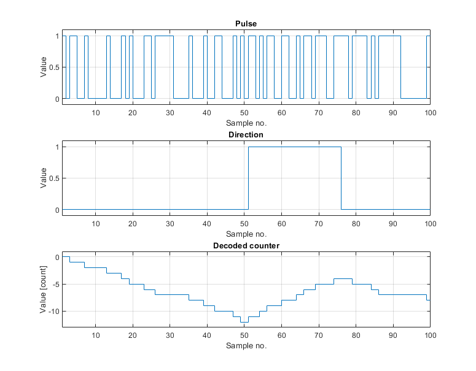
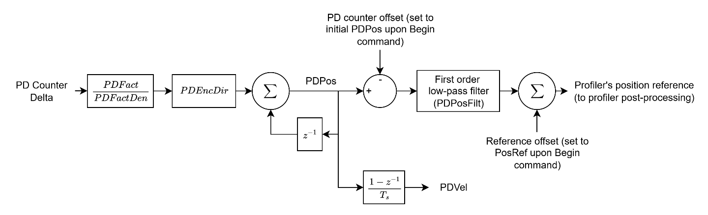
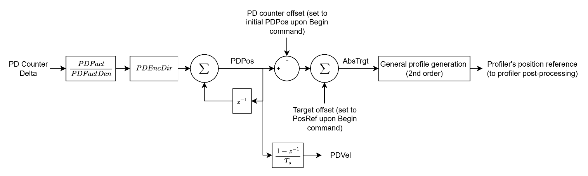

# 运动模式 - 脉冲方向（PD）

本节内容涵盖直接 PD 运动（[MotionMode](../../../02-keywords/10-motion/02-motion-configuration/MotionMode.md) = 3）和间接 PD 运动（[MotionMode](../../../02-keywords/10-motion/02-motion-configuration/MotionMode.md) = 4）。本节所有关键字仅在这两种运动模式下适用。

脉冲方向指令是一种传统方法，用于将负责轨迹规划的控制器与驱动电机的驱动器解耦。

借助此方法，具有特定应用轨迹规划算法的控制器（例如 CNC 机床或激光切割机）可与任何支持该指令模式的运动台系统配合使用，从而实现不同尺寸和类型驱动器的灵活搭配。

**注意：**

1. 脉冲方向解码硬件仅在独立驱动器的 FPGA 中实现——即 AGD101EC、AGD155、AGD200 和 AGD301。PD 相关关键字也出现在 central-i（AGM800）参数表中，但 [PDSubType](PDSubType.md) 的 FPGA 回写功能尚未在 central-i 上实现，因此该功能在当前固件中实际上仅限于独立产品。
2. 脉冲方向输入引脚对每款产品均已硬件固定，且输入引脚必须为差分类型。无需配置 DInMode，以下数字量输入将自动作为脉冲方向输入。

脉冲方向指令分为两个阶段。

1.  编码（由位置参考生成脉冲方向输出）

2.  解码（由脉冲方向数字量输入生成位置参考）

本节讨论脉冲方向指令的解码（从输入的脉冲/方向信号生成位置参考）。

在脉冲方向信号的解码过程中，若方向信号为高电平，则每个脉冲上升沿使计数器递增；若方向信号为低电平，则计数器递减。解码后的计数器将根据运动模式用作位置参考或目标位置。

两条输入线首先经过硬件消抖滤波器处理（由 [DInFilt](../../../02-keywords/05-inputs-outputs/04-digital-inputs/DInFilt.md) 按轴设置，范围 0-15）：仅当电平变化保持稳定达到一定数量的滤波器时钟周期后才被接受，从而滤除 P/D 输入线上的电气噪声和触点抖动。经过滤波后的信号如何计数取决于 [PDSubType](../../../02-keywords/10-motion/06-motion-mode-pulse-and-direction-pd/PDSubType.md)：脉冲方向格式仅计数脉冲线的**上升沿**（每个脉冲计一次，方向线决定符号），而 A-quad-B 格式计数两个正交通道的**每次**跳变（每个编码器周期计四次，超前/滞后顺序决定符号）。每个控制器周期，硬件将自上次周期以来累积的净有符号步数传递给固件，随后经过缩放、符号修正并累积到 [PDPos](../../../02-keywords/10-motion/06-motion-mode-pulse-and-direction-pd/PDPos.md) 中。

如下方框图所示，计数器值的变化量经过缩放（[PDFact](../../../02-keywords/10-motion/06-motion-mode-pulse-and-direction-pd/PDFact.md) 和 [PDFactDen](../../../02-keywords/10-motion/06-motion-mode-pulse-and-direction-pd/PDFactDen.md)）、符号修正（[PDEncDir](../../../02-keywords/10-motion/06-motion-mode-pulse-and-direction-pd/PDEncDir.md)）后累积到 [PDPos](../../../02-keywords/10-motion/06-motion-mode-pulse-and-direction-pd/PDPos.md)（缩放计数器）中。此操作在每个控制器周期执行，以避免丢失脉冲方向信号的跟踪。

提供两种脉冲方向运动模式：

1.  直接脉冲方向运动

设置 [MotionMode](../../../02-keywords/10-motion/02-motion-configuration/MotionMode.md) = 3 并命令开始运动（[Begin](../../../02-keywords/10-motion/04-motion-command/Begin.md)）后，主偏移量和从偏移量将被一次性重置为 PDPos 和初始位置参考。这是为了确保生成的位置参考仅反映自运动开始以来 PDPos 的变化量。此后，PDPos 的任何变化将对应规划器位置参考的相同变化，并经过低通滤波器（[PDPosFilt](../../../02-keywords/10-motion/06-motion-mode-pulse-and-direction-pd/PDPosFilt.md)）处理。

2.  间接脉冲方向运动

> 

同样，设置 [MotionMode](../../../02-keywords/10-motion/02-motion-configuration/MotionMode.md) = 4 并命令开始运动（[Begin](../../../02-keywords/10-motion/04-motion-command/Begin.md)）后，主偏移量和从偏移量将被一次性重置为 PDPos 和初始位置参考。

不同之处在于，PDPos 的任何变化对应目标位置（[AbsTrgt](../13-motion-mode-ptp/AbsTrgt.md)）的相同变化。AbsTrgt 被送入二阶轨迹规划器，该规划器遵守 Speed、Accel 和 Decel 的最大运动学限制。平滑缩放增量的滤波器也不存在于此模式中。

**注意：**

1. 对于直接和间接 PD 运动，一旦命令运动，轴将无限期保持运动状态，直到请求停止运动或禁用轴。
2. 对于直接和间接 PD 运动，生成的位置参考受软件限位保护/钳位。
3. 对于间接 PD 运动，轨迹规划最高为二阶。如需三阶或更高阶运动曲线，请联系 Agito。
4. 对于直接和间接 PD 运动，仅在脉冲方向输入和生成的位置参考均停止变化后经过 PDEndTime 时间后，才会检查到位状态（InTargetStat）。
