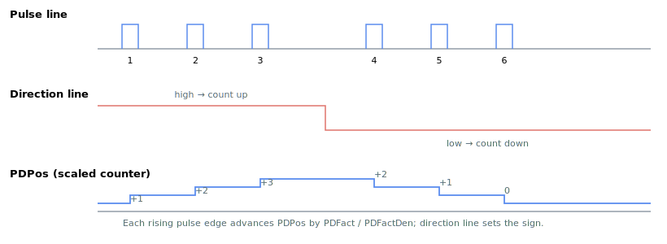

# PDPos

Read-only scaled pulse-and-direction counter, accumulated every controller cycle.

## Overview

`PDPos` is the pulse-and-direction (P/D) input counter. Every controller cycle the controller reads the number of pulses decoded since the previous cycle, scales them by [PDFact](PDFact.md)/[PDFactDen](PDFactDen.md), applies the [PDEncDir](PDEncDir.md) sign, and accumulates the result. `PDPos` is the core value of P/D decoding: in **direct** P/D motion ([MotionMode](../02-motion-configuration/MotionMode.md) = 3) the change in `PDPos` since the start of motion drives the position reference [PosRef](../01-kinematics-status/PosRef.md); in **indirect** P/D motion (`MotionMode` = 4) the same change drives the profiler target [AbsTrgt](../13-motion-mode-ptp/AbsTrgt.md).

`PDPos` is read-only over the bus but can be re-zeroed or preset with [SetPDPos](SetPDPos.md). It powers up at 0.


The waveform below shows how each rising pulse edge changes `PDPos` by `PDFact / PDFactDen`, and how the direction line flips the sign:



## How it works

### Per-cycle accumulation

The reading and scaling are done once per axis every controller cycle. Each cycle the controller:

1. Reads the signed pulse count decoded for this cycle.
2. Scales it by the factor `PDFact / PDFactDen`, carrying the fractional remainder from the previous cycle so fractional pulses are never lost over time.
3. Applies the direction sign so `PDEncDir = 0` adds and `PDEncDir = 1` subtracts.
4. Accumulates the result into `PDPos`.

Because the fractional remainder is carried forward, a fractional `PDFact/PDFactDen` ratio does not drift, and accumulating every cycle guarantees no pulses are dropped between reads. [PDVel](PDVel.md) is derived from the same per-cycle scaled change.

### How PDPos becomes the reference

`Begin` latches the current `PDPos` value so motion is measured **relative to the instant motion started**:

- **Direct (MotionMode = 3):** `PosRef` is built from the change in `PDPos` since `Begin`, passed through the first-order filter [PDFiltFact](PDFiltFact.md) (set via [PDPosFilt](PDPosFilt.md)), then added to the reference latched at `Begin`. If the result hits a software travel limit the motion is aborted (further pulses would be lost).
- **Indirect (MotionMode = 4):** the same delta sets the profiler target [AbsTrgt](../13-motion-mode-ptp/AbsTrgt.md), and the controller's own second-order profiler drives `PosRef` toward it subject to `Speed`/`Accel`/`Decel`.

### Modulo

If [ModRev](../../03-encoder/04-modulo-mode/ModRev.md) ≠ 0, when the feedback wraps the controller shifts `PDPos` by one `ModRev` interval together with the rest of the reference frame, so the P/D following error is preserved across the wrap.

### Auxiliary-encoder reuse

When the P/D inputs are repurposed as an auxiliary encoder, the controller copies `PDPos`/`PDVel` into the auxiliary feedback ([AuxPos](../01-kinematics-status/AuxPos.md)/`AuxVel`) instead of using them for P/D motion.

### Reading in user units

When queried over a communication channel, `PDPos` is converted from internal counts to pulse-direction user units by [PDUsrUnits](PDUsrUnits.md). This scaling affects the reported value only, not the internal computation.

## Examples

```text
APDPos              ; read the current scaled P/D counter (pulse-direction units)
```

### Walk-through: configure a direct pulse-and-direction follower

A typical bring-up of a P/D follower (axis A, motor off, no motion in progress). The example uses direct P/D motion (`MotionMode = 3`); for indirect motion use `MotionMode = 4` and replace `PDPosFilt` with the usual `Speed` / `Accel` / `Decel` kinematics.

```text
; --- 1) Set the input format and scaling (once, with motor off) ---
APDSubType=0         ; 0 = pulse + direction, 1 = A-quad-B
APDFact=1            ; numerator   of the pulses-in / counts-out ratio
APDFactDen=1         ; denominator of the same ratio
APDEncDir=0          ; sign of the accumulation (0 add, 1 subtract)
APDPosFilt=12800     ; low-pass cut-off (Hz x 100), default 128 Hz; direct mode only

; --- 2) Optionally clear the counter so it starts at zero ---
ASetPDPos=0          ; preset PDPos to 0

; --- 3) Arm direct P/D motion ---
AMotionMode=3        ; 3 = direct P/D, 4 = indirect P/D
AMotorOn=1
ABegin               ; latches PDPos at start; from now PosRef tracks (PDPos - latched)

; --- 4) While running, observe the counter and the follower ---
APDPos               ; current scaled counter (advances with incoming pulses)
APDVel               ; rate of change of PDPos
APosRef              ; follower reference -- in direct mode this tracks the PDPos delta
```

If `APDPos` increments but `APosRef` does not move, check `PDEncDir`, `PDFact / PDFactDen` and that `MotionMode` is 3 (or 4) and `Begin` has been issued.

## See also

- [PDVel](PDVel.md) — rate of change of `PDPos`
- [PDFact](PDFact.md) / [PDFactDen](PDFactDen.md) — scaling-factor numerator/denominator
- [PDEncDir](PDEncDir.md) — accumulation direction (sign)
- [PDFiltFact](PDFiltFact.md) / [PDPosFilt](PDPosFilt.md) — direct-mode smoothing of the delta into `PosRef`
- [SetPDPos](SetPDPos.md) — preset/re-zero the counter
- [PDUsrUnits](PDUsrUnits.md) — query unit conversion
- [PosRef](../01-kinematics-status/PosRef.md) / [AbsTrgt](../13-motion-mode-ptp/AbsTrgt.md) — what `PDPos` drives in direct / indirect mode
- [MotionMode](../02-motion-configuration/MotionMode.md) — selects direct (3) vs. indirect (4) P/D motion
