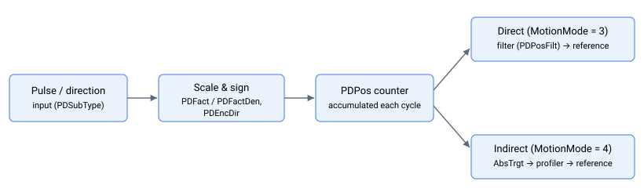
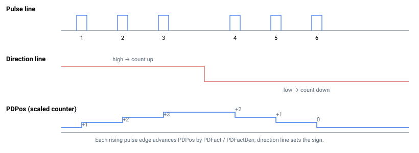

# PDPos

只读缩放脉冲方向计数器，每个控制器周期累积一次。

## 概述

`PDPos` 是脉冲方向（P/D）输入计数器。每个控制器周期，控制器读取自上一周期以来解码的脉冲数，按 [PDFact](PDFact.md)/[PDFactDen](PDFactDen.md) 进行缩放，应用 [PDEncDir](PDEncDir.md) 符号，然后将结果累积。`PDPos` 是 P/D 解码的核心值：在**直接** P/D 运动（[MotionMode](../02-motion-configuration/MotionMode.md) = 3）中，`PDPos` 自运动开始以来的变化量驱动位置参考 [PosRef](../01-kinematics-status/PosRef.md)；在**间接** P/D 运动（`MotionMode` = 4）中，同一变化量驱动规划器目标 [AbsTrgt](../13-motion-mode-ptp/AbsTrgt.md)。

`PDPos` 在总线上为只读，但可通过 [SetPDPos](SetPDPos.md) 重新清零或预置。上电时初始值为 0。



下方波形图展示了每个上升脉冲沿如何将 `PDPos` 改变 `PDFact / PDFactDen`，以及方向线如何翻转符号：



## 工作原理

### 每周期累积

每个控制器周期，每个轴的读取和缩放操作执行一次。每个周期，控制器执行以下步骤：

1. 读取本周期内解码的带符号脉冲计数。
2. 按系数 `PDFact / PDFactDen` 进行缩放，并将上一周期的小数余数带入，确保长期内小数脉冲不会丢失。
3. 将结果累积至 `PDPos`。

由于小数余数会被带入下一周期，`PDFact/PDFactDen` 为小数比例时不会产生漂移，且每个周期的累积确保读取之间不会有脉冲丢失。[PDVel](PDVel.md) 由同一每周期缩放变化量（在应用 [PDEncDir](PDEncDir.md) 符号之前）推导得出。

累积的总体方向由 **`PDFact` 的符号**（可为负值）决定。在较新的固件中，单独的 [PDEncDir](PDEncDir.md) 位也可翻转符号（`PDEncDir = 0` 为累加，`PDEncDir = 1` 为累减）；在旧版固件中，`PDEncDir` 无效，符号仅由 `PDFact` 决定。

### 硬件行为

解码硬件维护一个运行步进计数器，每个控制器周期锁存并重置为零，因此固件每个周期读取的是**自上一周期以来积累的带符号净步进计数**（上升步进计数减去下降步进计数）。该每周期差值为带符号 16 位值，即单个周期内可表示的净变化为 -32768 至 +32767 步。控制器周期以固定的 16,384 Hz 运行（约 61 微秒/周期），因此在任何实际输入脉冲速率下，每周期差值均不会达到其 16 位限制——这正是每周期读取能保证读取之间不丢失脉冲的原因。原始 16 位差值是缩放、符号和累积步骤的输入；`PDPos` 本身在更宽的寄存器中累积，不受 16 位限制。

### PDPos 如何成为参考值

`Begin` 锁存当前 `PDPos` 值，使运动相对于**运动开始时刻**进行测量：

- **直接（MotionMode = 3）：** `PosRef` 由 `PDPos` 自 `Begin` 以来的变化量构成，经过一阶滤波器 [PDFiltFact](PDFiltFact.md)（通过 [PDPosFilt](PDPosFilt.md) 设置）后，加上 `Begin` 时锁存的参考值。若结果触及软件行程限位，运动将中止（后续脉冲将丢失）。
- **间接（MotionMode = 4）：** 同一差值设置规划器目标 [AbsTrgt](../13-motion-mode-ptp/AbsTrgt.md)，控制器自身的二阶规划器在 `Speed`/`Accel`/`Decel` 约束下驱动 `PosRef` 向其靠近。

### 取模

若 [ModRev](../../03-encoder/04-modulo-mode/ModRev.md) ≠ 0，当反馈发生环绕时，控制器将 `PDPos` 随参考框架整体偏移一个 `ModRev` 间隔，从而在环绕过程中保持 P/D 跟随误差。

### 以用户单位读取

通过通信通道查询时，`PDPos` 由 [PDUsrUnits](PDUsrUnits.md) 将内部计数转换为脉冲方向用户单位。该缩放仅影响报告值，不影响内部计算。

## 示例

```text
APDPos              ; read the current scaled P/D counter (pulse-direction units)
```

### 操作演示：配置直接脉冲方向从轴

典型的 P/D 从轴调试步骤（轴 A，电机关闭，无运动进行中）。示例使用直接 P/D 运动（`MotionMode = 3`）；对于间接运动，使用 `MotionMode = 4` 并以常规 `Speed` / `Accel` / `Decel` 运动学参数替代 `PDPosFilt`。

```text
; --- 1) Set the input format and scaling (once, with motor off) ---
APDSubType=0         ; 0 = pulse + direction, 1 = A-quad-B
APDFact=1            ; numerator   of the pulses-in / counts-out ratio
APDFactDen=1         ; denominator of the same ratio
APDEncDir=0          ; extra sign of the accumulation on newer firmware (0 add, 1 subtract); on older firmware use a negative PDFact to reverse direction
APDPosFilt=12800     ; low-pass cut-off (Hz x 100), default 128 Hz; direct mode only

; --- 2) Optionally clear the counter so it starts at zero ---
ASetPDPos=0          ; preset PDPos to 0

; --- 3) Arm direct P/D motion ---
AMotionMode=3        ; 3 = direct P/D, 4 = indirect P/D
AMotorOn=1
ABegin               ; latches PDPos at start; from now PosRef tracks (PDPos - latched)

; --- 4) While running, observe the counter and the follower ---
APDPos               ; current scaled counter (advances with incoming pulses)
APDVel               ; rate of change of PDPos
APosRef              ; follower reference -- in direct mode this tracks the PDPos delta
```

若 `APDPos` 在递增但 `APosRef` 不移动，请检查 `PDEncDir`、`PDFact / PDFactDen`，以及 `MotionMode` 是否为 3（或 4）且已发出 `Begin`。

## 另请参阅

- [PDVel](PDVel.md) — `PDPos` 的变化率
- [PDFact](PDFact.md) / [PDFactDen](PDFactDen.md) — 缩放系数的分子/分母
- [PDEncDir](PDEncDir.md) — 累积方向（符号）
- [PDFiltFact](PDFiltFact.md) / [PDPosFilt](PDPosFilt.md) — 直接模式下差值送入 `PosRef` 的平滑滤波器
- [SetPDPos](SetPDPos.md) — 预置/重新清零计数器
- [PDUsrUnits](PDUsrUnits.md) — 查询单位转换
- [PosRef](../01-kinematics-status/PosRef.md) / [AbsTrgt](../13-motion-mode-ptp/AbsTrgt.md) — `PDPos` 在直接/间接模式下驱动的目标
- [MotionMode](../02-motion-configuration/MotionMode.md) — 选择直接（3）还是间接（4）P/D 运动
